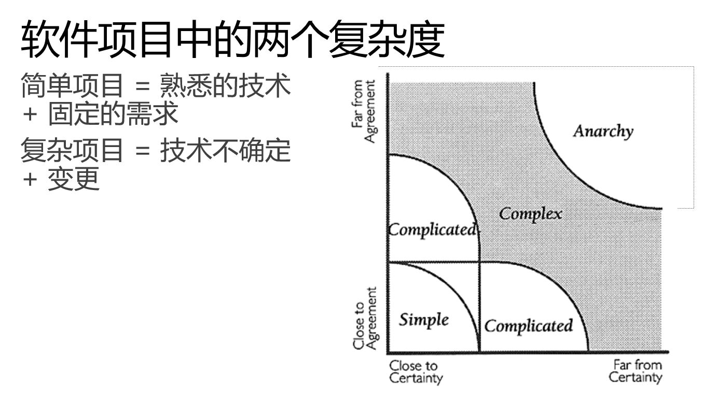
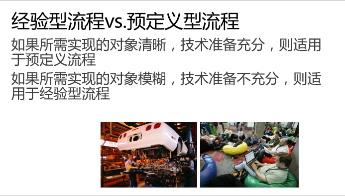
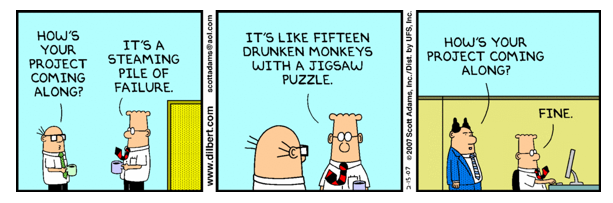

关于敏捷开发
-------------------------

敏捷软件开发（英语：Agile software development），又称敏捷开发，是一种从1990年代开始逐渐引起广泛关注的一些新型软件开发方法，是一种应对快速变化的需求的一种软件开发能力。它们的具体名称、理念、过程、术语都不尽相同，相对于「非敏捷」，更强调程序员团队与业务专家之间的紧密协作、面对面的沟通（认为比书面的文档更有效）、频繁交付新的软件版本、紧凑而自我组织型的团队、能够很好地适应需求变化的代码编写和团队组织方法，也更注重软件开发过程中人的作用。

敏捷宣言
~~~~~~~~~~~~~~~~~~~~~~~~~~

敏捷一词来源于2001年初美国犹他州雪鸟滑雪圣地的一次敏捷方法发起者和实践者（他们发起组成了敏捷联盟）的聚会。

雪鸟会议共同起草了 `敏捷软件开发宣言`_ 。其中最重要的部分就是对一些与会者一致同意的软件开发价值观的表述。

价值观
^^^^^^^^^^^^^^^^^^^^^^^^^^

    **个体和互动：** 高于 流程和工具。

    **工作的软件：** 高于 详尽的文档。

    **客户合作：** 高于 合同谈判。

    **响应变化：** 高于 遵循计划。

其中左边的描述是右边原则的重点。

原则
^^^^^^^^^^^^^^^^^^^^^^^^^^

宣言中还包括以下原则：

* 对我们而言，最重要的是通过尽早和不断交付有价值的软件满足客户需要。
* 我们欢迎需求的变化，即使在开发后期。敏捷过程能够驾驭变化，保持客户的竞争优势。
* 经常交付可以工作的软件，从几星期到几个月，时间尺度越短越好。
* 业务人员和开发者应该在整个项目过程中始终朝夕在一起工作。
* 围绕斗志高昂的人进行软件开发，给开发者提供适宜的环境，满足他们的需要，并相信他们能够完成任务。
* 在开发小组中最有效率也最有效果的信息传达方式是面对面的交谈。
* 可以工作的软件是进度的主要度量标准。
* 敏捷过程提倡可持续开发。出资人、开发人员和用户应该总是维持不变的节奏。
* 对卓越技术与良好设计的不断追求将有助于提高敏捷性。
* 简单——尽可能减少工作量的艺术至关重要。
* 最好的架构、需求和设计都源自自我组织的团队。
* 每隔一定时间，团队都要总结如何更有效率，然后相应地调整自己的行为。

敏捷开发方法
~~~~~~~~~~~~~~~~~~~~~

除了 敏捷开发宣言_ 内所提到的价值观和原则以外，敏捷开发并没有一个完整的方法列表，因为所有的敏捷开发方法都是广大开发人员在日常的工作中摸索出来的，针对某种特定场景适用的方法。也就是说，以下所列出的敏捷开发方法并以一定适用于你的团队或者你的问题，但是敏捷鼓励所有人按照自己的方式尝试任何的方法，只要这种方法遵循以上价值观和原则，那么它就是一种敏捷方法。

* Scrum
* 看板方法 Kanban 
* 敏捷建模 Agile Modeling
* 特性驱动开发 Feature-driven development (FDD)
* 测试驱动开发 Test-drive development (TDD)
* 极限编程 eXteme Programming (XP)
* 精益开发 Lean Development 
* 微软解决方案框架敏捷版 Microsoft Solution Framework (MSF) for Agile 
* 敏捷数据方法 Agile Data Method
* 自适应软件开发 Adaptive Software Development (ASD)
* Six Sigma 
* 水晶方法 Crystal 
* 行为驱动开发 Behavior-driven development (BDD)
* 动态系统开发方法 Dynamic Systems Development Method (BSDM) 
* 探索性测试 Exploratory Testing 

以下是Forrester在2009年针对各种敏捷开发方法进行的一项调研结果，其中显示在所有敏捷方法中，Scrum的接受度最高。同时，在接受调研的开发人员中，已经有35%的人员在使用某种敏捷开发方法。

.. figure:: images/agilemethods.png

为什么敏捷开发受到热捧
~~~~~~~~~~~~~~~~~~~~~~~

上面的调研报告中可以看出，越来越多的开发团队在使用某种敏捷开发方法来解决他们所遇到的问题。为什么敏捷开发受到大家的接受与热捧，就在于这些方法真的可以帮助我们解决问题。同时，敏捷从来不主张用同一个方法或流程套用到所有团队和所有情况中，它鼓励团队根据自己的情况找到适合自己的方法（前提是遵循敏捷价值和原则），这样其实敏捷将所有那些可以帮助到团队，让团队感受到价值的方法全部囊括，也就不难看出为什么敏捷收到热捧了。这都是我们自己想出来的办法，自然觉得好！

不过，从软件研发的本质上来分析一下，其实就不难看出为什么遵循这些价值和原则的方法可以成功。

**软件开发过程是一个探索过程**

软件开发中的2个复杂度，分别是不确定的需求和不确定的技术。这2点在软件出现后的十几年发展中没有变得简单，而是越来越复杂。这一特性和很多的其他的行业有很大的不同，在制造业中，随着技术的发展，我们可以使用越来越成熟的技术，对产品的设计也可以通过很多方式固化下来，然后才进入大规模生产。但是软件不同，经过了这么多年的发展，我们发现我们面临的问题越来越复杂，所使用的技术也越来越繁多。这种行业性的不同特点决定了我们无法使用工业制造领域所惯用的很多方法来解决软件研发的问题，这就是瀑布模型（waterfall）会失败的原因所在。当然，近些年来工业生产中也在推行如柔性生产线，精益制造，工业4.0等。这些趋势的出现，实际都是因为市场环境发生变化的速度在加快，我们必须找到一种可以快速适应变化的方式。

实施敏捷转型的前提 - 自上而下
~~~~~~~~~~~~~~~~~~~~~~~~~~~~

**经验型管理方法需要开放的企业文化**

要做好软件研发，我们就必须找到一种能够通过变化来适应变化的方法，并在开发过程中持续改进我们的流程并适时引入新的方法，废除老的方法。这种方式要求我们的团队必须能够接受问题，愿意做出改变，因此一种开放的团队文化是实施所有敏捷方法的前提。当然，我们无法要求团队在一开始就具备这种文化，这种文化的建立本身也是敏捷转型的必然结果。因此，任何团队的敏捷转型都必须是自上而下的，首先管理者（这里至少要上升到技术总负责人的层面）要认可敏捷的价值，并愿意为了这个目标而适度接受组织变革。如下面这个漫画中的情形所描述的企业文化，是无法接受这种转型的。

上图描述了迪尔伯特在和自己同时谈论项目进展情况的时候说：我们就如同15只喝醉的猴子在一起做拼图游戏一般混乱，可见他的项目有多么糟糕；但当他的领导问起同样的问题时：他的回答却是简单的一句：正常。

团队如果希望能够引入敏捷，就必须先让领导认可敏捷的价值，如果领导无法认可，这种事情宁可不做。因为在敏捷转型的过程中，我们首先就是要把团队现有的问题全部暴露出来，可以说所有的敏捷团队管理方法都是一种暴露问题的手段。如果在问题暴露出来后无法让所有人，特别是那些利益受到影响的人接受（管理者首当其冲），那么后续的改进都无法排入日程。

敏捷转型的9个成功要素
~~~~~~~~~~~~~~~~~~~~~~~~~

所有的敏捷方法大致可以分为2类：团队管理和工程实践。团队管理方法是敏捷转型的根基，也是持续改进的基础；而工程实践则是团队为了解决某个特定问题而选用/采用的某种具体方法。要落实这些方法，以下9点非常重要：

* 建立团队沟通习惯：使用每日立会（Daily Standup）的方式进行计划，并且使用商业价值（Business Value）点来决定优先级
* 透明化流程：使用燃尽图/燃上图，kanban为所有项目干系人提供项目进度，风险反馈和更新
* 理清需求源头：从业务线中选取产品负责人（PO），并直接对软件开发项目负责
* 控制需求粒度：将需求拆分成很小的颗粒，持续快速迭代开发，并及时收集反馈
* 建立反馈机制：将敏捷项目与企业级PMO良好集成，提供计划和报表支持
* 不要从新发明轮子：引入专家指导，借助外脑实现快速敏捷转型。调查结果：使用敏捷专家提供指导的企业中，有41%具备更好的预测能力
* 评估收益：建立度量是建立管理的基础。如cycle time，自动化比例，产品中的bug数量等数据度量，持续的提供比较和改进基础
* 明确优先级： 在用户时代，敏捷的价值就在于驱使PO按照为用户获得的商业价值来确定交付的优先级
* 建立持续改进机制： 在过程中保持学习并持续改进。不仅仅以在每个sprint后面的Retro，而应该在每个步骤后都进行反思和改进

参考
~~~~~~~~~~~~~~~~~~~~~~

* 关于 敏捷开发宣言_ 
* 关于 维基百科敏捷开发_  

.. _敏捷软件开发宣言: http://www.agilemanifesto.org/iso/zhchs/ 
.. _维基百科敏捷开发： https://zh.wikipedia.org/wiki/%E6%95%8F%E6%8D%B7%E8%BD%AF%E4%BB%B6%E5%BC%80%E5%8F%91

