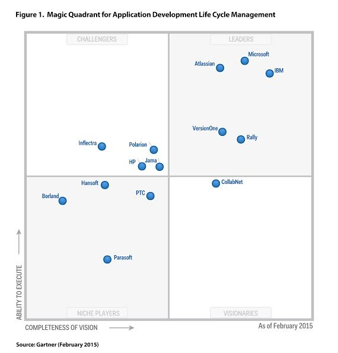

关于 Visual Studio ALM
-----------------------

Team Foundation Server是微软研发平台的核心产品。在2015年Gartner的软件开发生命周期管理工具评估报告中，微软的TFS又一次在可实施性和功能完整性这两个关键性指标上位于前2名，特别是可实施性位列第一，这标志着使用TFS进行软件全生命周期管理是最可靠，最容易取得成功的选择。

微软的TFS产品之所以可以具备如此完备的功能和实用性和微软几万名产品开发人员的使用有着紧密的关系，自2005年发布第一版以来，微软的主要产品线，包括Windows, Office, Visual Studio, Xbox以及Azure云计算平台都在使用TFS作为研发管理平台，经过了10年超过6个大版本的迭代，TFS已经具备了管理上万人研发团队进行大规模复杂项目开发的经过验证的能力。无论开发团队使用传统的瀑布，CMMI或者新兴的敏捷，Scrum或者Kanban来组织自己的开发流程，TFS都能提供完善的工具和高度可定制性来满足要求。仅在Visual Studio产品线，TFS就管理者超过3亿6千万源代码文件，1千9百万工作项和近5000名开发人员，每天要进行超过22万次版本编译，总数据量超过15TB。

使用微软自己的开发平台来管理自己的大规模软件研发，是微软TFS研发管理平台与其他厂商的产品最大的区别，在Gartner的评估中出现的任何一家公司都不具备如此规模的研发团队和复杂的产品来磨练自己的研发平台，这就是为什么TFS可以在“可实施性”上力拔头筹的原因。

在中国，已经有多家大型团队使用TFS进行研发管理的成功案例。在金融行业中，PICC是中国保险行业规模最大的提供商，2014年的营业规模超过2500亿元。同时，PICC的软件研发团队超过千人，分布在北京，成都和广州的多个研发中心。PICC自2014年引入TFS进行研发管理以来，已经对超过110个项目，20万条工作项进行了管理，受控代码进2亿个文件。PICC的研发平台选型工作持续近1年半的时间，完整评估了来自微软，IBM，PTC及惠普的多个解决方案，最终选定TFS作为其研发平台的单一工具，其考虑点主要有：1）全生命周期管理能力；2）多种研发模式的支持，既要支持敏捷，也要支持传统的瀑布；3）多种开发环境的支持，如：Java和.NET ; 4) 易用性，如与常用办公软件的集成；5）集成能力，接入第三方系统的能力；6）实施服务团队的能力。在整个实施过程中，微软的实施团队共提供了超过30场培训，覆盖超过700人，200多小时的培训时间。同时完成了近百张不同的报表开发和近万行定制代码的编写。

从功能上来看，微软TFS研发管理平台提供了从需求管理，项目管理，配置（源代码）管理，测试管理，代码编译持续集成，自动化测试，自动化发布及部署环境管理在内的研发运维一体化（DevOps）的完整工具链。在产品和项目开发的每个环节都可以提供完整的工具支持和良好的用户体验。

	- 需求管理：TFS提供简单易用的轻量级条目化需求管理，需求人员可以使用自己熟悉的Office办公软件完成需求的编写，修改并导入至TFS形成可追述的条目化需求，TFS对每条需求均维护详细的历史纪录并可以与其他条目（包括：需求，任务，测试用例，缺陷，代码和版本等）建立不同类型的联系。通过这种联系，我们可以从任何需求条目抽取出所关联的所有过程资产，便于管理人员进行跟踪和数据分析。在TFS中，我们对需求管理的理解是端到端的，而不仅仅处于需求收集和分析阶段。
	- 项目管理：TFS的项目管理能力包含了项目规划，跟踪，监控和控制能力。项目管理中我们需要对人，流程和工具进行结合，并使用某种方法论进行指导来完成。在TFS中，内置了瀑布，敏捷和Scrum三种研发过程方法论模型，同时允许用户定制或者导入自己的管理模型。通过与各种不同的集成开发环境（IDE）的集成，项目的过程跟踪可以和开发人员的日常操作无缝集成，大大降低项目管理造成的额外工作。对所有这些过程所产生的数据，我们都可以通过TFS所内置的数据分析引擎和报表进行可视化，让管理精细化和科学化。
	- 配置（源代码）管理：TFS中支持两种配置管理模型：1）集中式的配置管理适合需要精细化权限分离的层级化管理模式，对于使用团队成员复杂（如包含外包），产品庞大，安全性要求高的项目非常适合；2）分布式配置管理对于地域上分散，网络环境不可靠以及需要更加灵活的分支/合并模型的团队更加适合，对于敏捷开发的支持也更加灵活。在TFS2015版本中，我们可以混合使用2种配置管理模型，进一步提升了配置管理的灵活性。
	- 测试管理：TFS的测试管理与需求管理具有非常强的联系，对于测试V模型的支持简单直接，让测试团队和开发团队的协作更加高效。从单元测试，功能测试，集成测试，验收测试，到自动化测试，压力测试，性能测试，TFS中都提供了解决方案并可将测试结果纳入项目管理数据分析中综合使用。
	- 代码编译和持续集成：快速的质量反馈是提升软件质量的最有效手段，持续集成让开发人员可以快速知晓代码质量水平，让测试人员可以快速获取可测试版本，让运维人员可以快速获取可部署版本。作为整个研发工具链的输送管道，TFS的跨平台构建引擎可以同时在Windows, Linux, Mac, Unix等主流操作系统上完成代码编译，打包，自动化代码规范校验和发布能力；为研发团队建立快速反馈提供了最佳的工具支撑。
	- 自动化发布和部署环境管理：TFS中所内置的Release Management功能可以方便的建立开发-测试-预生产-生产环境的发布管道，并在每一步骤接入持续集成系统的版本，在管理人员完成审批的前提下，自动完成某一产品版本在发布管道中的推送，并在必要的时候进行回滚操作，确保环境的可用性。与云计算平台，私有云，虚拟化以及新兴工具（如：docker, puppet, chef等）的集成，让TFS具备企业DevOps核心发布管道的能力。

TFS研发管理平台具备诸多开箱即用和功能和流程，特备适合中小型团队直接使用；对于大型研发团队，TFS同时提供了强大的集成能力。内置的流程模板可以将项目管理模型模板化，对人员和流程进行绑定；灵活的配置管理需要进行细致的权限划分和分支规划；跨平台的构建工具现在已经开源，可以自行开发插件来支持不同的构建环境；后台强大的数据分析平台的数据可以通过不同的报表工具来进行数据可视化；最后，TFS提供互联网标准的Rest API来完成第三方系统的集成。对于大型企业的研发管理来说，以上能力缺一不可，但均需要投入相当的资源进行二次开发和持续改进。

企业研发管理改进，特别是大型企业的研发过程改进是一项系统工程，常常涉及组织级变革的需要。业界的经验告诉我们，这种变革的推进常常是缓慢而又艰难的，在企业内经常会遇到很多阻力。这时引入外部管理顾问和技术实施团队是最有效的推进手段。在前面所述的PICC案例中，微软的实施团队在完成系统实施的基础上还完成了很多管理流程梳理和落地培训的工作，为整个研发平台的实施以及管理能力的提升起到了不可忽视的作用。
