样例项目背景
---------------
今天用一个真实的应用做一个演练。这个样例叫做PartsUnlimited，是根据《凤凰项目》这本书为背景制作的。

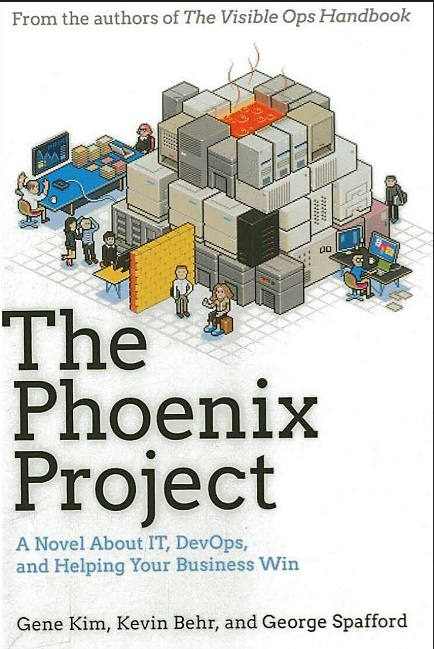

本书讲述了一位IT经理临危受命，在未来董事的帮助和自己“三步工作法”理念的支撑下，最终挽救了一家具有悠久历史的汽车配件制造商的故事。
小说揭示了管理现代IT组织与管理传统工厂的共通之处，让读者不仅能对如何管理IT组织心领神会，更重要的是将以完全不同于以往的视角看待自己的工作环境。
为了让开发者验证微软的DevOps工具链，微软提供哟一套以本书中的PartsUnlimited公司为背景的样例程序，本教程由三部分构成：包括使用ASP.NET VNext电子商务网站，使用开源的Java和MongoDB的生产管理系统以及中间件系统。
全部源代码可以通过GitHub下载，地址：https://github.com/Microsoft/PartsUnlimited
这次所做的演练是基于ASP.NET的电子商务网站中的用户故事而做的。共完成了5个故事，涵盖了用户注册，登陆，查看产品，下订单等主要流程。

1.新用户注册
~~~~~~~~~~~

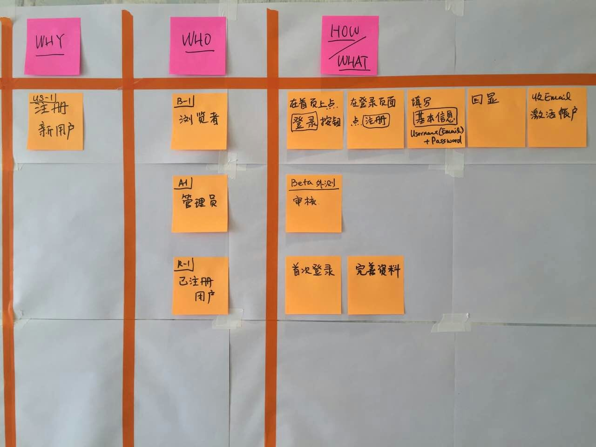

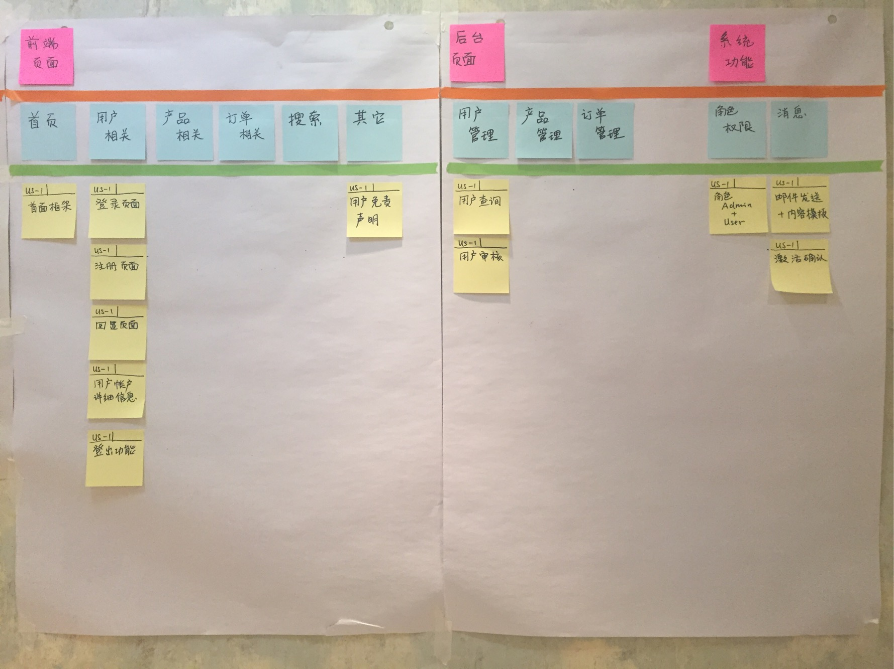

2.浏览产品
~~~~~~~~~

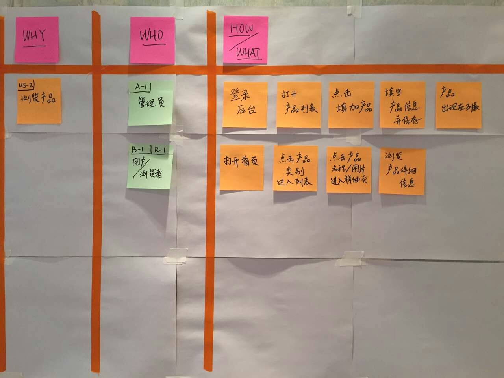

.. figure:: images/UserStoryOfBrowseProduct-2.jpg

3.下订单
~~~~~~~

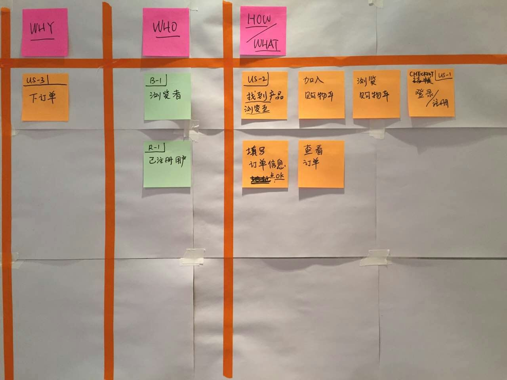

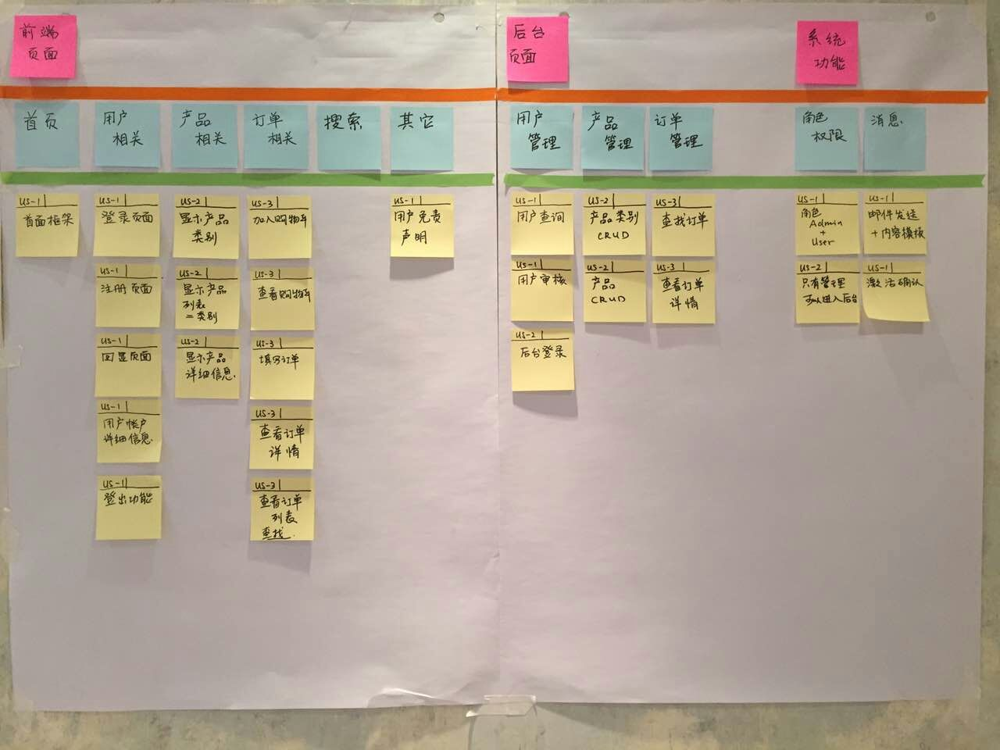

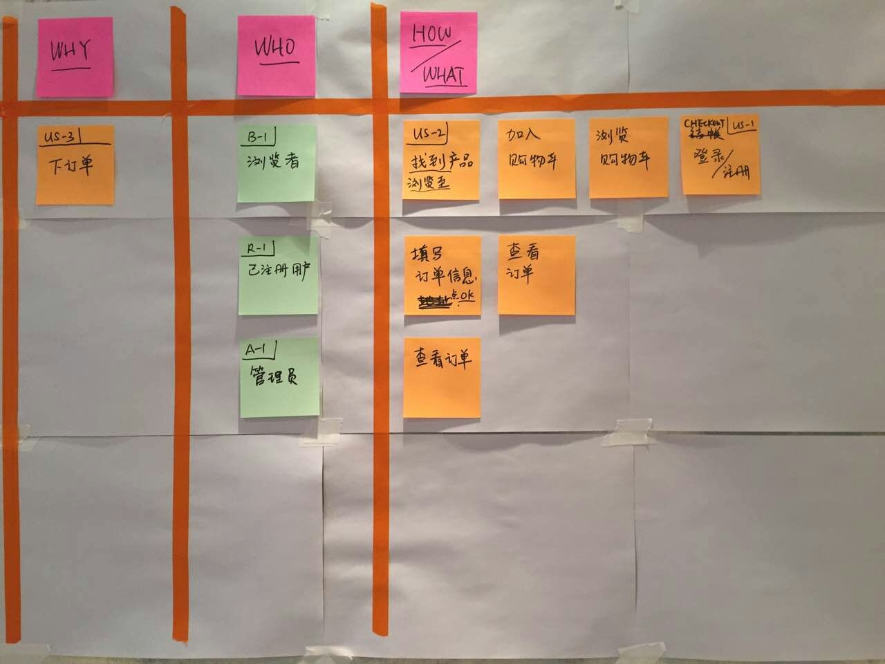

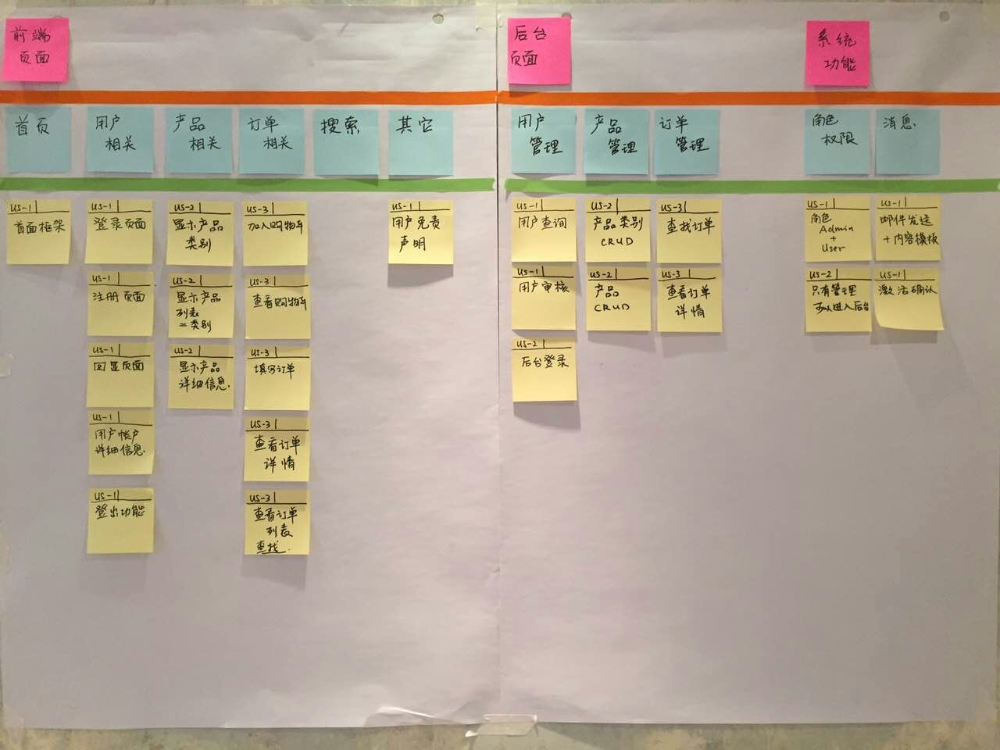

4.产品搜索
~~~~~~~~~

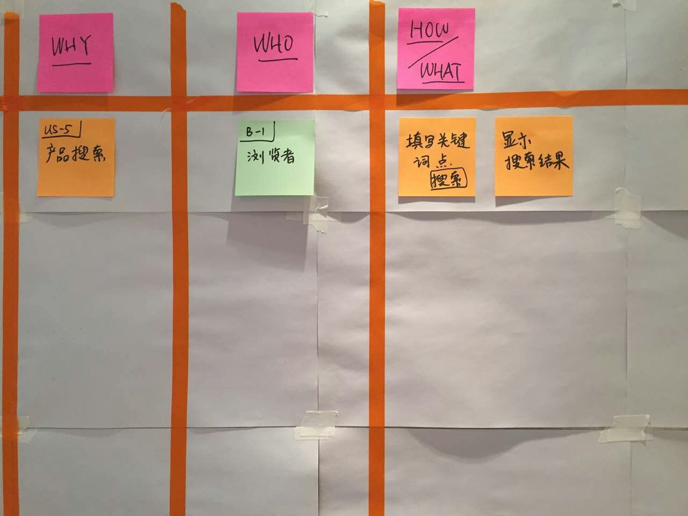

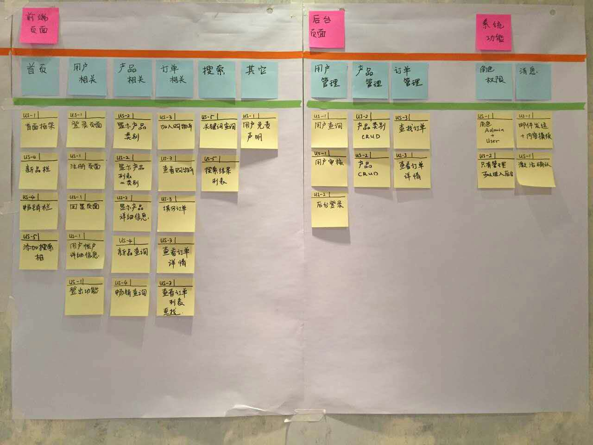

5.主页促销
~~~~~~~~~

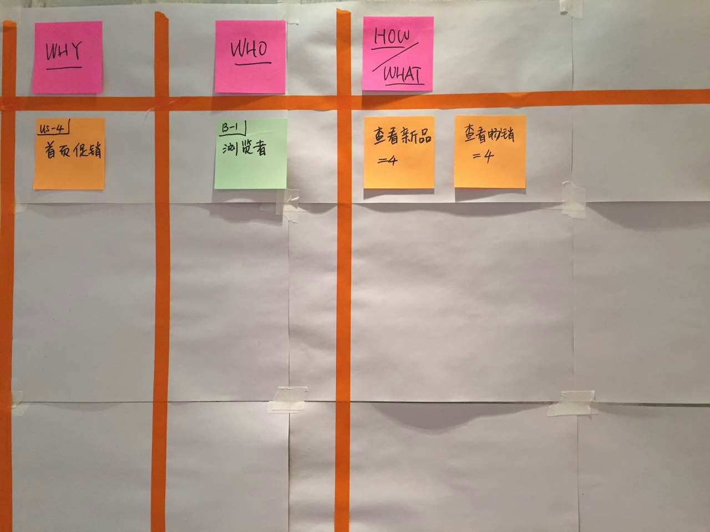

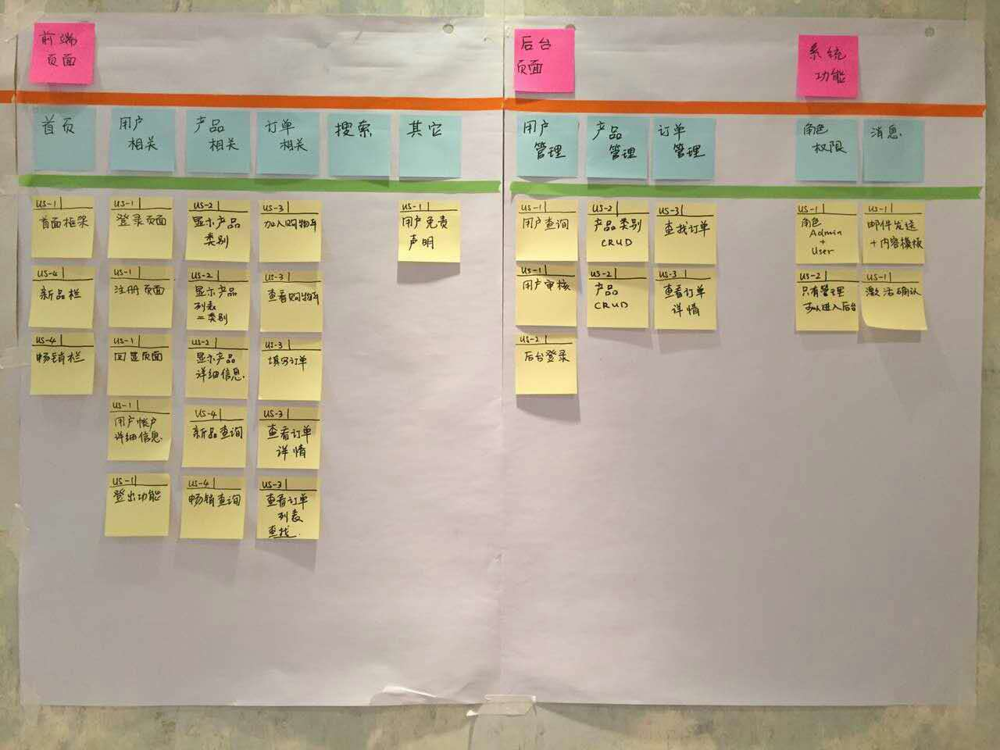

最后完成的用户故事按照优先级放入kanban。
~~~~~~~~~~~~~~~~~~~~~~~~~~~~~~~~~~~~

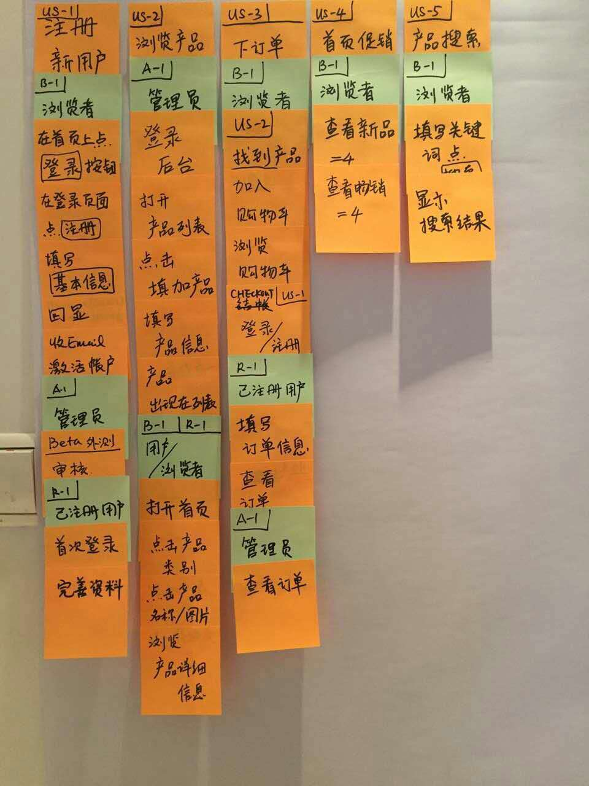