练习二：敏捷项目集管理
~~~~~~~~~~~~~~~~~~~~~~~

本次练习中，我们将会学习如何使用TFS进行敏捷项目组合管理，可以允许大型公司和组织进行多团队协作开发。我们将在PartsUnlimited项目上实现多个团队协同工作。

任务一：配置团队层级和区域路径
^^^^^^^^^^^^^^^^^^^^^^^^^^^^

1.  点击右上角的 **管理服务器** 按钮（齿轮形状），进入TFS管理页面。此时从我们可以看到，PartsUnlimited项目目前只有一个默认团队，这个团队是创建项目时默认建立的。由于我们的示例项目包含前端网页和后台管理功能，所以我们可以再创建两个团队，前端开发团队和后台开发团队。
由于每个团队各自只关心分配给他们的任务，所以我们要求积压工作视图只显示每个团队自己的需求和任务，这一点可以通过给 **不同团队** 分配 **不同的区域路径** 实现。现在我们可以通过点击 **新建团队** 按钮来创建团队。

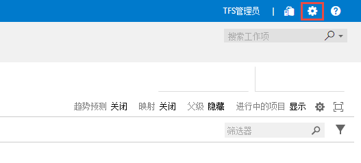

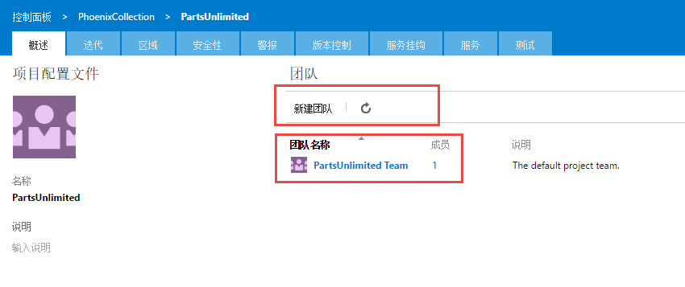

2.  在 **创建新团队** 窗口中，输入 **团队名称** 为“前端开发”，**不勾选** “使用团队名称创建区域路径”，然后点击 **创建团队** 。

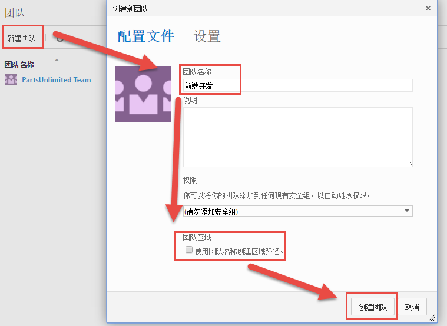

3.  利用同样的方式，我们可以添加“后台开发”团队。团队添加后的界面应该如下图所示：

.. figure:: images/Exercise-2-View-of-project-teams.png

4.  接下来我们需要为我们的项目创建区域路径。区域路径是从我们 **样例项目背景** 的 **用户故事地图** 地图中提取出来的。点击 **区域** 选项卡，我们可以看到当前只有以项目名称命名的根区域。我们先选择根区域，然后点击 **新建子级** 按钮，弹出 **创建区域** 窗口，在 **区域名称** 中输入“前端页面”，点击 **保存并关闭** 。

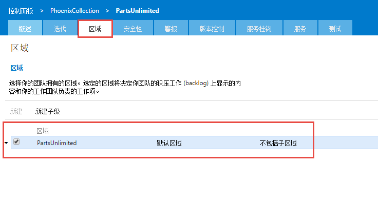

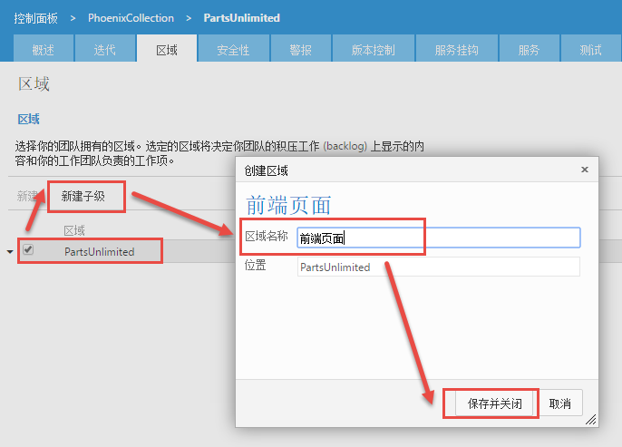

5.  可以看到在根区域中下一级出现了“前端页面”区域。同理可以在根区域中加入“后台页面”、“系统功能”。同理，当我们选定“前端页面”这个区域时，点击 **新建子级** 按钮，我们就可以在该区域下新建子区域了。我们可以将用户故事地图中的区域信息按照这样的方式完整的录入到 **区域** 下。

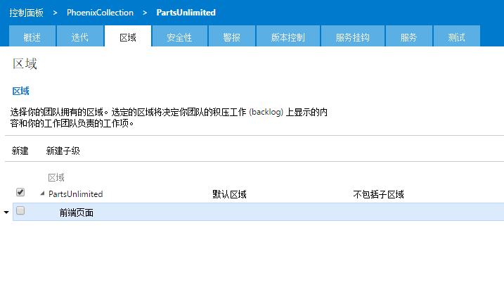

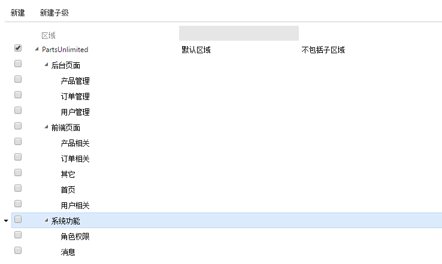

6.  下面我们需要做的就是为 **每个团队** 设置各自的 **区域**。当需求或积压工作分配到某个区域路径时，只有与区域对应的团队成员才能看到这些需求或积压工作，其他团队成员看不见，也就是对其他团队屏蔽。根据项目的实际情况，我们应该将区域 **前端页面** 分配给 **前端开发** 团队，**后台页面** 和 **系统功能** 分配给 **后台开发** 团队。点击 **概述** 选项卡，进入项目的概述页面，然后点击 **前端开发** 团队，进入该团队的设置页面，然后点击 **区域** 选项卡，勾选 **前端页面** ，右键点击 **前端页面** ，在快捷菜单中选择 **包含子区域** ，此时 **前端开发** 团队与 **前端页面** 及其子区域进行了绑定。同理可以将 **后台开发** 团队与 **后台页面** 和 **系统功能** 及其子区域进行绑定。

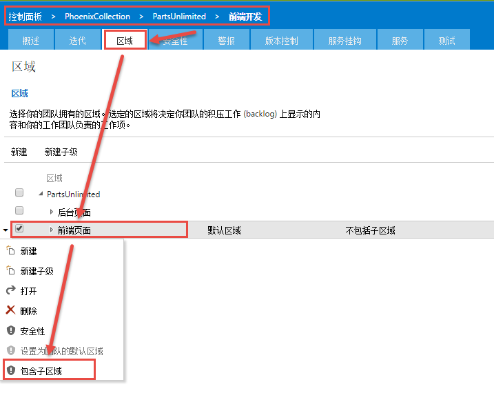

7.  接下来我们回到项目积压工作项页面，将一些前端需求和后台需求分配到相应的区域路径。选择 **首页框架** 和 **登陆页面** 这两个积压工作，将它们的 **区域路径** 字段值分别设为 **PartsUnlimited\前端页面\首页**、**PartsUnlimited\前端页面\用户相关**，将 **用户查询** 和 **用户审核** 的 **区域路径** 字段设为 **PartsUnlimited\后台页面\用户管理** 。

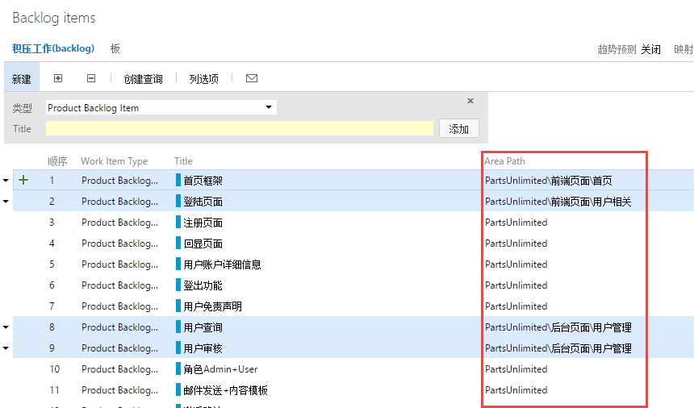

8.  接下来我们来验证设置我们的设置。点击页面的标题部分的导航栏，选择 **浏览全部** 按钮，弹出项目和团队选择框，选择 **前端开发** 团队，点击 **导航**，进入该团队的积压工作页面，此时我们可以看到 **积压工作（backlog）** 列表中只有 **首页框架** 和 **登陆页面** 这两个积压工作项，与我们要求的完全一致。同理可以验证 **后台开发** 团队能看到的积压工作项也是我们刚才设置的。

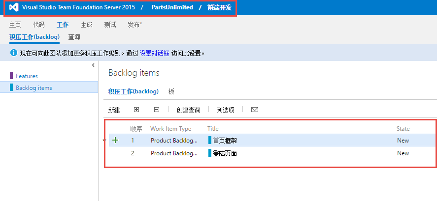

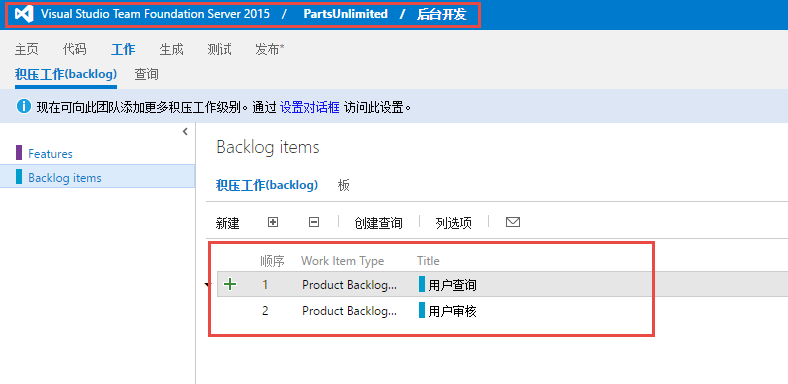
