练习三：根据项目特性配置敏捷规划工具
~~~~~~~~~~~~~~~~~~~~~~~~~~~~~~~~~

在前面的练习中，我们已经了解了如何使用TFS进行多团队协作开发。在本练习中，我们将会学到如何使用看板以及看板是如何提高敏捷开发效率的。同时也会介绍下工作项标记的功能。这些功能都是可以根据团队的实际情况可定制的，而不需要修改过程模板文件的。

任务一：介绍 **看板** 工具
^^^^^^^^^^^^^^^^^^^^^^^^^^^^

1.  可以使用看板来跟踪工作项的状态，如查看当前正在进行的工作、工作的执行人员、下一步需要执行的工作以及完成的工作等。转到团队的“积压工作(backlog)”页并打开看板。 团队项目的所有参与者都可以使用看板更新工作状态。

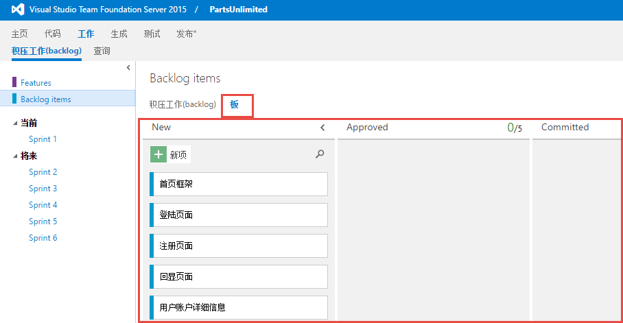

2.  此时我们可以看到kanban中共有四列，对应着backlog积压工作项的4个状态，分别是New（新建）、Approve（确认）、Committed（已提交）、Done（完成）。当前所有的工作项都处于New（新建）状态，每个工作项都是用一个小卡片表示。小卡片上当前显示工作项的标题和被指派的团队成员，我们也可以自定义工作项卡片上显示的字段，
将我们所关心的内容字段显示在卡片上。点击kanban右上角的 **齿轮** 图标，进入看版设置窗口，点击左侧的 **字段** 标签，然后点击 **附加字段** 下的 **字段** **+** ，在出现的 **下拉框** 中选择想要在卡片上显示的字段。我们可以添加字段 **Area Path** （区域路径）字段和 **State**（状态）字段。

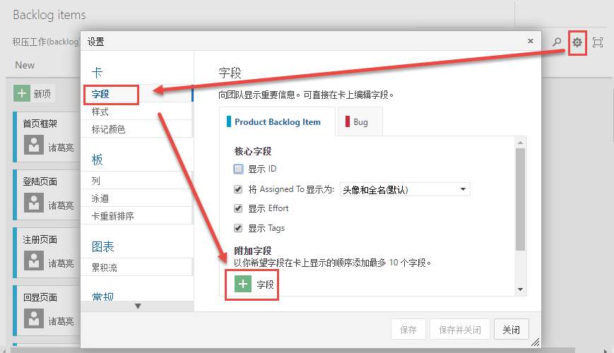

3.  回到kanpan视图，可以看到此时卡片上已出现了 **Area Path** 字段和 **State** 字段。当然我们可以在 **设置** 窗口中设置kanban的其它属性,如修改卡片的样式、颜色，在kanban中添加或移动状态列,设置每一列中工作项的最大个数，kanban中是否显示bug，设置工作日等等。

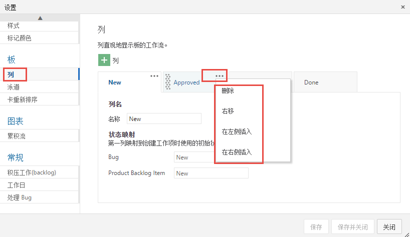

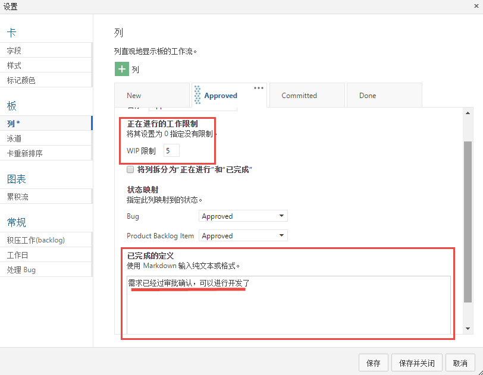

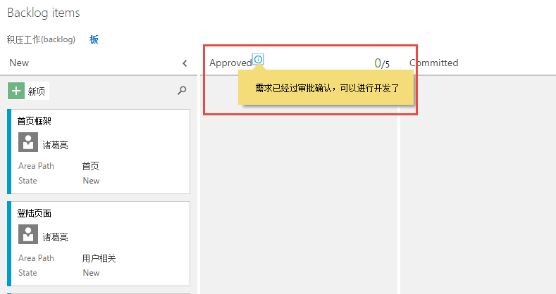

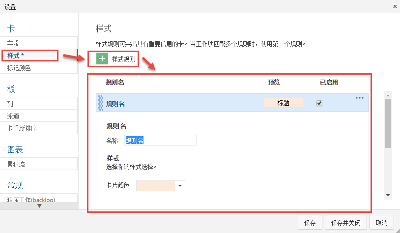

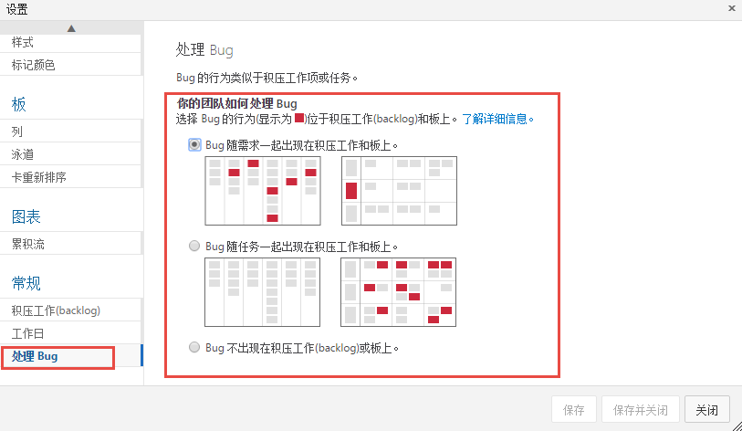

4.  回到kanban视图，此时所有的工作项都分配给了 **诸葛亮** ，需要他对这些工作项进行审批确认。假设此时诸葛亮已经对前三个工作项进行了确认，那他需要将前三个工作项 **托拽** 到 **Approve** 列。

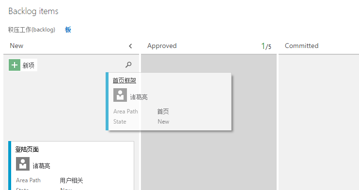

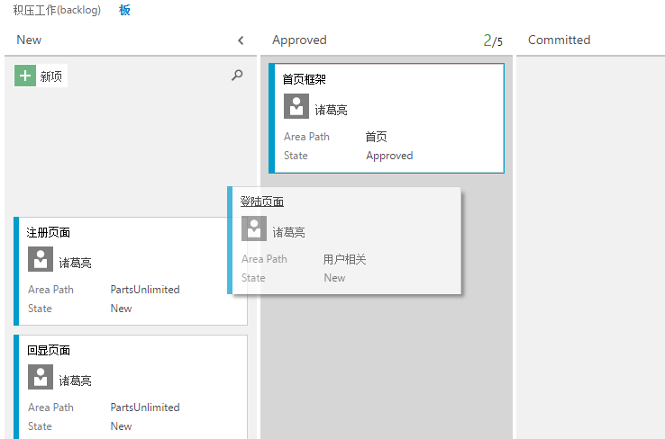

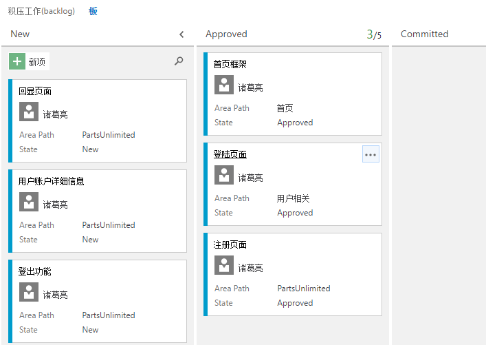

5.  可以看到此时该三个工作项卡片上的 **State** 的值变为 **Approve** 了。此时诸葛亮可以将该三个工作项指派给其他开发人员，开发人员根据自己的完成情况来同样拖拽卡片，来更改工作项状态，使流程继续走下去。

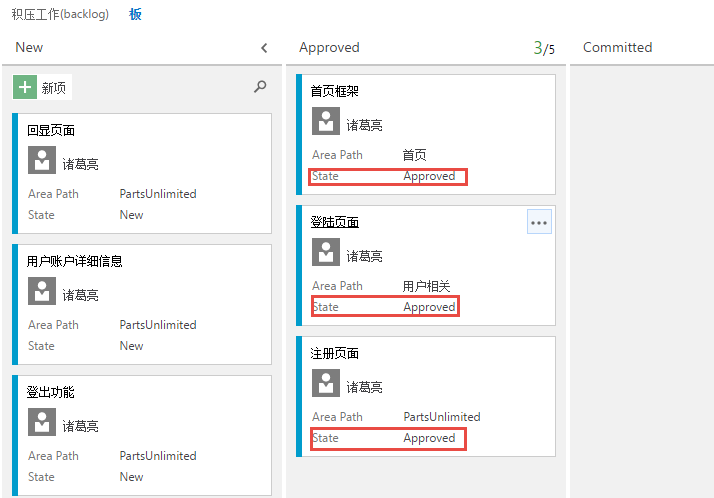

任务二：使用 **标记**
^^^^^^^^^^^^^^^^^^^^^^^^^^^^

1.  使用标记可以很容易对工作项进行归类，方便以后对工作项的查询和刷选。

2.  回到积压工作项列表。假设我们现在的积压工作有部分同时需要同时在手机端实现，我们就可以利用标记功能来对这些积压工作项进行标记，方便以后进行查找。例如，序号为1、4、6这三个工作项需要同时在手机端实现，那么可以分别打开这三个工作项，添加 **标记** “手机”。

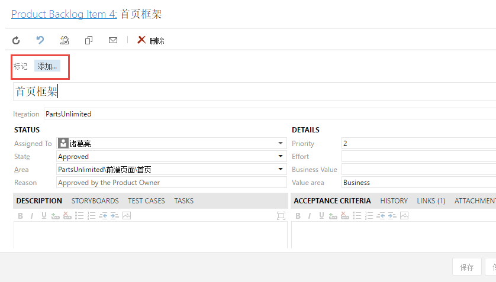

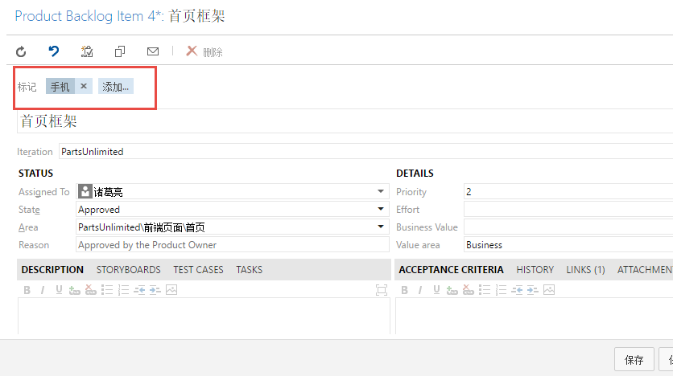

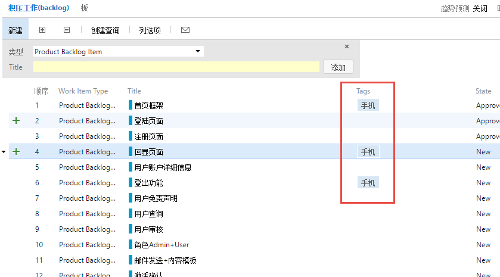

3.  接下来我们就可以利用 **标记** 来查看我们刷选工作项。点击工作项列表的右上角 **漏斗** 图标，会在下面出现标记 **手机** 字样，我们点击 **手机** 标签，会发现积压工作项列表中已经刷选出含有标记 **手机** 工作项。

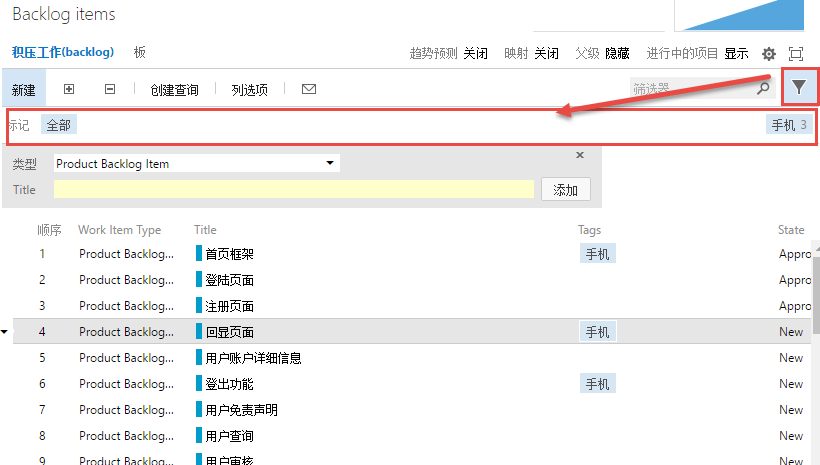

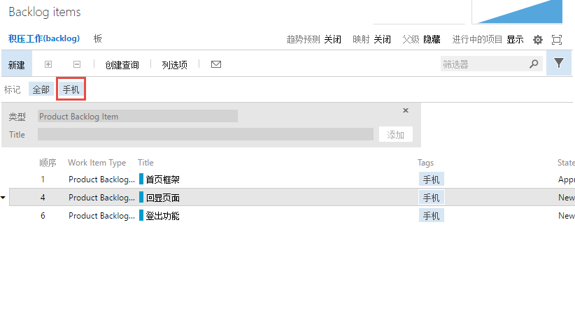