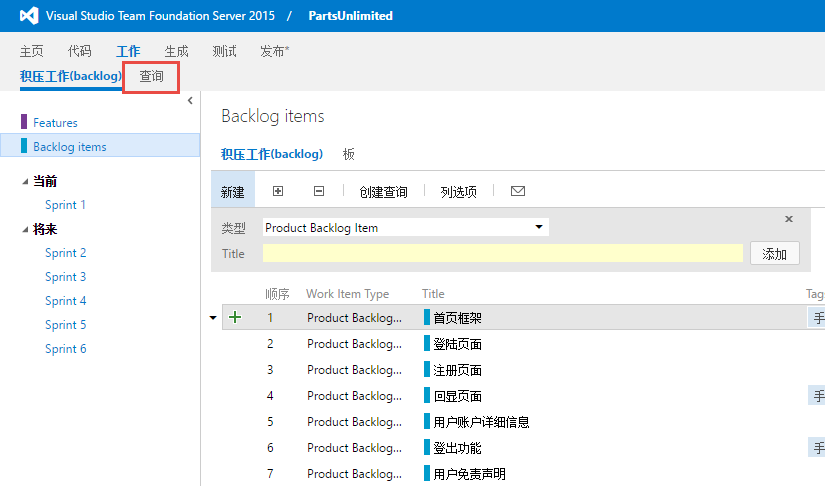
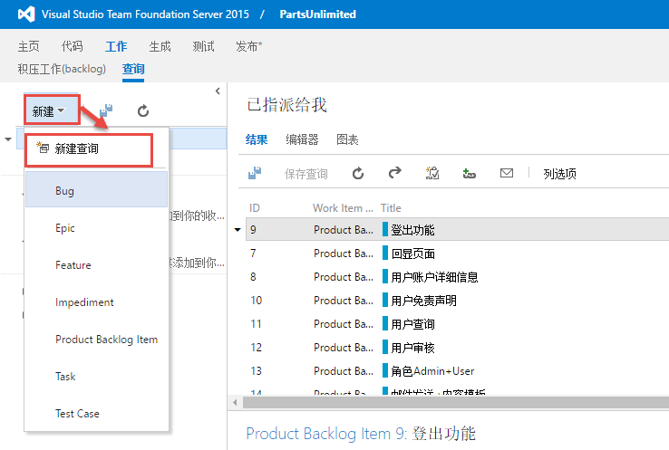
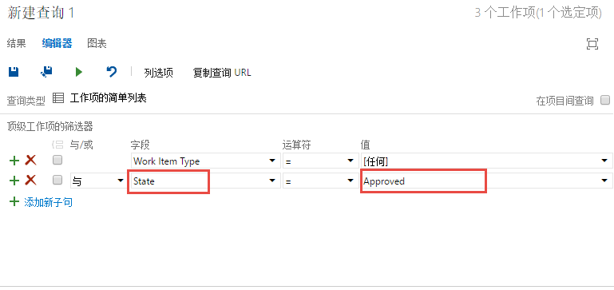
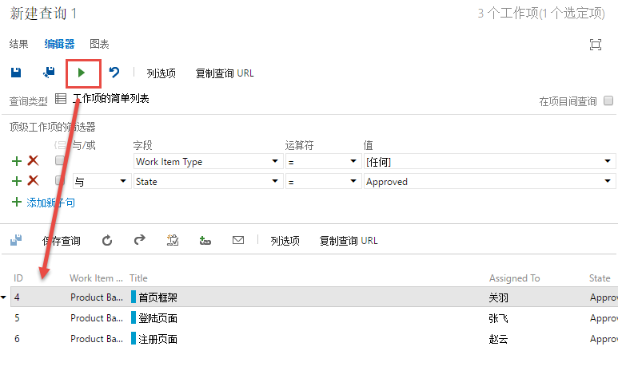
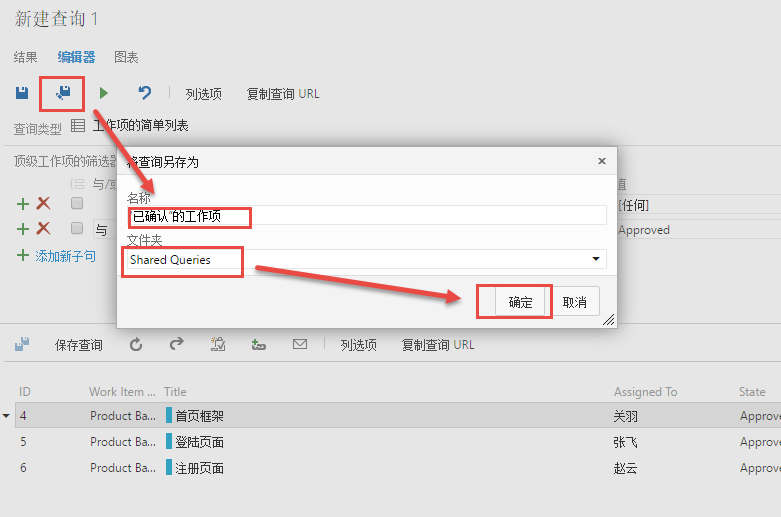
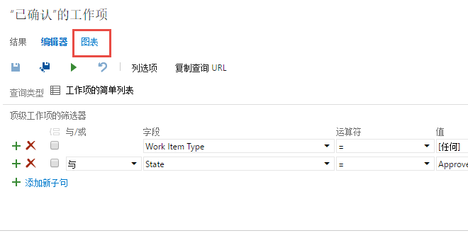
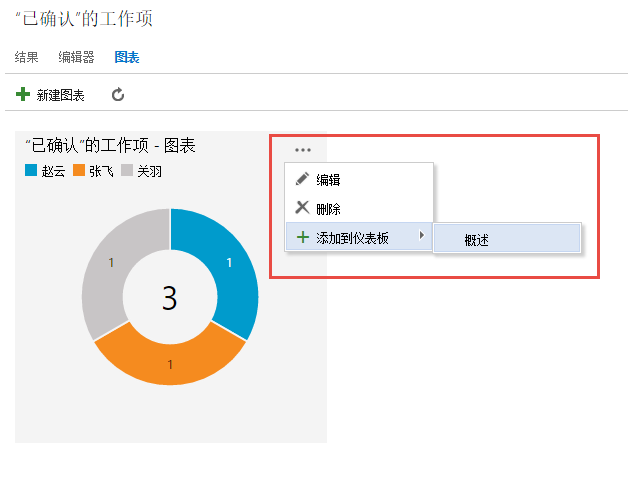
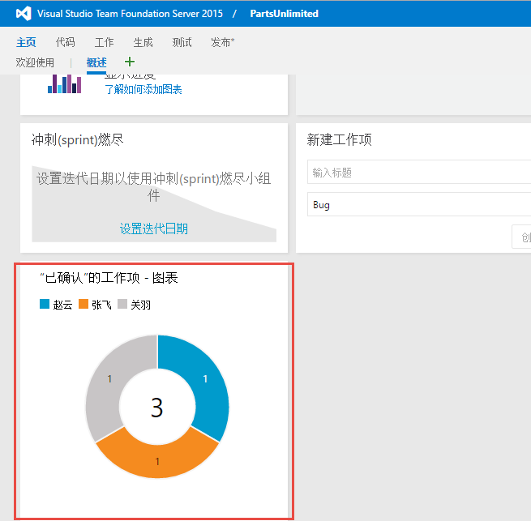

练习四：创建工作项查询和图表
~~~~~~~~~~~~~~~~~~~~~~~~~~

在本次练习中，我们将会学到如何查询工作项，以及根据查询来生成图表。利用图表我们能更好的展现项目当前的状态。

任务一：创建和共享工作项图表
^^^^^^^^^^^^^^^^^^^^^^^^^^^^

1.  我们现在回到积压工作项列表界面。假设现在我们想要更好的查看哪些工作项的状态是 **Approve** （已确认），都已指派给了哪些成员。点击 **查询** 选项卡进入工作项查询界面。

2.  首先我们必须要定义一个查询，来获取我们想要的一些工作项数据。点击 **新建** 下拉按钮，选择 **新建查询** 。

3.  新建的查询默认会查询当前项目的所有状态的工作项。我们想要筛选出所有状态为 **Approve** 的工作项，所以必须要修改字段 **State** 的值为 **Approve** 。

4.  修改好查询条件后，我们可以运行查询来验证是不是我们想要的结果。点击 **运行查询** 图标，可以在查询定义的下面得到查询结果。

5.  当我们确认该查询无误后，可以将该查询保存到 **共享查询** 文件夹中。

6.  接下来我们可以根据我们刚才新建的查询来创建图表了。点击 **图表** 选项卡进入创建图表的界面。

7.  图表创建完成后，返回 **图表** 界面后，可以看到刚才创建的图表已经显示出来了。我们还可以将该图表放入团队首页仪表盘，使每个团队成员都能看见。点击图表中的 **...** 按钮，选择 **添加到仪表盘-概述** 。

8.  当我们返回到团队的首页后，我们可以在仪表盘中看到我们刚才放入仪表盘中的图表。

