敏捷项目规划 – 产品规划，迭代规划和项目监控
----------------------------------------

在这个试验中，您和您的团队成员将使用TFS内置的敏捷规划工具完成产品backlog管理(包括用户故事和积压工作项2级backlog)。对于已经放入backlog的需求进行优先级排序，并按照产品发布版本进行迭代规划，将需求放入迭代形成迭代开发计划，对需求工作量进行估计并按照团队的能力进行迭代工作量规划。

我们还将模拟2-3个迭代的开发过程，由您和你的团队一起完成具体开发任务的更新，跟踪和交付。

最终，我们将使用报表对您的团队的开发过程进行监控和评估，您将可以使用自定义的报表了解在已经完成的迭代中您的团队的效率如何。

通过本次实验，您可以学到内置在TFS2015中的敏捷工具和多层级backlog管理工具，以及如何利用它们来帮助您实现在您的团队中快速规划、管理、跟踪您的工作。您将用一个具体的迭代来了解产品积压工作看板、迭代积压工作看板、任务看板来跟踪您的工作流程。我们也将简要了解针对大型团队和组织的增强工具。

练习一
~~~~~

本次练习中，您将会学到如何利用TFS2015来管理您的积压工作、创建工作项、将工作细化成任务、分配任务给指定成员、用任务看板来跟踪任务状态。本次练习中所使用的项目管理工具适用于中小型开发团队进行项目开发。

任务一：登陆TFS Web门户
^^^^^^^^^^^^^^^^^^^^^^

1.	从任务栏中打开IE浏览器并从收藏栏中打开 **TFS Web Portal** 链接。

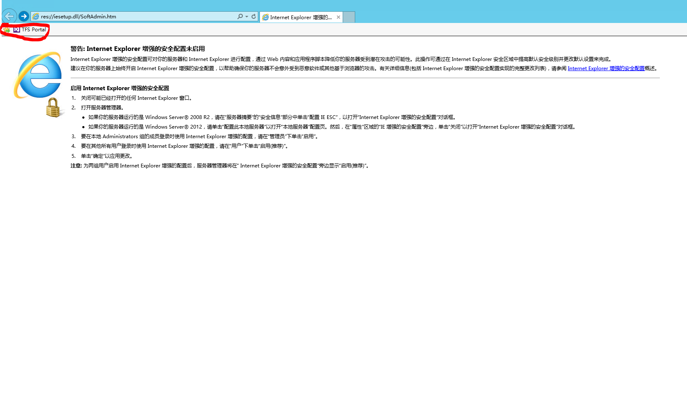

2.	使用用户名liubei登陆。(密码请参考快速入门的 :doc:`/getting-started/sample-project-introduction` 一节内容）

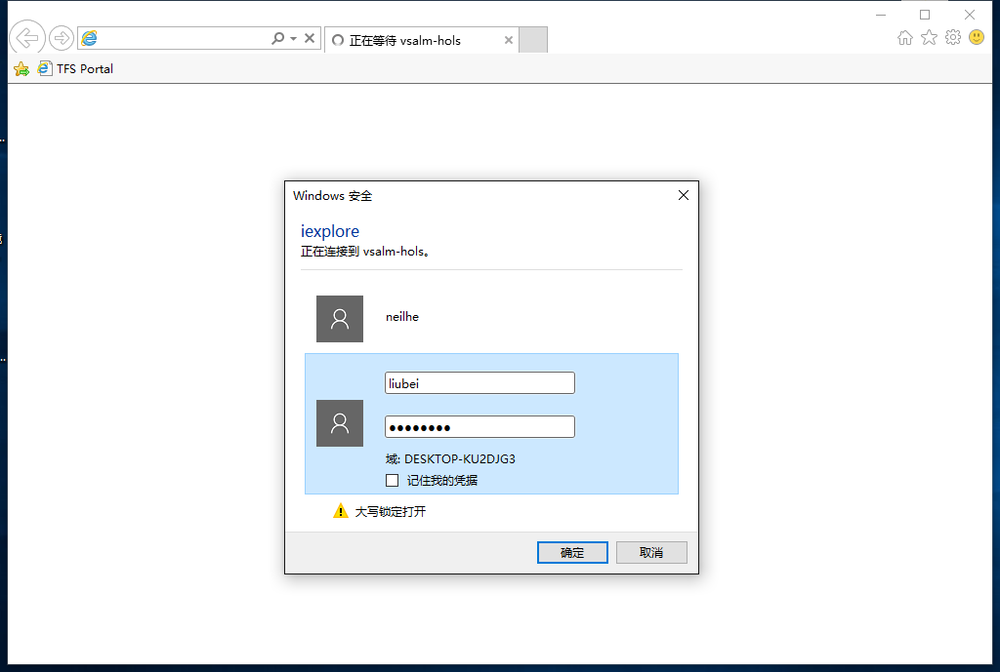

3.	从TFS主页中，选择 **浏览** 按钮打开项目和团队信息。

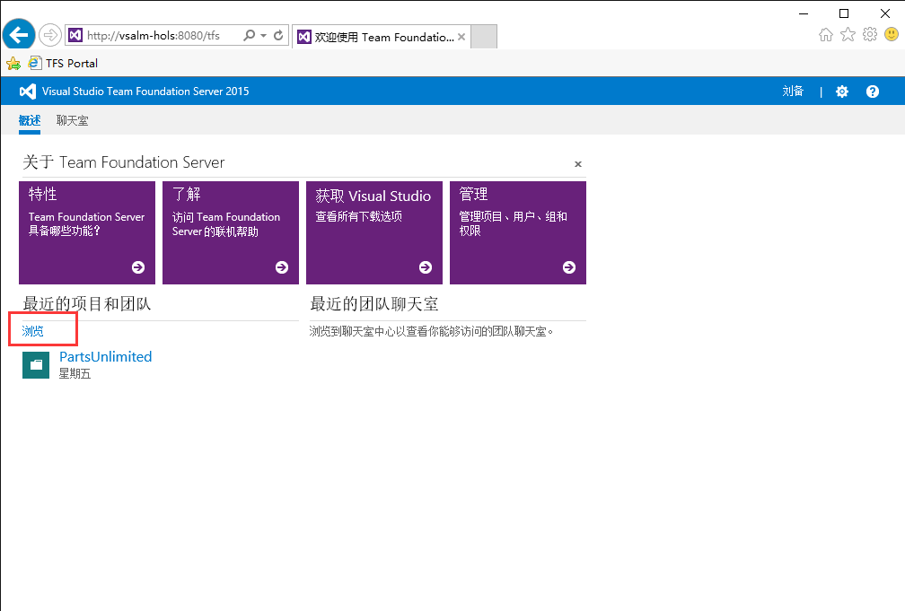

4.  选择 **PartsUnlimited** 项目和默认的团队。

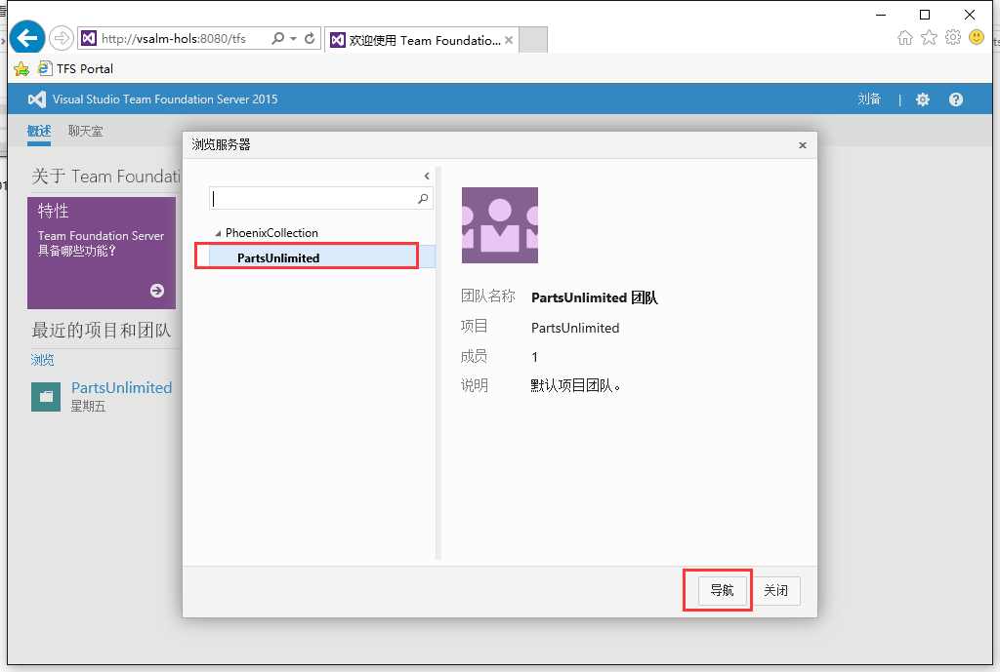

5.	接下来会出现PartsUnlimited默认团队的主页视图。该视图提供包含各种信息的卡片组合，例如查询结果卡片、新建工作项卡片、冲刺燃尽图卡片、团队成员卡片等等。

.. figure:: images/Exercise-1-The-team-Portal-of-Project-PartsUnlimited-default-team.png

任务二：管理积压工作项列表
^^^^^^^^^^^^^^^^^^^^^^^^^^^^

1.	通过选择屏幕顶部的 **Work** 标签来导航到积压工作项界面

.. figure:: images/Exercise-1-Go-to-Backlog-UI.png

2.	产品积压工作项可以帮助我们定义那些需要做的工作。一旦你拥有一个积压工作，你可以用它来管理当工作进展的状态变更，如：工作完成或与工作项关联的事项被迁入，测试通过，或者其他一些相关事项发生的情况。每个产品积压工作项均有很多不同的字段帮助你对要管理的信息进行跟踪，并提供基于状态转换的工作流来帮助你跟踪进度。

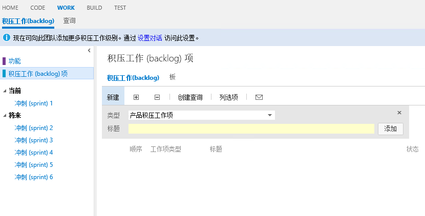

3.	试想下当我们的团队成员被要求实现一个新的产品积压工作项。这个产品积压工作项可以使顾客将浏览的产品加入购物车。这个产品积压工作项应该被设置为高优先级，因为产品负责人（PO）从用户那里得到了很强烈需要此功能的反馈。

现在你需要在标题这一栏中输入 **将产品加入购物车** ，并点击 **添加** 按钮将此积压工作项加入列表。

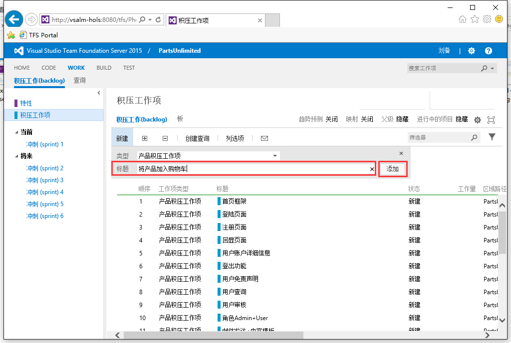

.. note:: 
    请注意列表中有一条红色的横线，这表示你所新添加的工作项出现的位置，你可以通过点选不同的工作项来控制这条线的位置，将新工作项直接放入特定位置。

如果你的工作项不在正确的位置，请使用鼠标拖拽完成优先级排序操作。

4.	在产品积压工作列表中，工作项是按照优先级来进行排序的，优先级高的位于最上面。我们刚才创建的工作项拥有高优先级，所以我们应该将它拖拽到列表的最顶端。

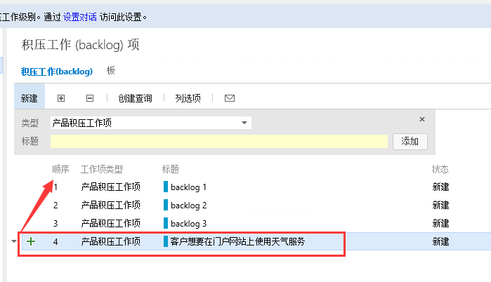

5.	双击打开我们刚创建的工作项，我们可以在工作项信息界面中配置该工作项的详细信息。

6.	将该工作项指派给诸葛亮，设置状态为 **已批准** ，将工作量设置为 **8** 。点击 **保存并关闭** 按钮

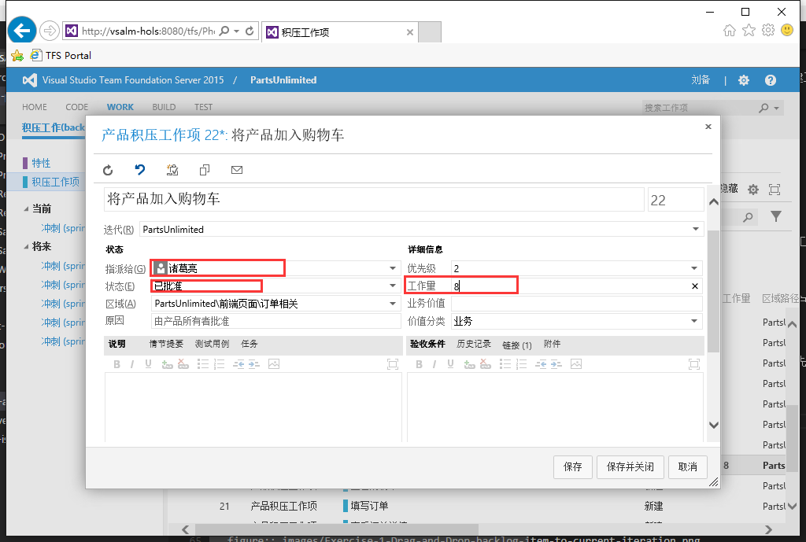

7.	通过将刚创建的工作项拖拽到当前的迭代上来指定该工作项处于当前的迭代周期内。

注意屏幕左侧所列出的迭代列表，这些可以被视为迭代开发计划，将工作项拖入这些节点表示将工作项加入开发计划。

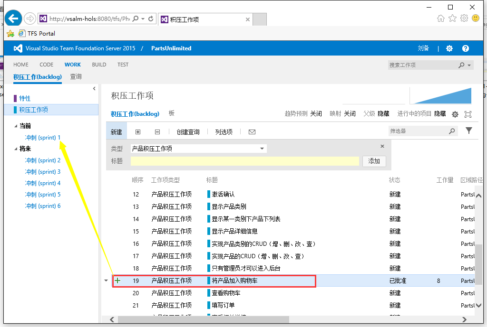

8.	可以在列表中检查该工作项的 **迭代路径** 列的值来确定该工作项是否已分配到当前迭代周期内。

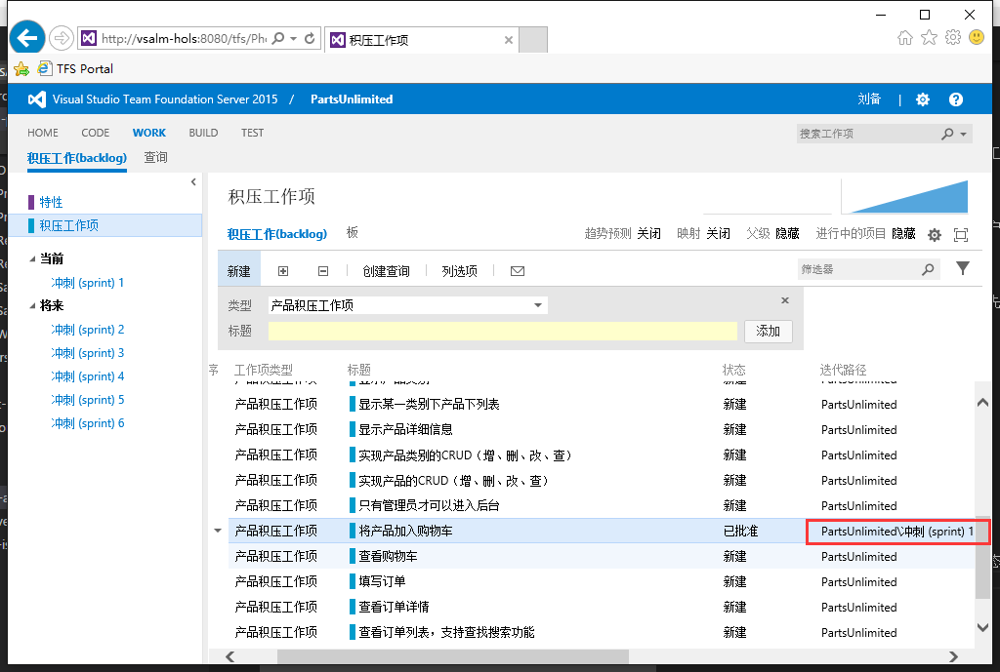

.. note:: 

    如果工作项的状态设置为 **已关闭** 时，该工作项将会从该列表中消失。这样设计正是表达了“积压工作”的含义，只有那些还没有完成的工作才会被显示在这个列表中。

9.  产品积压工作项视图中我们可以点击右上角的两个缩略的小图表来打开速度图和累积流。速度图通过对比团队在每个迭代完成的工作量来反应团队的开发速度情况。累积流表示在一段时间里处于不同状态的工作项的数量及其变化趋势。

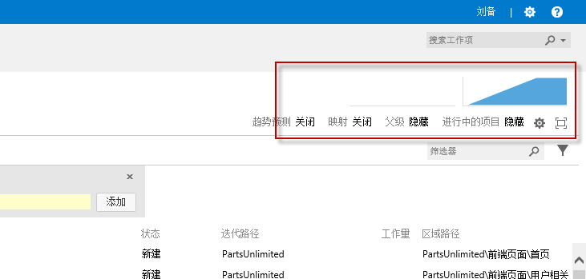

任务三：团队容量计划
^^^^^^^^^^^^^^^^^^^^^^^^^^^^

1.  点击左侧的 **冲刺（sprint）1** ，进入迭代1的工作项视图。在此视图中可以看到我们刚放入迭代1的积压工作项“将产品放入购物车”。利用上述方法我们添加多个积压工作项，并将其放入迭代1中，如下图所示。同时在此视图的右上角我们可以为该迭代设置起始日期。一旦我们为迭代设置起始日期后，我们就可以为这个迭代内分配团队资源了。
迭代内的团队的资源分配可以通过 **容量** 视图来设置。

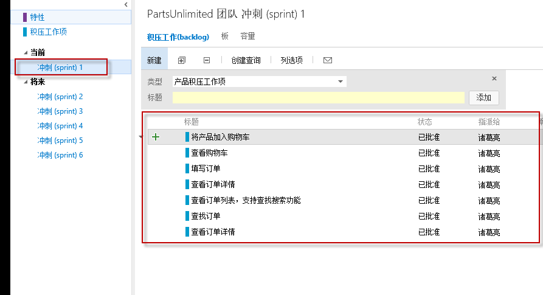

2.  选择 **容量** 链接来查看和设置迭代1的团队资源。

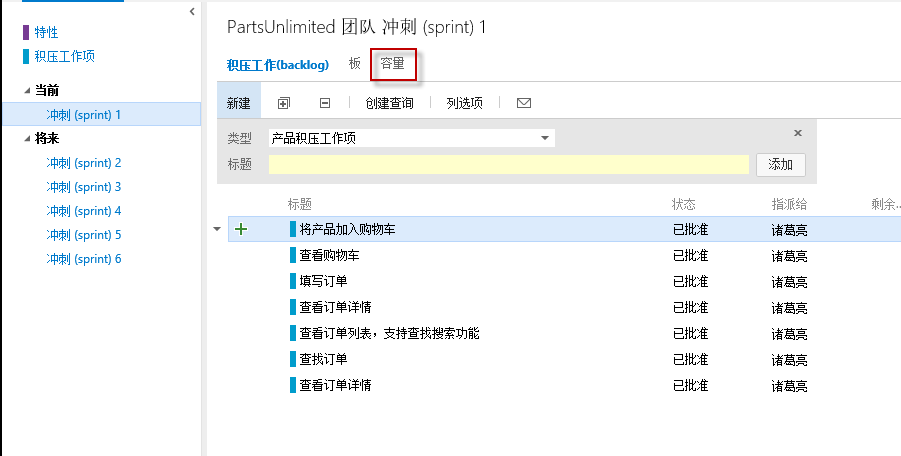

3.  在 **容量** 视图中，我们可以看到每个团队成员都对应有 **休息日** ，**活动** ， **每天的容量** 三个字段。其中 **休息日** 表示该成员在这个迭代中有多少天是不工作的，**活动** 表示该成员在迭代中所做的工作是什么类型的，每天的容量表示该成员在一天中花多长时间来处理迭代中的工作。
我们假设这个迭代中只有 **赵云** 在公司进行开发，并且只能工作 **8** 小时，那么此时的 **容量** 视图如下所示：

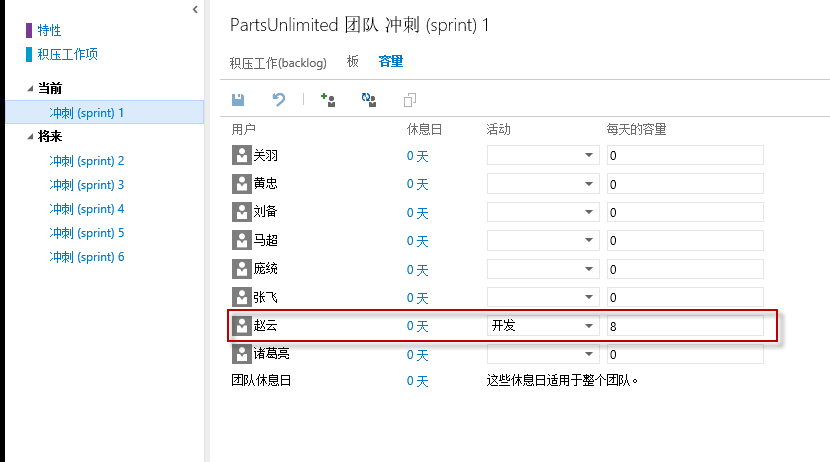

4.  回到我们的 **积压工作（backlog）** 视图，我们假设我们新建的积压工作已经确认通过了，那么现在可以将该积压工作添加任务。选定该积压工作，然后点击左边的 **+** 符号来添加任务。这个任务将会自动表现为积压工作项的子任务，用来帮助描述为了实现该积压工作所需要的技术实现细节。

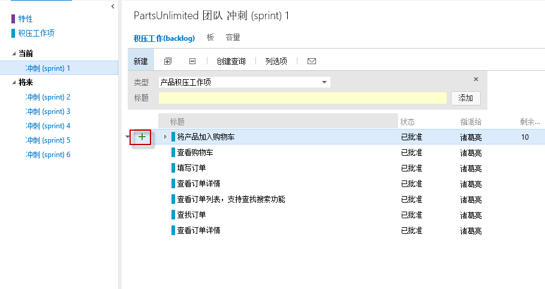

5.  我们可以为新加的子任务设置 **标题** 为“当选定一个产品时，页面上出现一个‘加入购物车’按钮”，**指派给** 设置为 **赵云** ，**剩余工作** 设置为 **10** ，然后 **保存并关闭** 。

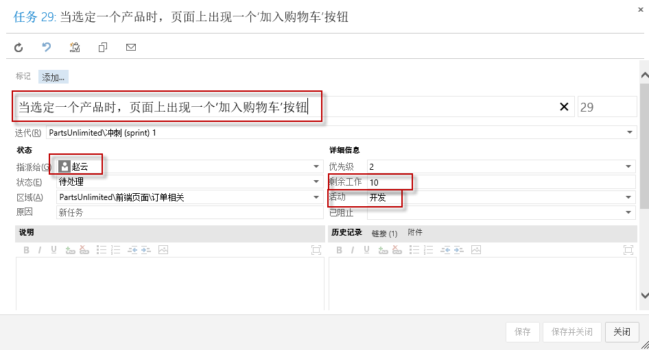

6.  此时我们可以打开右上角的 **工作详细信息** 标签的 **打开/关闭** 按钮来查看当前迭代容量情况。由于这个迭代此时团队的总容量为8小时，而任务量为10小时，所以会出现下图所示的情形，红色表示当前任务量超过团队计划的任务量。一旦出现红色，项目负责人就必须要考虑增加人员或减少迭代的任务量，可以将一些积压工作放入下一个迭代中。

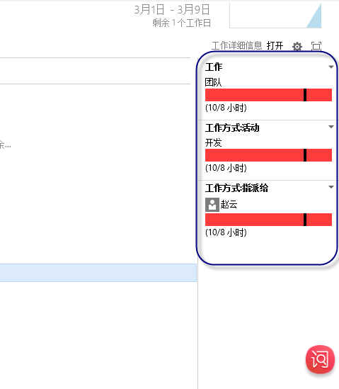

