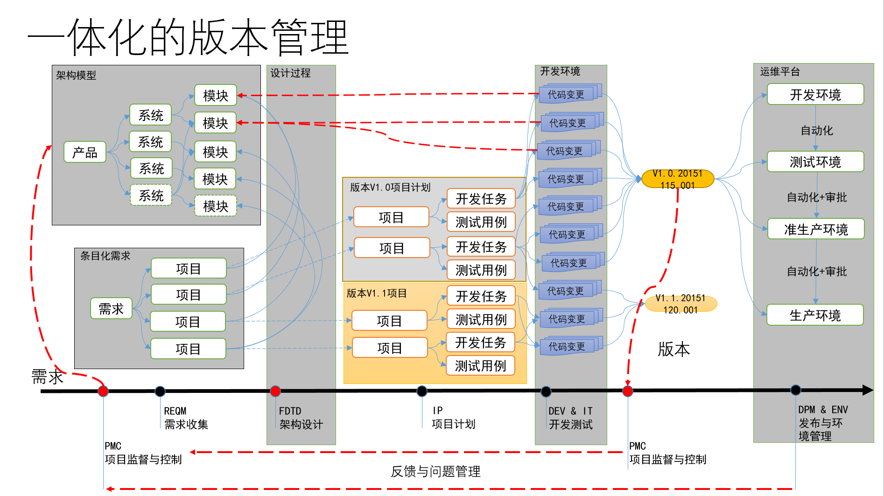

敏捷项目规划 – 产品规划，迭代规划和项目监控
----------------------------------------

在这个试验中，您和您的团队成员将使用TFS内置的敏捷规划工具完成产品backlog管理(包括用户故事和积压工作项2级backlog)。对于已经放入backlog的需求进行优先级排序，并按照产品发布版本进行迭代规划，将需求放入迭代形成迭代开发计划，对需求工作量进行估计并按照团队的能力进行迭代工作量规划。

我们还将模拟2-3个迭代的开发过程，由您和你的团队一起完成具体开发任务的更新，跟踪和交付。

最终，我们将使用报表对您的团队的开发过程进行监控和评估，您将可以使用自定义的报表了解在已经完成的迭代中您的团队的效率如何。

在开发中，我们需要对版本进行2个维度的管理，一个是 **计划版本** 一个是 **发布版本** 。 计划版本指的是我们希望团队所完成的内容，而发布版本指的是团队实际完成的内容。我们需要跟踪这2个维度之间的差异，以及每个维度内所包含的内容，这样才能完成产品的端到端管理。

通过本次实验，您可以学到内置在TFS2015中的敏捷工具和多层级backlog管理工具，以及如何利用它们来帮助您实现在您的团队中快速规划、管理、跟踪您的工作。您将用一个具体的迭代来了解产品积压工作看板、迭代积压工作看板、任务看板来跟踪您的工作流程。我们也将简要了解针对大型团队和组织的增强工具。

练习一
~~~~~

本次练习中，您将会学到如何利用TFS2015来管理您的积压工作、创建工作项、将工作细化成任务、分配任务给指定成员、用任务看板来跟踪任务状态。本次练习中所使用的项目管理工具适用于中小型开发团队进行项目开发。

任务一：登陆TFS Web门户
^^^^^^^^^^^^^^^^^^^^^^

1.	从任务栏中打开IE浏览器并从收藏栏中打开 **TFS Web Portal** 链接。

.. figure:: images/Exercise-1-Open-TFS-Web-Portal-From-Browse.png

2.	使用用户 **刘备** 登陆。(用户名和密码请参考快速入门的 :doc:`/getting-started/sample-project-introduction` 一节内容）

.. figure:: images/Exercise-1-Login-TFS-Web-Portal-From-Browse.png

3.	从TFS主页中，选择 **浏览** 按钮打开项目和团队信息。

.. figure:: images/Exercise-1-Browse-Projects-and-Teams.png

4.  选择 **PartsUnlimited** 项目和默认的团队。

.. figure:: images/Exercise-1-Select-Project-PartsUnlimited-and-default-team.png

5.	接下来会出现PartsUnlimited默认团队的主页视图。该视图提供包含各种信息的卡片组合，例如查询结果卡片、新建工作项卡片、冲刺燃尽图卡片、团队成员卡片等等。

.. figure:: images/Exercise-1-The-team-Portal-of-Project-PartsUnlimited-default-team.png

任务二：管理积压工作项列表
^^^^^^^^^^^^^^^^^^^^^^^^^^^^

1.	通过选择屏幕顶部的 **Work** 标签来导航到积压工作项界面

.. figure:: images/Exercise-1-Go-to-Backlog-UI.png

2.	产品积压工作项可以帮助我们定义那些需要做的工作。一旦你拥有一个积压工作，你可以用它来管理当工作进展的状态变更，如：工作完成或与工作项关联的事项被迁入，测试通过，或者其他一些相关事项发生的情况。每个产品积压工作项均有很多不同的字段帮助你对要管理的信息进行跟踪，并提供基于状态转换的工作流来帮助你跟踪进度。

.. figure:: images/Exercise-1-The-Backlog-UI.png

3.	试想下当我们的团队成员被要求实现一个新的产品积压工作项。这个产品积压工作项可以使顾客将浏览的产品加入购物车。这个产品积压工作项应该被设置为高优先级，因为产品负责人（PO）从用户那里得到了很强烈需要此功能的反馈。

现在你需要在标题这一栏中输入 **将产品加入购物车** ，并点击 **添加** 按钮将此积压工作项加入列表。

.. figure:: images/Exercise-1-Create-the-ShoppingCart-service-backlog-item.png

.. note:: 
    请注意列表中有一条红色的横线，这表示你所新添加的工作项出现的位置，你可以通过点选不同的工作项来控制这条线的位置，将新工作项直接放入特定位置。

如果你的工作项不在正确的位置，请使用鼠标拖拽完成优先级排序操作。

4.	在产品积压工作列表中，工作项是按照优先级来进行排序的，优先级高的位于最上面。我们刚才创建的工作项拥有高优先级，所以我们应该将它拖拽到列表的最顶端。

.. figure:: images/Exercise-1-Drag-and-Drop-backlog-item-for-list.png

5.	双击打开我们刚创建的工作项，我们可以在工作项信息界面中配置该工作项的详细信息。

将该工作项指派给诸葛亮，设置状态为 **已批准** ，将工作量设置为 **8** 。点击 **保存并关闭** 按钮

.. note:: 
    
    在Scrum中，敏捷团队一般使用 **故事点** 的方式来标识工作量，故事点使用1，2，3，5，8，11这样的 **斐波那契数列值** 来标识相对工作量。由于在我们进行项目规划时往往无法准确的估计工作量的大小，但是不同工作项之间的相对大小比较容易判断，所以我们这里只标识相对工作量的大小，而将更加准确的工作量估算留待迭代中进行，因为那个时候团队将对积压工作进行分解，形成具体的开发任务，这是我们就可以使用小时来进行更加准确的估算了。
    
    关于**斐波那契数列值**，请查考 
    
    https://zh.wikipedia.org/wiki/%E6%96%90%E6%B3%A2%E9%82%A3%E5%A5%91%E6%95%B0%E5%88%97
    
    关于 **故事点**， 请参考
    
    https://agilefaq.wordpress.com/2007/11/13/what-is-a-story-point/ 

.. figure:: images/Exercise-1-Edit-the-detail-information-of-backlog-item.png

6.	通过将刚创建的工作项拖拽到当前的迭代上来指定该工作项处于当前的迭代周期内。

注意屏幕左侧所列出的迭代列表，这些可以被视为迭代开发计划，将工作项拖入这些节点表示将工作项加入开发计划。

.. figure:: images/Exercise-1-Drag-and-Drop-backlog-item-to-current-iteration.png

可以在列表中检查该工作项的 **迭代路径** 列的值来确定该工作项是否已分配到当前迭代周期内。

.. figure:: images/Exercise-1-Check-the-backlog-item-iteration.png

.. note:: 

    如果工作项的状态设置为 **已关闭** 时，该工作项将会从该列表中消失。这样设计正是表达了“积压工作”的含义，只有那些还没有完成的工作才会被显示在这个列表中。

7.  产品积压工作项视图中我们可以点击右上角的两个缩略的小图表来打开速度图和累积流。速度图通过对比团队在每个迭代完成的工作量来反应团队的开发速度情况。累积流表示在一段时间里处于不同状态的工作项的数量及其变化趋势。

.. figure:: images/Exercise-1-Velocity-chart-and-burndown-chart.png

任务三：团队容量计划
^^^^^^^^^^^^^^^^^^^^^^^^^^^^

1.  点击左侧的 **冲刺（sprint）1** ，进入迭代1的工作项视图。在此视图中可以看到我们刚放入迭代1的积压工作项“将产品放入购物车”。利用上述方法我们添加多个积压工作项，并将其放入迭代1中，如下图所示。同时在此视图的右上角我们可以为该迭代设置起始日期。一旦我们为迭代设置起始日期后，我们就可以为这个迭代内分配团队资源了。
迭代内的团队的资源分配可以通过 **容量** 视图来设置。

.. figure:: images/Exercise-1-The-view-of-sprint-1.png

2.  选择 **容量** 链接来查看和设置迭代1的团队资源。

.. figure:: images/Exercise-1-Select-team-capacity.png

3.  在 **容量** 视图中，我们可以看到每个团队成员都对应有 **休息日** ，**活动** ， **每天的容量** 三个字段。其中 **休息日** 表示该成员在这个迭代中有多少天是不工作的，**活动** 表示该成员在迭代中所做的工作是什么类型的，每天的容量表示该成员在一天中花多长时间来处理迭代中的工作。
我们假设这个迭代中只有 **赵云** 在公司进行开发，并且只能工作 **8** 小时，那么此时的 **容量** 视图如下所示：

.. figure:: images/Exercise-1-Set-team-capacity.png

4.  回到我们的 **积压工作（backlog）** 视图，我们假设我们新建的积压工作已经确认通过了，那么现在可以将该积压工作添加任务。选定该积压工作，然后点击左边的 **+** 符号来添加任务。这个任务将会自动表现为积压工作项的子任务，用来帮助描述为了实现该积压工作所需要的技术实现细节。

.. figure:: images/Exercise-1-Add-task-to-backlog.png

5.  我们可以为新加的子任务设置 **标题** 为“当选定一个产品时，页面上出现一个‘加入购物车’按钮”，**指派给** 设置为 **赵云** ，**剩余工作** 设置为 **10** ，然后 **保存并关闭** 。

.. figure:: images/Exercise-1-Set-detail-information-for-task.png

.. note:: 

    这里的 **剩余工作** 字段所设置的 **10** 一般表示10个小时。

6.  此时我们可以打开右上角的 **工作详细信息** 标签的 **打开/关闭** 按钮来查看当前迭代容量情况。由于这个迭代此时团队的总容量为8小时，而任务量为10小时，所以会出现下图所示的情形，红色表示当前任务量超过团队计划的任务量。一旦出现红色，项目负责人就必须要考虑增加人员或减少迭代的任务量，可以将一些积压工作放入下一个迭代中。

.. figure:: images/Exercise-1-Open-work-detail-information.png

练习二
~~~~~

本次练习中，我们将会学习如何使用TFS进行敏捷项目组合管理，可以允许大型公司和组织进行多团队协作开发。我们将在PartsUnlimited项目上实现多个团队协同工作。

任务一：配置团队层级和区域路径
^^^^^^^^^^^^^^^^^^^^^^^^^^^^

1.  点击右上角的 **管理服务器** 按钮（齿轮形状），进入TFS管理页面。此时从我们可以看到，PartsUnlimited项目目前只有一个默认团队，这个团队是创建项目时默认建立的。由于我们的示例项目包含前端网页和后台管理功能，所以我们可以再创建两个团队，前端开发团队和后台开发团队。
由于每个团队各自只关心分配给他们的任务，所以我们要求积压工作视图只显示每个团队自己的需求和任务，这一点可以通过给 **不同团队** 分配 **不同的区域路径** 实现。现在我们可以通过点击 **新建团队** 按钮来创建团队。

.. figure:: images/Exercise-2-Get-into-configure-page.png

.. figure:: images/Exercise-2-Profile-of-team-project.png

2.  在 **创建新团队** 窗口中，输入 **团队名称** 为“前端开发”，**不勾选** “使用团队名称创建区域路径”，然后点击 **创建团队** 。

.. figure:: images/Exercise-2-Create-new-team.png

3.  利用同样的方式，我们可以添加“后台开发”团队。团队添加后的界面应该如下图所示：

.. figure:: images/Exercise-2-View-of-project-teams.png

4.  接下来我们需要为我们的项目创建区域路径。区域路径是从我们 **样例项目背景** 的 **用户故事地图** 地图中提取出来的。点击 **区域** 选项卡，我们可以看到当前只有以项目名称命名的根区域。我们先选择根区域，然后点击 **新建子级** 按钮，弹出 **创建区域** 窗口，在 **区域名称** 中输入“前端页面”，点击 **保存并关闭** 。

.. figure:: images/Exercise-2-View-of-initial-Area.png

.. figure:: images/Exercise-2-Create-new-area.png

5.  可以看到在根区域中下一级出现了“前端页面”区域。同理可以在根区域中加入“后台页面”、“系统功能”。同理，当我们选定“前端页面”这个区域时，点击 **新建子级** 按钮，我们就可以在该区域下新建子区域了。我们可以将用户故事地图中的区域信息按照这样的方式完整的录入到 **区域** 下。

.. figure:: images/Exercise-2-View-of-Area-1.png

.. figure:: images/Exercise-2-View-of-complete-Area.png

6.  下面我们需要做的就是为 **每个团队** 设置各自的 **区域**。当需求或积压工作分配到某个区域路径时，只有与区域对应的团队成员才能看到这些需求或积压工作，其他团队成员看不见，也就是对其他团队屏蔽。根据项目的实际情况，我们应该将区域 **前端页面** 分配给 **前端开发** 团队，**后台页面** 和 **系统功能** 分配给 **后台开发** 团队。点击 **概述** 选项卡，进入项目的概述页面，然后点击 **前端开发** 团队，进入该团队的设置页面，然后点击 **区域** 选项卡，勾选 **前端页面** ，右键点击 **前端页面** ，在快捷菜单中选择 **包含子区域** ，此时 **前端开发** 团队与 **前端页面** 及其子区域进行了绑定。同理可以将 **后台开发** 团队与 **后台页面** 和 **系统功能** 及其子区域进行绑定。

.. figure:: images/Exercise-2-Configure-Area-for-project-teams.png

7.  接下来我们回到项目积压工作项页面，将一些前端需求和后台需求分配到相应的区域路径。选择 **首页框架** 和 **登陆页面** 这两个积压工作，将它们的 **区域路径** 字段值分别设为 **PartsUnlimited\前端页面\首页**、**PartsUnlimited\前端页面\用户相关**，将 **用户查询** 和 **用户审核** 的 **区域路径** 字段设为 **PartsUnlimited\后台页面\用户管理** 。

.. figure:: images/Exercise-2-Put-some-WorkItem-to-team-Area.png

8.  接下来我们来验证设置我们的设置。点击页面的标题部分的导航栏，选择 **浏览全部** 按钮，弹出项目和团队选择框，选择 **前端开发** 团队，点击 **导航**，进入该团队的积压工作页面，此时我们可以看到 **积压工作（backlog）** 列表中只有 **首页框架** 和 **登陆页面** 这两个积压工作项，与我们要求的完全一致。同理可以验证 **后台开发** 团队能看到的积压工作项也是我们刚才设置的。

.. figure:: images/Exercise-2-WorkHub-of-frontDev.png

.. figure:: images/Exercise-2-WorkHub-of-endDev.png

练习三
~~~~~

在前面的练习中，我们已经了解了如何使用TFS进行多团队协作开发。在本练习中，我们将会学到如何使用看板以及看板是如何提高敏捷开发效率的。同时也会介绍下工作项标记的功能。这些功能都是可以根据团队的实际情况可定制的，而不需要修改过程模板文件的。

任务一：介绍 **看板** 工具
^^^^^^^^^^^^^^^^^^^^^^^^^^^^

1.  可以使用看板来跟踪工作项的状态，如查看当前正在进行的工作、工作的执行人员、下一步需要执行的工作以及完成的工作等。转到团队的“积压工作(backlog)”页并打开看板。 团队项目的所有参与者都可以使用看板更新工作状态。

.. figure:: images/Exercise-3-View-of-backlog-items-kanban.png

2.  此时我们可以看到kanban中共有四列，对应着backlog积压工作项的4个状态，分别是New（新建）、Approve（确认）、Committed（已提交）、Done（完成）。当前所有的工作项都处于New（新建）状态，每个工作项都是用一个小卡片表示。小卡片上当前显示工作项的标题和被指派的团队成员，我们也可以自定义工作项卡片上显示的字段，
将我们所关心的内容字段显示在卡片上。点击kanban右上角的 **齿轮** 图标，进入看版设置窗口，点击左侧的 **字段** 标签，然后点击 **附加字段** 下的 **字段** **+** ，在出现的 **下拉框** 中选择想要在卡片上显示的字段。我们可以添加字段 **Area Path** （区域路径）字段和 **State**（状态）字段。

.. figure:: images/Exercise-3-Add-field-to-card.png

3.  回到kanpan视图，可以看到此时卡片上已出现了 **Area Path** 字段和 **State** 字段。当然我们可以在 **设置** 窗口中设置kanban的其它属性,如修改卡片的样式、颜色，在kanban中添加或移动状态列,设置每一列中工作项的最大个数，kanban中是否显示bug，设置工作日等等。

.. figure:: images/Exercise-3-modify-column-for-card.png

.. figure:: images/Exercise-3-modify-WIP-for-card.png

.. figure:: images/Exercise-3-Add-notice-for-column.png

.. figure:: images/Exercise-3-Add-style-for-card.png

.. figure:: images/Exercise-3-Deal-with-bug-for-card.png

4.  回到kanban视图，此时所有的工作项都分配给了 **诸葛亮** ，需要他对这些工作项进行审批确认。假设此时诸葛亮已经对前三个工作项进行了确认，那他需要将前三个工作项 **托拽** 到 **Approve** 列。

.. figure:: images/Exercise-3-Drag-workitem-to-other-column-1.png

.. figure:: images/Exercise-3-Drag-workitem-to-other-column-2.png

.. figure:: images/Exercise-3-Drag-workitem-to-other-column-3.png

5.  可以看到此时该三个工作项卡片上的 **State** 的值变为 **Approve** 了。此时诸葛亮可以将该三个工作项指派给其他开发人员，开发人员根据自己的完成情况来同样拖拽卡片，来更改工作项状态，使流程继续走下去。

.. figure:: images/Exercise-3-Change-state-of-workitem-card.png

任务二：使用 **标记**
^^^^^^^^^^^^^^^^^^^^^^^^^^^^

1.  使用标记可以很容易对工作项进行归类，方便以后对工作项的查询和刷选。

2.  回到积压工作项列表。假设我们现在的积压工作有部分同时需要同时在手机端实现，我们就可以利用标记功能来对这些积压工作项进行标记，方便以后进行查找。例如，序号为1、4、6这三个工作项需要同时在手机端实现，那么可以分别打开这三个工作项，添加 **标记** “手机”。

.. figure:: images/Exercise-3-Add-flag-to-workitem-1.png

.. figure:: images/Exercise-3-Add-flag-to-workitem-2.png

.. figure:: images/Exercise-3-Add-flag-to-workitem-3.png

3.  接下来我们就可以利用 **标记** 来查看我们刷选工作项。点击工作项列表的右上角 **漏斗** 图标，会在下面出现标记 **手机** 字样，我们点击 **手机** 标签，会发现积压工作项列表中已经刷选出含有标记 **手机** 工作项。

.. figure:: images/Exercise-3-filter-tag-from-workitems-1.png

.. figure:: images/Exercise-3-filter-tag-from-workitems-2.png

练习四
~~~~~

在本次练习中，我们将会学到如何查询工作项，以及根据查询来生成图表。利用图表我们能更好的展现项目当前的状态。

任务一：创建和共享工作项图表
^^^^^^^^^^^^^^^^^^^^^^^^^^^^

1.  我们现在回到积压工作项列表界面。假设现在我们想要更好的查看哪些工作项的状态是 **Approve** （已确认），都已指派给了哪些成员。点击 **查询** 选项卡进入工作项查询界面。

.. figure:: images/Exercise-4-Navigate-to-Query-view.png

2.  首先我们必须要定义一个查询，来获取我们想要的一些工作项数据。点击 **新建** 下拉按钮，选择 **新建查询** 。

.. figure:: images/Exercise-4-Create-new-query.png

3.  新建的查询默认会查询当前项目的所有状态的工作项。我们想要筛选出所有状态为 **Approve** 的工作项，所以必须要修改字段 **State** 的值为 **Approve** 。

.. figure:: images/Exercise-4-modify-state-value-for-query.png

4.  修改好查询条件后，我们可以运行查询来验证是不是我们想要的结果。点击 **运行查询** 图标，可以在查询定义的下面得到查询结果。

.. figure:: images/Exercise-4-Result-of-query.png

5.  当我们确认该查询无误后，可以将该查询保存到 **共享查询** 文件夹中。

.. figure:: images/Exercise-4-Save-query-in-share-folder.png

6.  接下来我们可以根据我们刚才新建的查询来创建图表了。点击 **图表** 选项卡进入创建图表的界面。

.. figure:: images/Exercise-4-Navigate-to-Chart-view.png

7.  图表创建完成后，返回 **图表** 界面后，可以看到刚才创建的图表已经显示出来了。我们还可以将该图表放入团队首页仪表盘，使每个团队成员都能看见。点击图表中的 **...** 按钮，选择 **添加到仪表盘-概述** 。

.. figure:: images/Exercise-4-View-of-query-Chart.png

8.  当我们返回到团队的首页后，我们可以在仪表盘中看到我们刚才放入仪表盘中的图表。

.. figure:: images/Exercise-4-Chart-on-dashboard.png
