练习二: 建立产品发布管道 - 实现自动发布
~~~~~~~~~~~~~~~~~~~~~~~~~~~~~~~~~~~~~

建立发布管道可以帮助团队快速的将新版本部署到开发，测试或者生产环境，加速开发与测试，开发与运维，最终用户与开发之间的迭代速度。一个团队迭代速度的快慢决定其适应变化的能力，也是判断一个团队敏捷程度的重要标志。

任务一：在 **生成定义** 中添加 打包步骤
^^^^^^^^^^^^^^^^^^^^^^^^^^^^^^^^^^^^^^^^^^

应用程序打包是为了能够方便部署而将程序的文件结构调整为目标环境可以直接使用的格式，这个格式与开发时所用的格式往往不同。

1. 添加打包步骤

首先按照 *练习一 | 任务一：创建生成定义 | 步骤4-5* 中的方式在添加一个 PowerShell 任务，并将其放置在 *编译* 任务一下。并对这个任务的参数做如下配置

================    ===========
    参数              值
================    ===========
Script filename     publish.ps1
Arguments           -BuildConfiguration $(BuildConfiguration)
================    ===========

如下图：

.. figure:: images/CI-Exercise-1-add-powershell-task-publishscript.png

这个 publish.ps1 脚本将调用 dnu publish 这个命令来完成网站的打包工作，由于我们的网站中用到了很多前端工具，其中还会调用 npm 和 grunt 来完成前端脚本的打包工作。

publish.ps1 的内容如下：

.. code-block:: powershell

    # Publish to a self-contained folder
    & scripts/Call-Dnu.ps1 publish src/PartsUnlimitedWebsite -o artifacts\Publish --runtime dnx-clr-win-x64.1.0.0-rc1-update1 --no-source

2. 将打包结果上传至服务器

选中 **Copy Files** 这个生成任务，并在 **Contents** 这个参数中添加一行

.. code-block:: powershell

    **\publish\** 

如下图：

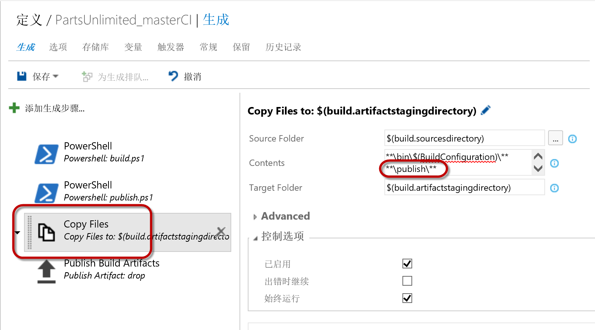

3. 触发生成以便将打包完成的文件上传至服务器

按照 *练习一 | 任务二：运行生成* 中的步骤触发生成并等待生成完成。

任务二：创建发布定义
^^^^^^^^^^^^^^^^^^^^^^^^^^^

与 **生成定义** 类似，在TFS中使用 **发布定义** 来管理发布管道。在一个 **团队项目** 可以创建多条发布管道分别对应不同的代码分支，团队或者目标环境。

1. 创建 **发布定义**

登录系统，并切换至 **发布** 视图，点击 **加号** 图标，创建新的 **发布定义**

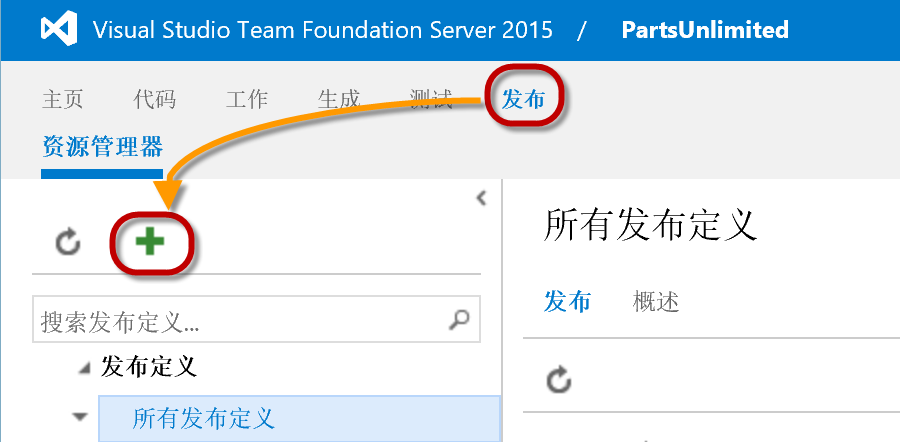

在弹出的 **部署模板** 对话框中，选择 **Emtpy** （空模板）并点击 **确定** 

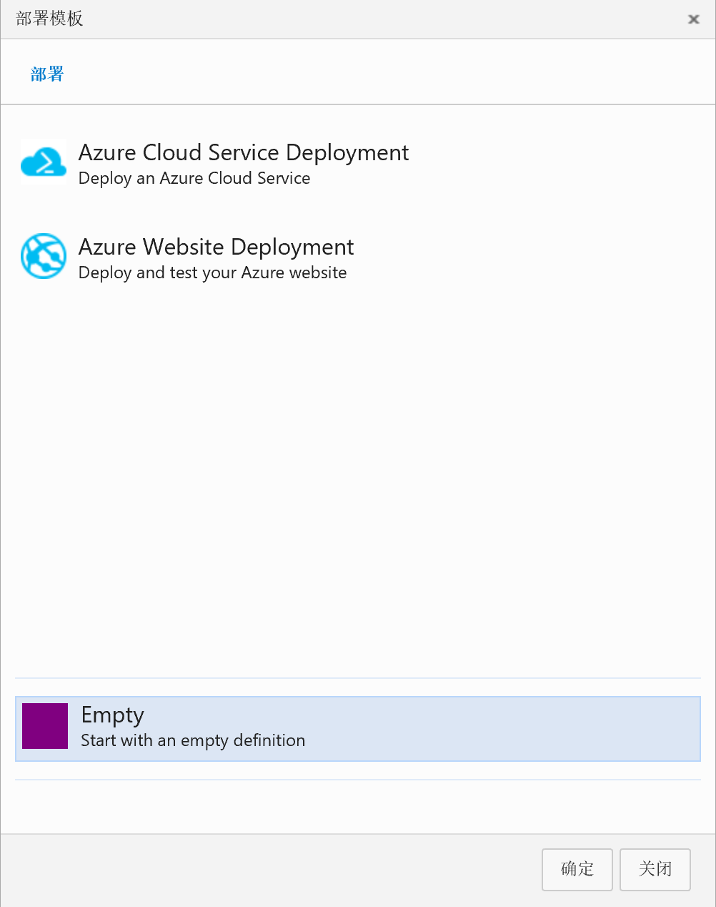

在名称中输入 **PartsUnlimited_Pipleline**，将第一个环境命名为 **测试环境** ，并单击 **保存** 按钮

.. figure:: images/CI-Exercise-2-create-release-definition-2.png

2. 将 **发布定义** 链接到 **生成定义** 上

单机 **链接到生成定义** 链接，并选择 **PartsUnlimited_masterCI** 定义，点击 **链接**

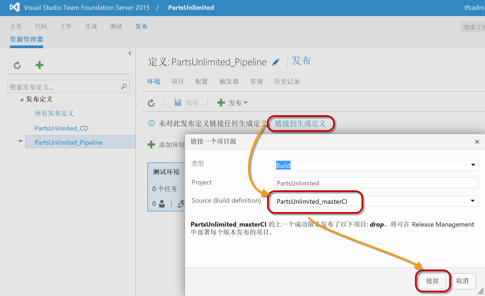

3. 配置 **测试环境** 的部署任务

在 **测试环境** 中点击 **添加任务** 

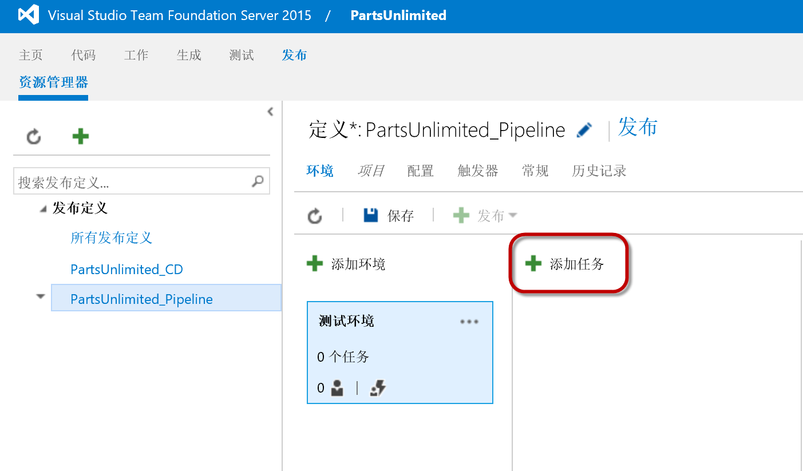

在弹出的 **添加任务** 对话框中选择 **部署 | Windows Machine File Copy** , 并点击 **添加** 按钮

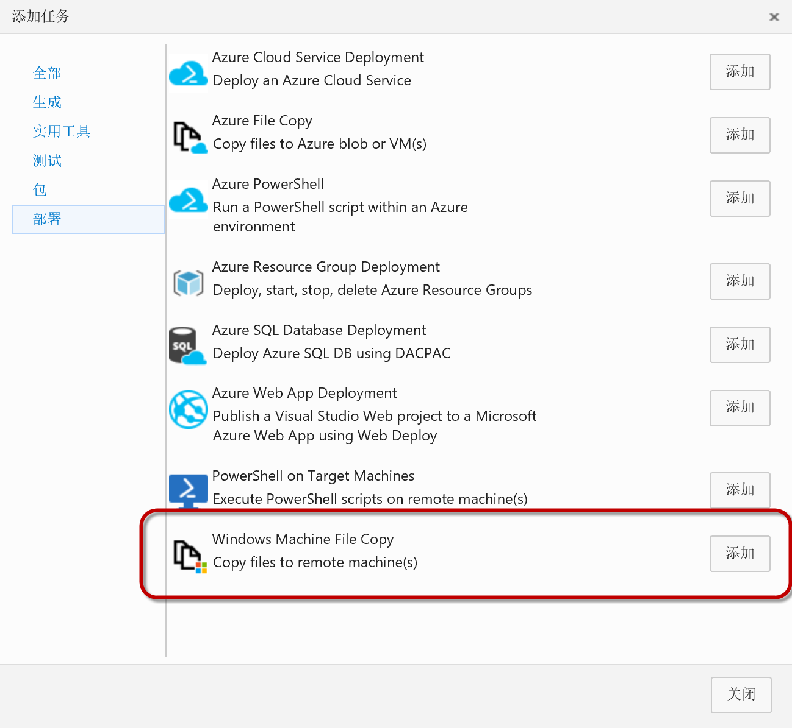

4. 配置 Windows Machine File Copy 任务 

点击 **Source** 参数后面的 **...** 标志

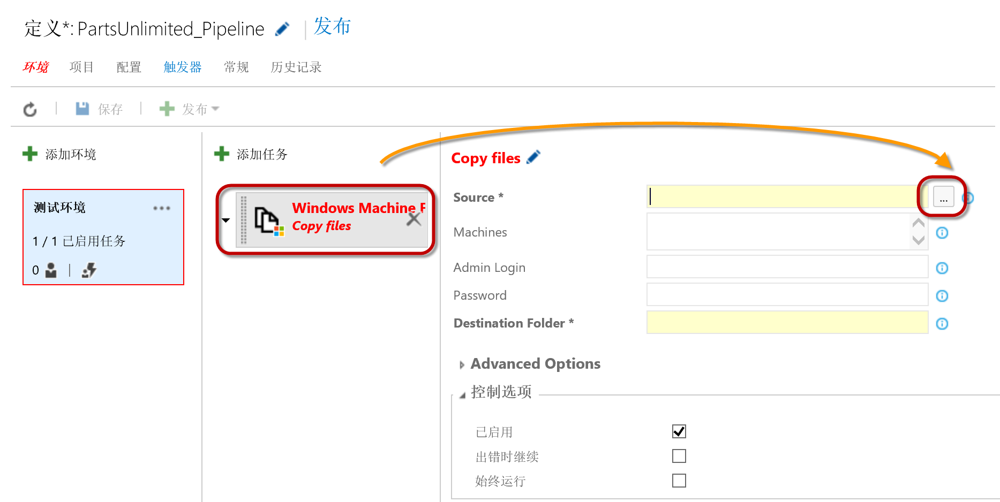

在弹出的 **选择文件或文件夹** 对话框中选择 

PartsUnlimited_masterCI/drop/artifacts/Publish 这个文件夹，并单击 **确定** 按钮

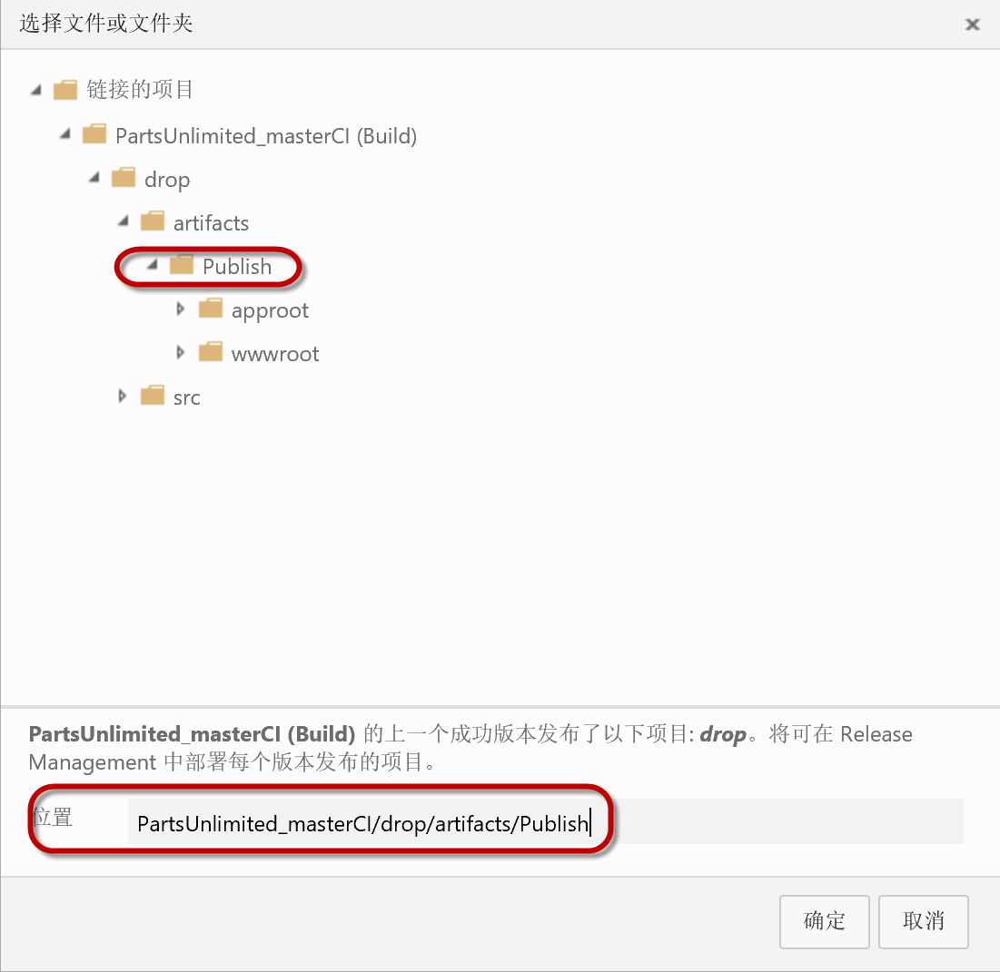

.. note::

    这个文件夹由 *练习二 | 任务一* 创建，如果您看不到这个文件夹，请从新执行这个步骤。

并对以下参数进行配置

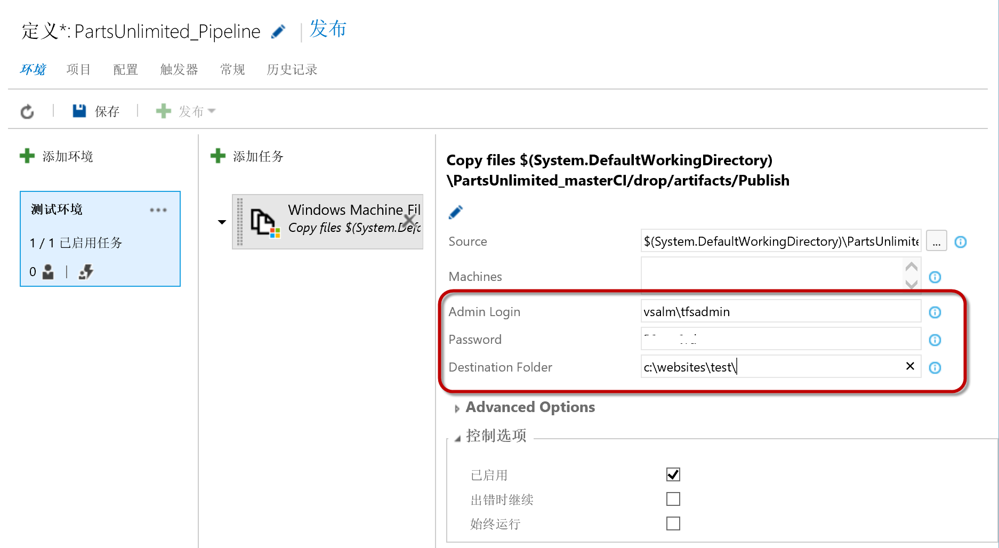

=================== ===========
    参数                 值
=================== ===========
Admin login          (对目标服务器有管理员权限的账户)
P2ssw0rd             (以上账户的密码)
Destination Folder   c:\\websites-[TeamID]\\test 
=================== ===========

.. note:: 
    
    为了简化实验的目的，我们已经在目标服务器上针对以下目录配置了IIS的站点
    
    ========== ========================== =====
    TeamID               目录               URL
    ========== ========================== =====
    A           c:\\websites-A\\test       http://[实验服务器]:8022
    A           c:\\websites-A\\pro        http://[实验服务器]:8023
    B           c:\\websites-B\\test       http://[实验服务器]:8032
    B           c:\\websites-B\\pro        http://[实验服务器]:8033
    C           c:\\websites-C\\test       http://[实验服务器]:8042
    C           c:\\websites-C\\pro        http://[实验服务器]:8043
    D           c:\\websites-D\\test       http://[实验服务器]:8052
    D           c:\\websites-D\\pro        http://[实验服务器]:8053
    ========== ========================== =====
    
    实际工作中，可以使用其他的 PowerShell 脚本来完成这个工作，可以参考
    
    `使用Powershell创建IIS站点 <http://www.iis.net/learn/manage/powershell/powershell-snap-in-creating-web-sites-web-applications-virtual-directories-and-application-pools>`_
    
4. 克隆环境

以上我们已经完成了 **测试环境** 的部署任务配置，为了实验简化目的，我们使用同样服务器的不同端口来模拟不同的环境，因此 **生产环境** 的配置不过是另外一个目录而已。所以，我们使用 **克隆环境** 来完成这一步操作。

点击 **测试环境** 右上角的 **...** 标识，并选择 **克隆环境** 

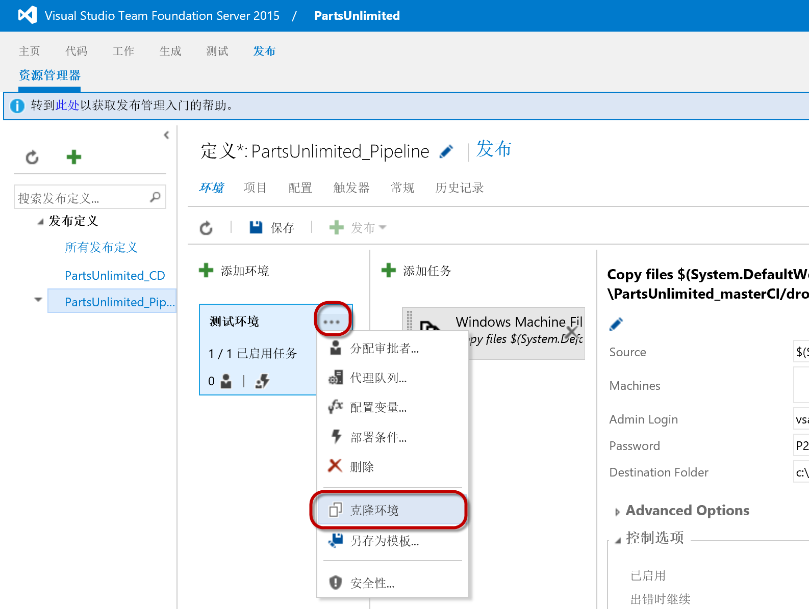

修改 Destination Folder 这个参数为：

=================== ===========
    参数                 值
=================== ===========
Destination Folder   c:\\websites\\pro  
=================== ===========

最后保存我们的 **发布定义** 

任务三：触发部署
^^^^^^^^^^^^^^^^^^^^^^^^^^^

1. 创建部署

在 **PartsUnlimited_Pipleline** 这个 **发布定义** 上点击 **发布 | 创建发布** 

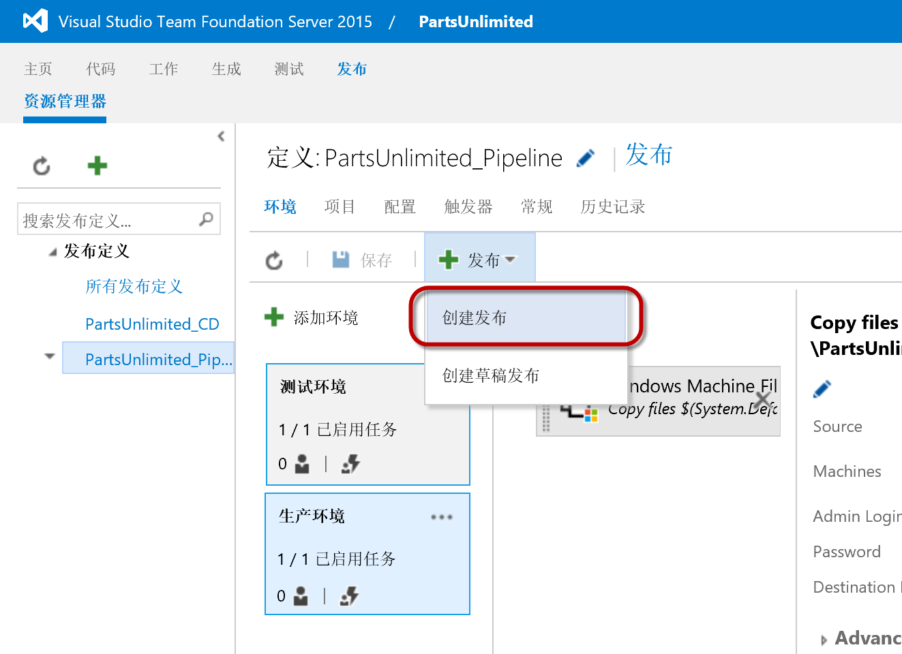

在弹出的 **创建PARTSUNLIMITED_PIPELINE的新版本** 对话框中，选择最新的版本，并单击 **创建** 按钮

.. figure:: images/CI-Exercise-2-create-deployment-1.png

2. 运行发布

在 PartsUnlimited_Pipleline / Release 1 上选择 **部署 | 测试环境** 启动一个向 **测试环境** 的部署任务

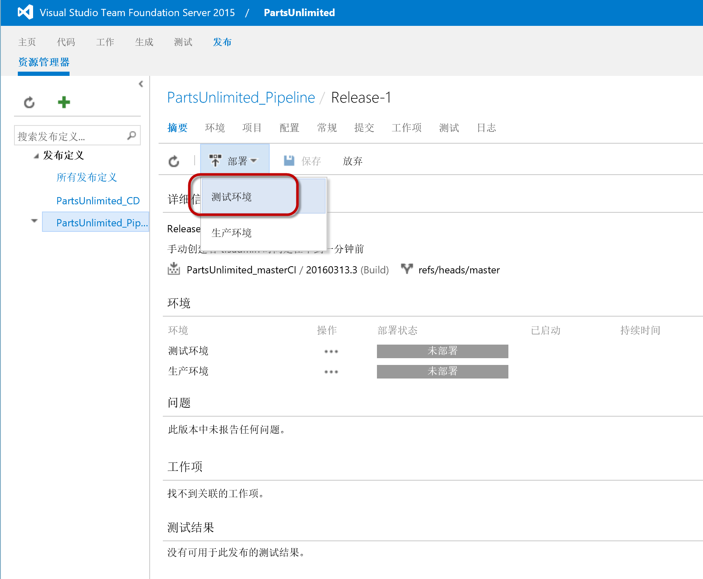

在弹出的  **在 测试环境 上部署 Release 1** 对话框中点击 **部署** 按钮

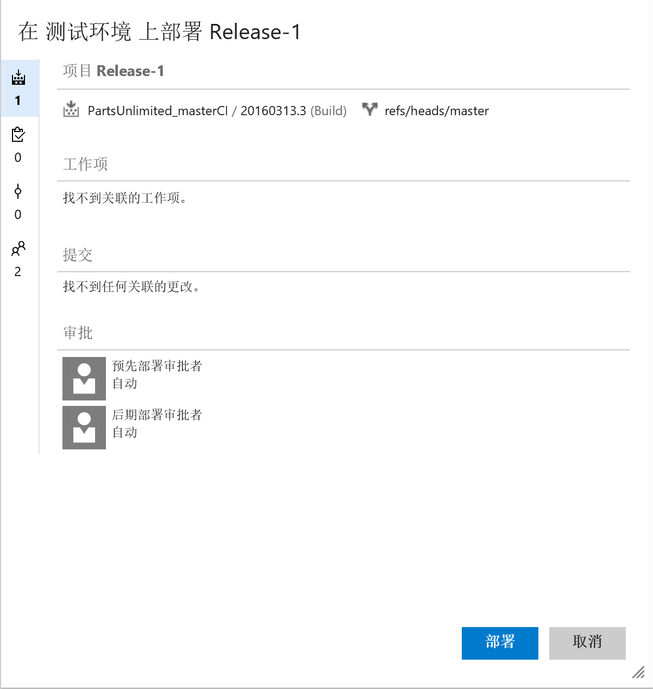

3. 查看部署进度

可以看到 **测试环境** 的进度条中显示 **正在进行** 或其他状态

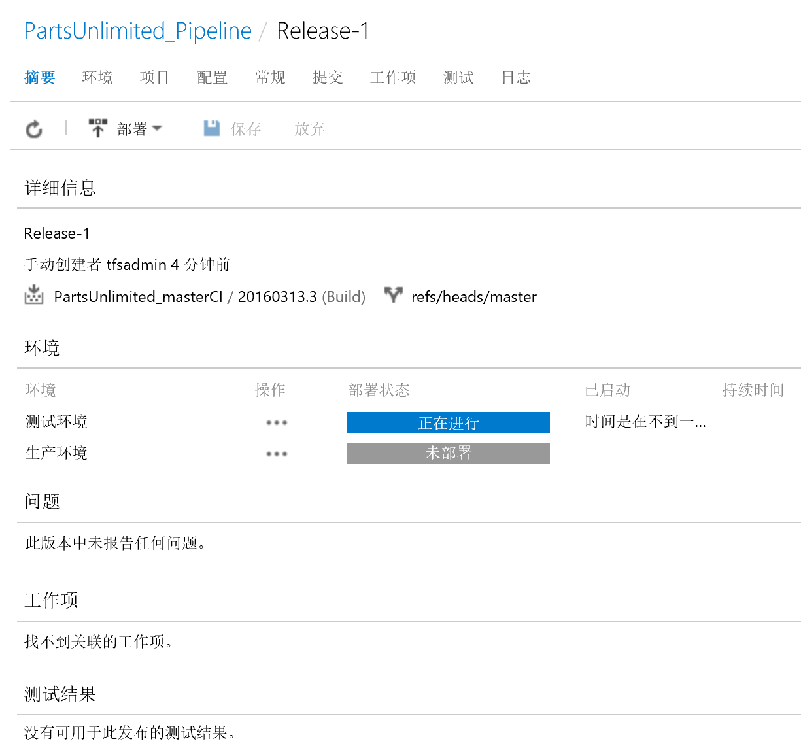

也可以切换至 **日志** 视图查看脚本的输出日志

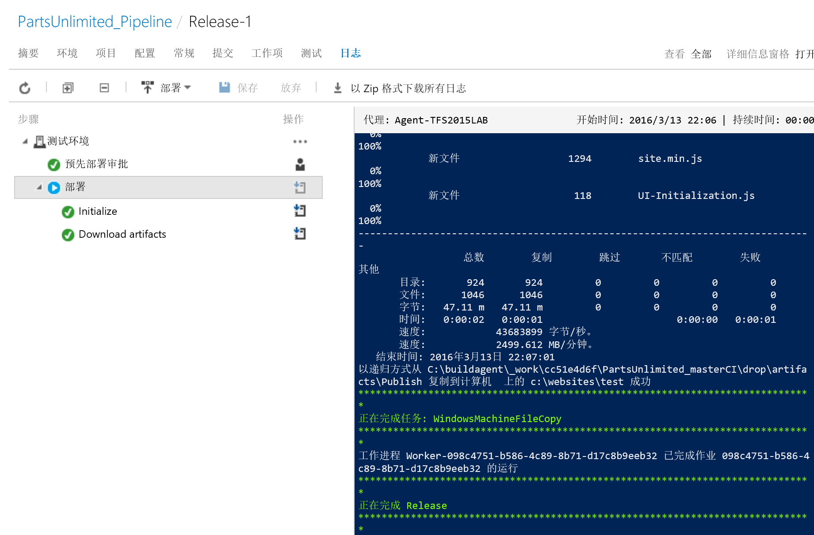

最终，如果一切顺利，进度条将显示 **成功** 

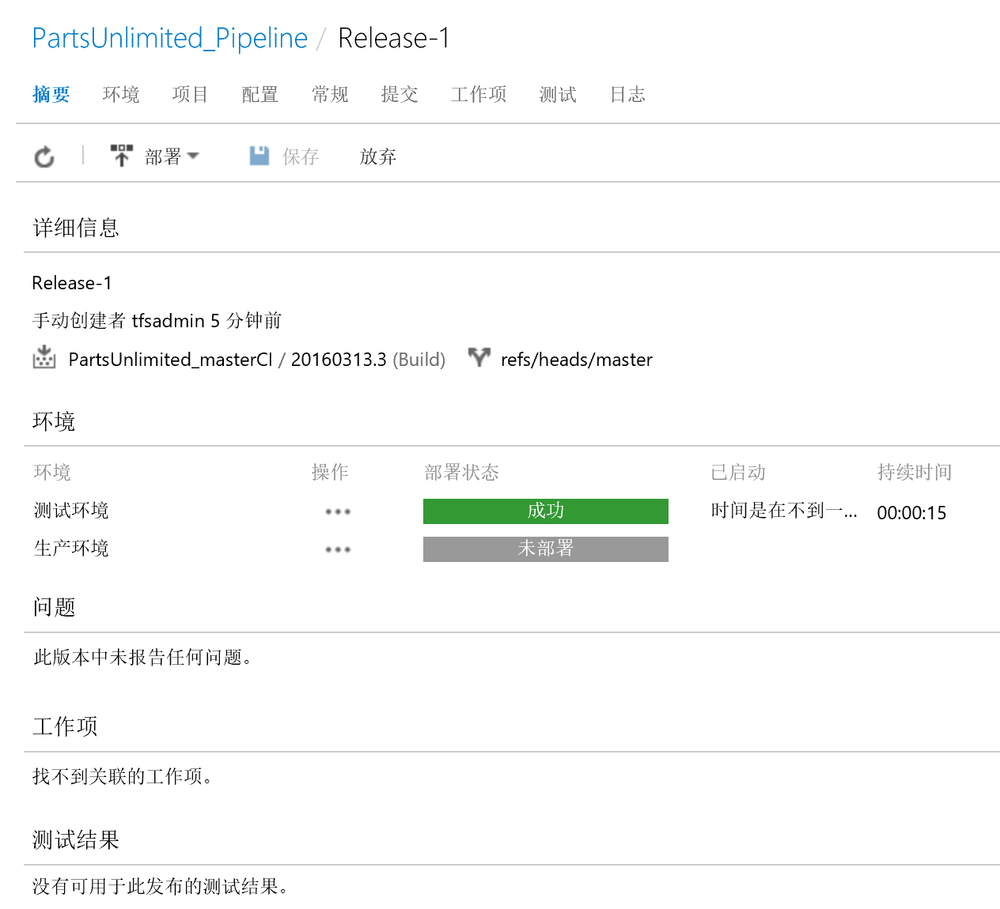

4. 查看部署完成的网站

我们可以打开一下地址看到 PartsUnlimited 站点已经可以运行

* 测试站点地址为 http://[实验服务器]:8012/
* 生产站点地址为 http://[实验服务器]:8013/

到这里为止，我们已经完成了我们所规划中的自动化编译和部署，如下图中的灰色部分：

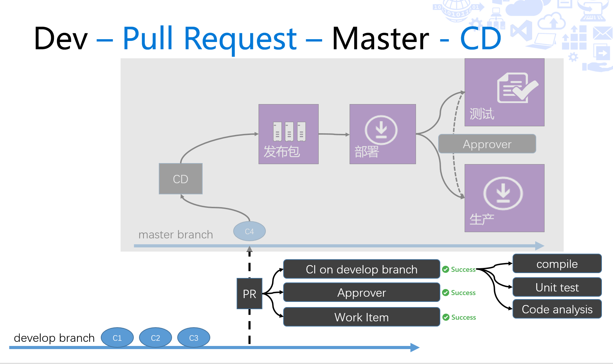