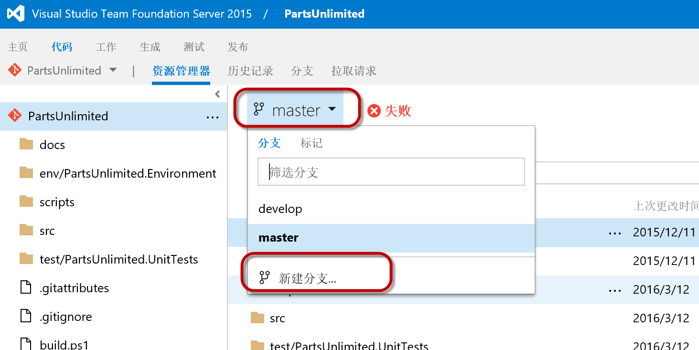
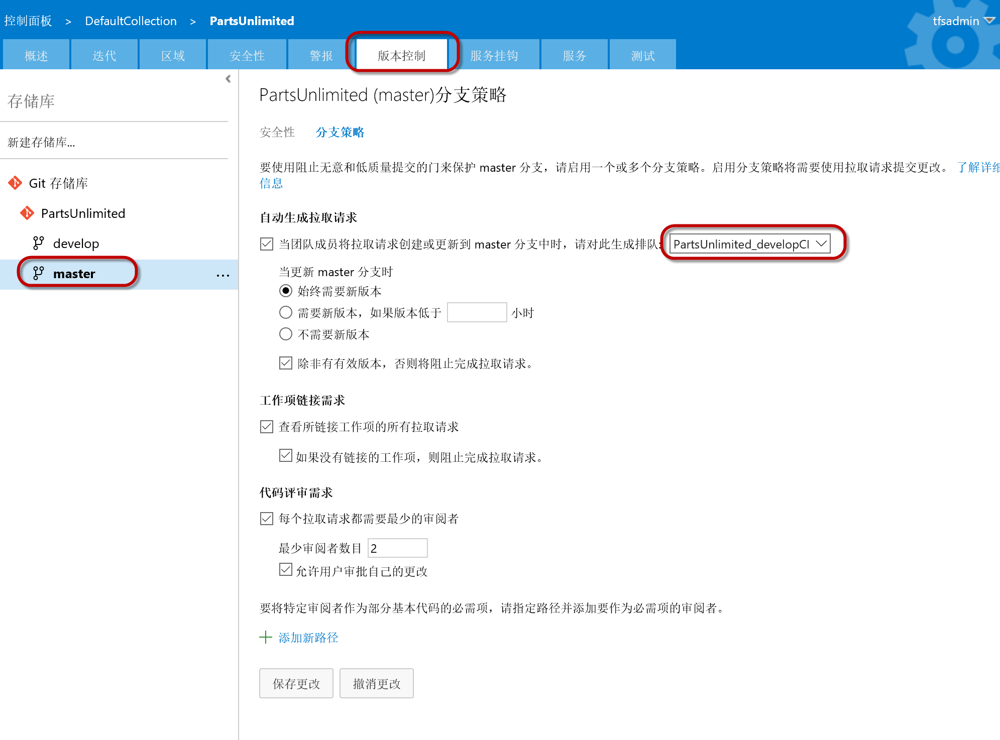
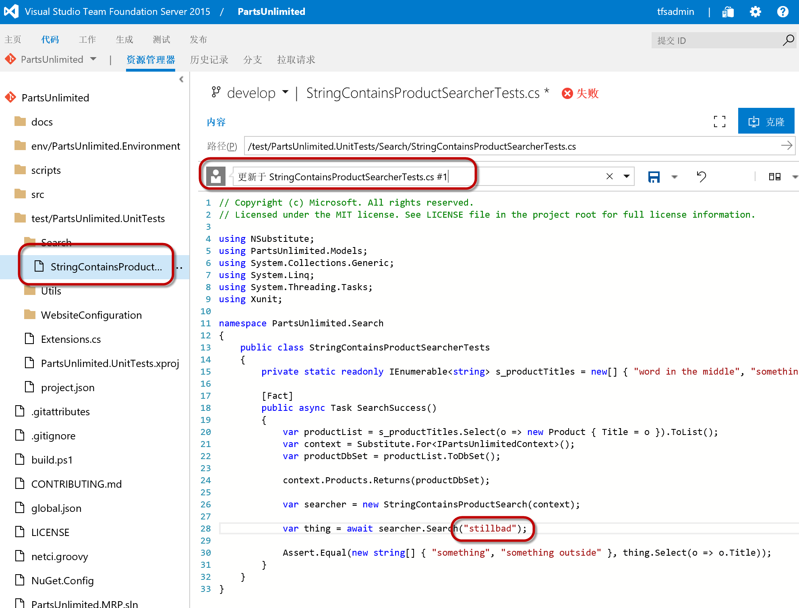
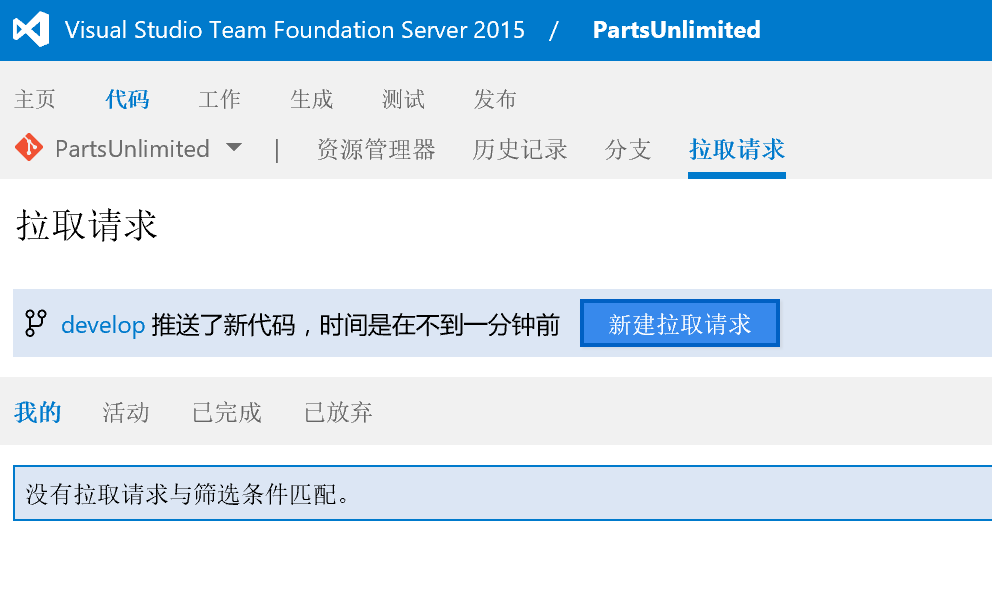
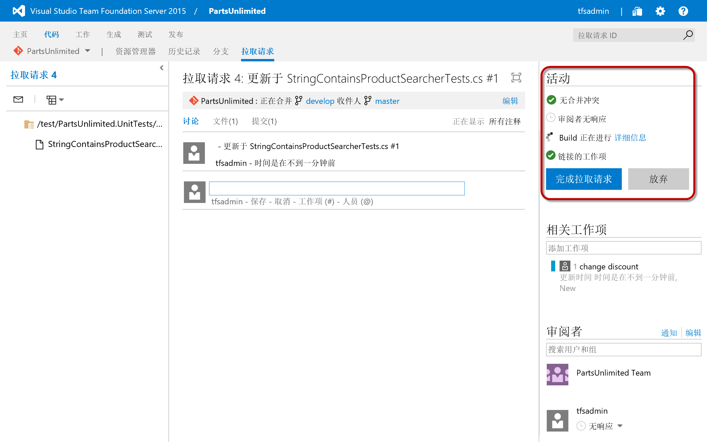
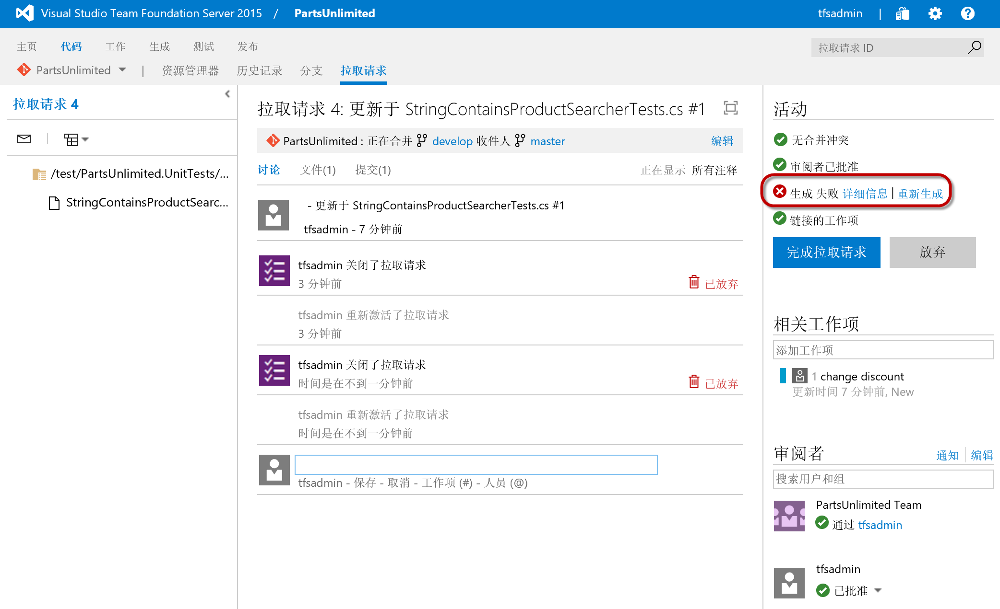
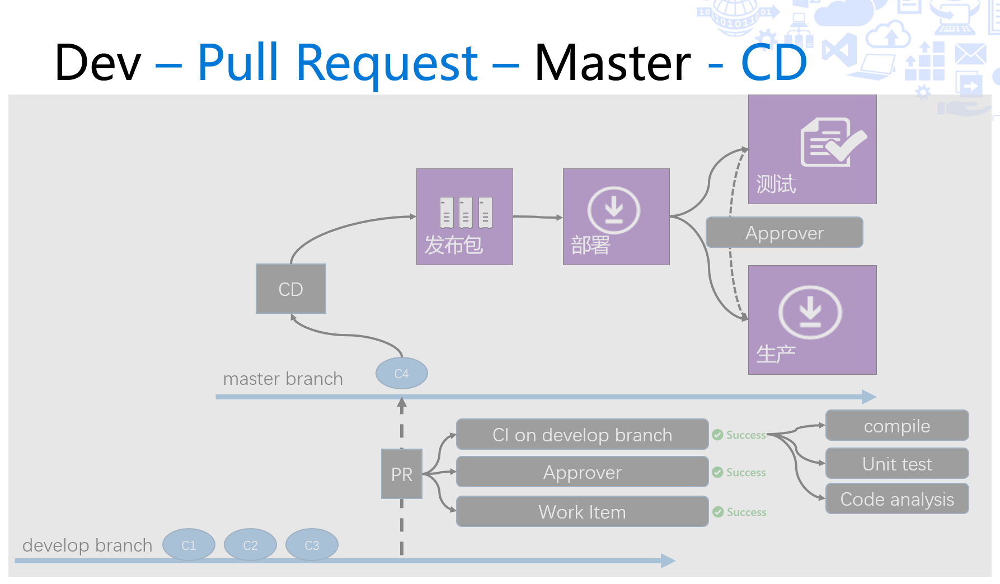

练习四：使用拉取请求（Pull Request）实现质量门控制
~~~~~~~~~~~~~~~~~~~~~~~~~~~~~~~~~~~~~

拉取请求是GitHub上用于共享代码的方式，在TFS中也支持这个方式在不同的git分支之间进行代码合并操作。通过在执行 **拉取请求** 时添加不同的策略，我们可以确保只有满足我们质量要求的代码进去目标分支，实现 **质量门** 控制。

1. 在源代码库中创建新的开发分支

登录TFS，并切换至 **代码** 视图，点击 **master分支 | 创建分支**

在弹出的 **创建分支** 对话框中，输入名称 develop，根据 master，并单击 **创建** 按钮

.. figure:: images/CI-Exercise-4-create-develop-branch-1.png

2. 在 **develop** 分支上创建 **生成定义**

按照 *练习一* 中的步骤，针对 **develop** 分支创建一个名为 **PartsUnlimited_developCI** 的 **生成定义**，在其中添加以下任务

=================== ===========
    任务                 内容
=================== ===========
PowerShell 任务       调用 build.ps1
PowerShell 任务       调用 test.ps1
=================== ===========

3. 配置分支策略

在当前 **团队项目** 页面的右上角，点击 **齿轮** 标志，进入项目管理后台，切换至 **版本控制** 中，对 **master** 分支进行以下配置

配置说明：

=================== ===========
    配置项            作用
=================== ===========
自动生成拉取请求       当针对目标分支提交拉取请求时，自动触发构建定义，并在构建失败时阻止合并。
工作项链接需求         要求拉取请求中的代码提交必须关联工作项，否则阻止合并。
代码评审需求           要求拉取请求必须经过审阅者的代码评审，如果审阅者不批准，则阻止合并。
=================== ===========

.. note:: 

    请注意，我们的目标分支为master，而触发的 **生成定义** 却是 **PartsUnlimited_developCI**。这样做的目的是在开发人员向master分支合并代码的时候，首先确保develop分支上的代码是健康的。一般的持续集成配置都是在代码已经进入目标分之后触发的，这样就算测试失败，但是目标分支已经被污染，仍然可能引起问题。
    
    通过这种 **预编译，预测试** 的方式，我们可以确保目标分支的代码健康。
    
4. 提交拉取请求

现在，让我们来创建一个拉取请求，测试一下我们的 **质量门** 

打开以下文件

.. code-block:: c#

    /test/PartsUnlimited.UnitTests/Search/StringContainsProductSearcherTests.cs

并将第28行修改为

.. code-block:: c#

    var thing = await searcher.Search("stillbad"); // correct value is "something" 
    
并在注释的最后添加 #1，将此次修改链接到 #1 号工作项

保存后，切换至 **拉取请求** 视图，并单击 **新建拉取请求** 按钮

在以下页面中，单击 **新建拉取请求** 按钮

.. figure:: images/CI-Exercise-4-create-pr-2.png

请注意以下页面中的 **活动** 部分，新的生成已经被触发

等待我们的生成完成，这是你会发现即便你点击 **完成拉取请求** 按钮，TFS也将阻止你完成此操作，这是因为我们所配置的策略在起作用。

4. 修改代码，再次提交拉取请求

为了让我们可以完成合并，你可以进行一下修改，让我们的测试通过，并完成拉取请求。

打开以下文件

.. code-block:: c#

    /test/PartsUnlimited.UnitTests/Search/StringContainsProductSearcherTests.cs

并将第28行修改为

.. code-block:: c#

    var thing = await searcher.Search("something"); // correct value is "something" 
    
完成拉取请求后，你会发现TFS会在合并完成后自动触发我们在masrter分支上所配置的 **生成定义**，进而完成部署。

总结
~~~~~~~~~~~~~~~~~~~~~~~~~~~~~~~~~~~~~

至此，我们就实现了一条完整的从 develop 分支到 master 分支，再到测试和生产环境的持续交付管道，这样的配置可以为敏捷开发团队提供良好的持续集成环境，并维护我们代码的健康。

