持续交付 - 持续集成，自动化发布和自动化测试
------------------------------------------------------

在这个实验中，您和您的团队成员将完成产品从代码到上线的发布管道的建立。我们将借助TFS所提供的持续集成引擎和Release Management功能构建一条全自动的发布管道，您将可以在完成代码编写后一键发布新版本到生产环境，并在这个过程中通过测试环境完成产品功能的验证和上线审批。

我们还将使用单元测试，代码覆盖率，代码分析和自动化UI测试来提高我们对代码质量的掌控能力。

最终我们将实现如下图的持续集成环境：

.. figure:: images/CI-planning-chart.png

练习一：为你的项目添加持续集成能力
~~~~~~~~~~~~~~~~~~~~~~~~~~~~~~~~

TFS使用 **生成定义** 来管理项目的持续集成配置，在每一个 **团队项目** 中，可以配置多个 **生成定义** 分别对应不同的代码分支，测试环境或者团队。在这个实验中，我们只对如何配置 **生成定义** 进行描述，关于如何规划您的持续集成方案，请参考：TODO 

任务一：创建生成定义
^^^^^^^^^^^^^^^^^^^^^^

1. 使用 **诸葛亮** 的账号登陆系统，并切换至您项目的 **生成** 功能区域下，并点击左侧的 **加号** 标识

.. figure:: images/CI-Exercise-1-Add-Build-Definition.png

2. 在弹出的 **创建生成定义** 窗口中，

选择 **Visual Studio** 并点击 **下一步** 

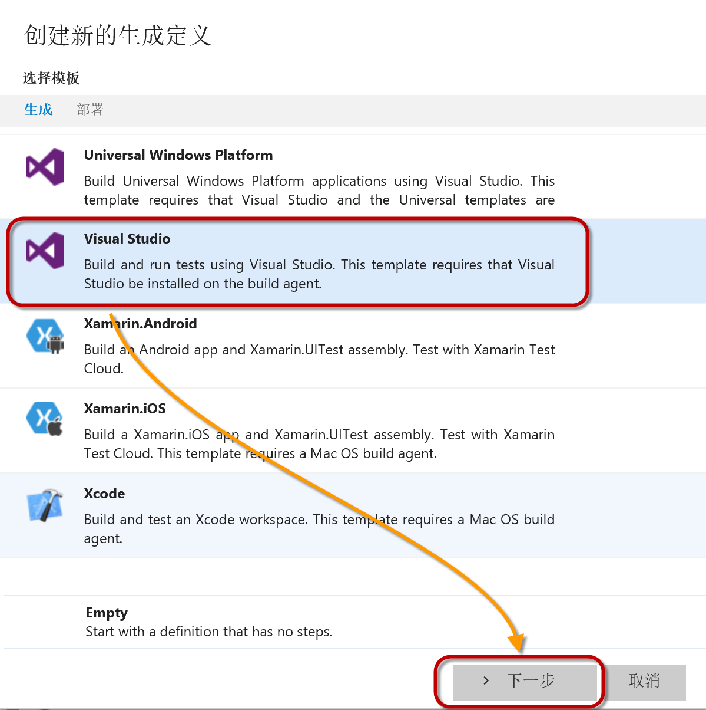

选择 **存储库源 | 存储库 | 默认分支 | 勾选持续集成 | 默认代理池** 并点击 **创建** 按钮

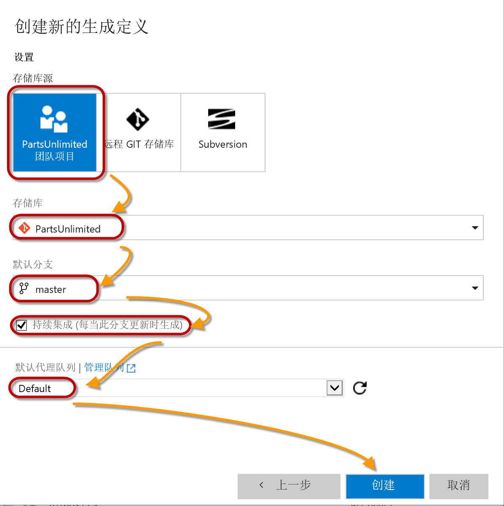
 
3. 对新创建的 **生成定义** 进行定制，删除下图中未出现的内容
 
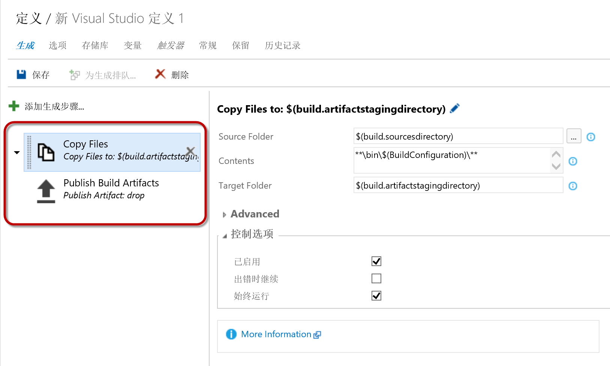
  
4. 添加 PowerShell 生成步骤 

点击 **添加生成步骤 | 实用工具 | 选中PowerShell** 并点击 **添加** 按钮 

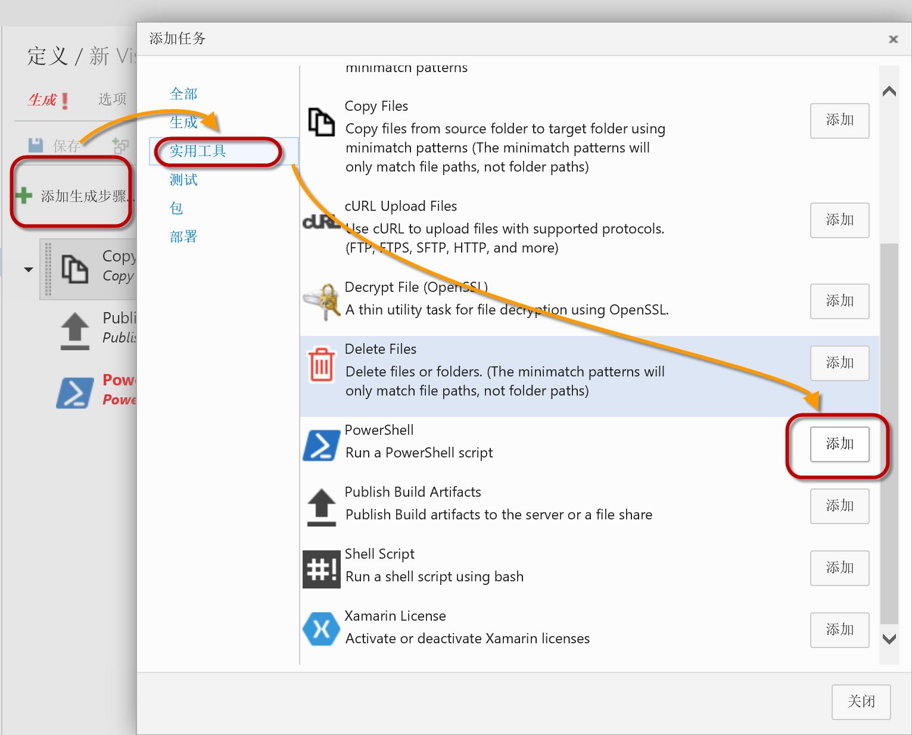

5. 配置 PowerShell 生成步骤，使用 PartsUnlimited 代码库中内置的 build.ps1 脚本来进行编译

将 PowerShell 生成步骤拖放到顶端，在右侧的 Script filename 和 Arguments 中分别输入：

================    ===========
    参数              值
================    ===========
Script filename     build.ps1
Arguments           -BuildConfiguration $(BuildConfiguration)
================    ===========

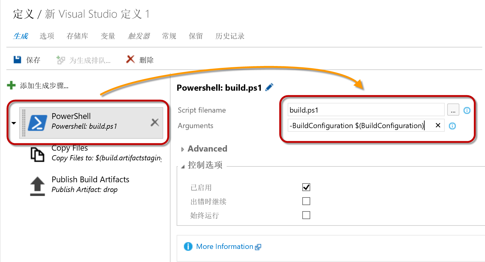

您也可以点击 Script filename 右侧的 **...** 按钮来从代码库中选择 build.ps1 这个脚本文件

.. figure:: images/CI-Exercise-1-add-powershell-task-buildscript-1.png

build.ps1 脚本内容如下：

.. code-block:: powershell

    [CmdletBinding()]
    Param(
        [Parameter(Mandatory=$True)] [string] $BuildConfiguration
    )

    #Install dnvm
    & scripts/Install-Dnvm.ps1

    # Restore and build projects
    & scripts/Call-Dnu.ps1 restore .\src
    & scripts/Call-Dnu.ps1 build .\src\PartsUnlimitedWebsite --configuration $BuildConfiguration
    
这个脚本中我们调用了Install-Dnvm.ps1和Call-Dnu.ps1 这两个脚本来完成.NET运行时的安装，依赖恢复(dnu restore)和编译 (dnu build)，并且脚本提供了一个叫做BuildConfiguration的参数允许我们提供不同的编译配置参数(release/debug)。

.. note:: 
    对于许多团队来说，编写一个脚本来进行编译是非常普遍的做法，就如同很多的c应用里面都有个makefile文件一样。这样做的好处是，任何开发人员获取到源代码后都可以直接执行这个脚本来完成如依赖获取，环境配置和编译的操作。
    
    对于一个采用敏捷开发方式的团队来说，为每一个人和每一个新的环境提供统一，简单的一键式的编译脚本非常重要，这可以大大节省开发人员和测试人员获取新的可运行环境的成本，提高效率。同时，这样做也便于我们在开发人员本地环境和持续集成环境中使用同样的方式来执行自动化，消除环境差异对效率的影响。

6. 保存新的 **生成定义** 

点击 **保存**，并在弹出的对话框中输入名称 **PartsUnlimited_masterCI**， 点击 **确定** 

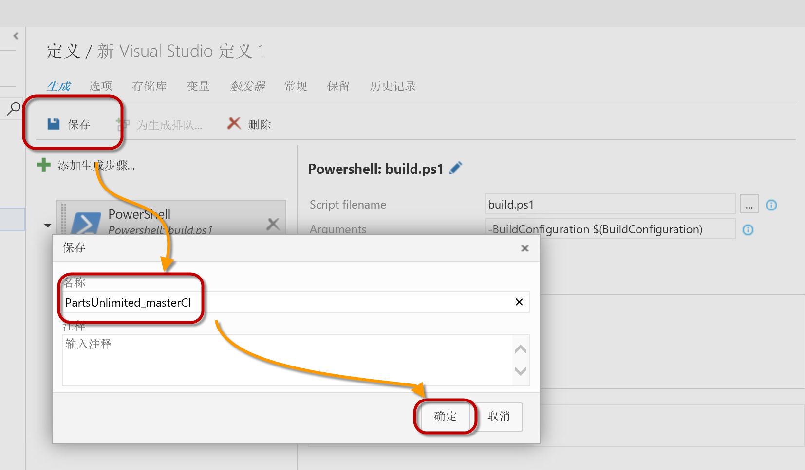
    
这样，我们就完成了一个最基本的 **生成定义** 的创建。这个定义中我们仅完成了编译的工作，在后续的练习中我们将添加更多的任务，如：自动化测试和打包。

任务二：运行生成
^^^^^^^^^^^^^^^^^^^^^^^^^^^

1. 将生成排队

回到 **生成** 视图，并点选我们创建的 **PartsUnlimited_masterCI** 生成定义，在右侧点击 **为生成排队** 按钮，在弹出的对话框中点击 **确定**

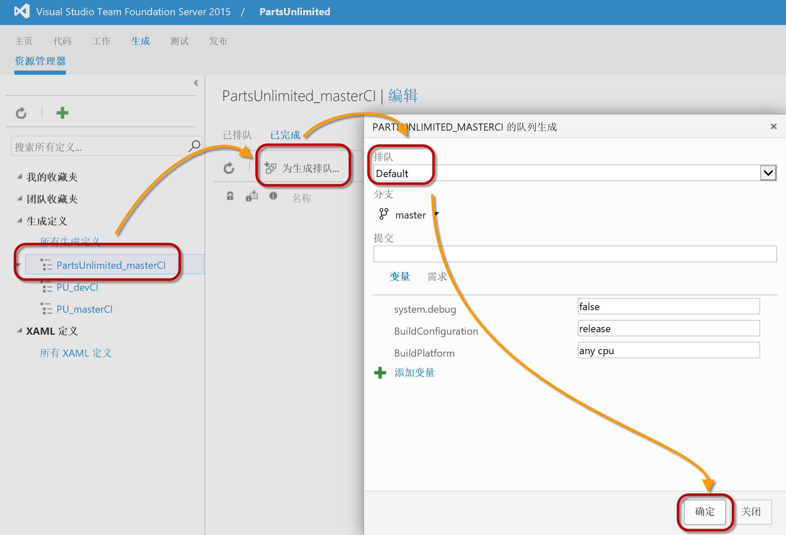

2. 查看生成进度

新的请求将被TFS排入生成队列，根据你所选择的代理池不同，你的请求将被逐个处理。

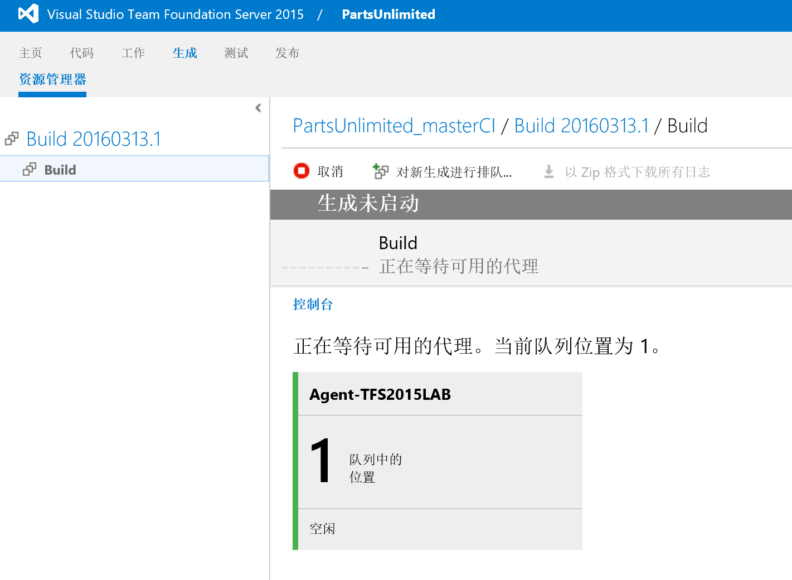

稍等片刻，您的构建请求将开始运行，这时TFS将会持续的推送日志信息

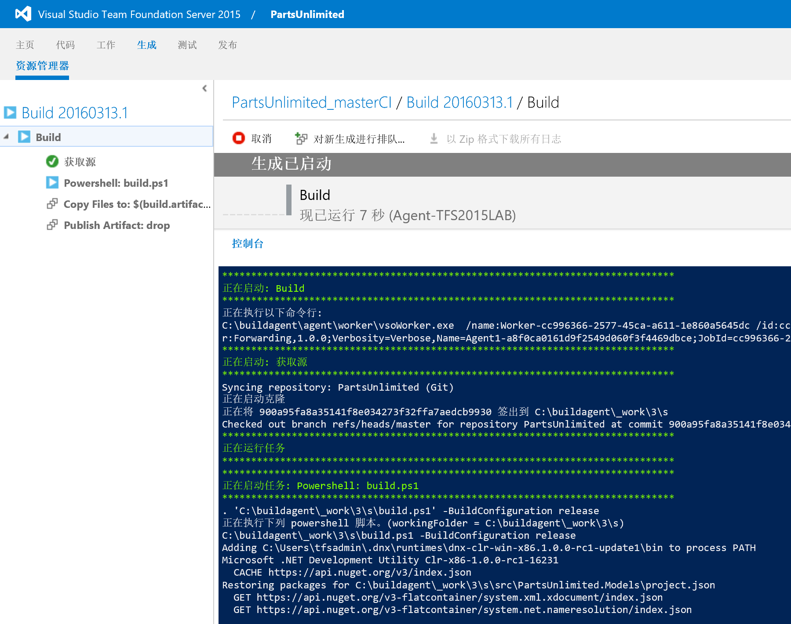

如果一切顺利，您的构建将成功完成。

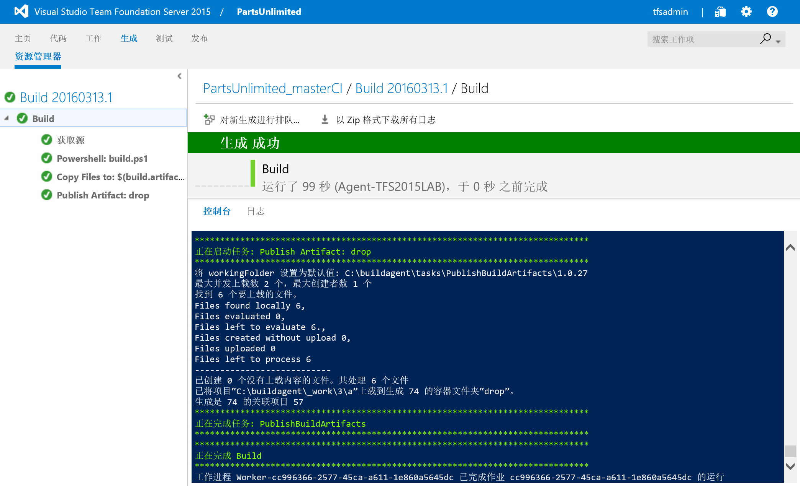

3. 查看生成结果

点击屏幕顶部所列出的构建ID （类似：Build 20160313.1），将进入生成结果页面

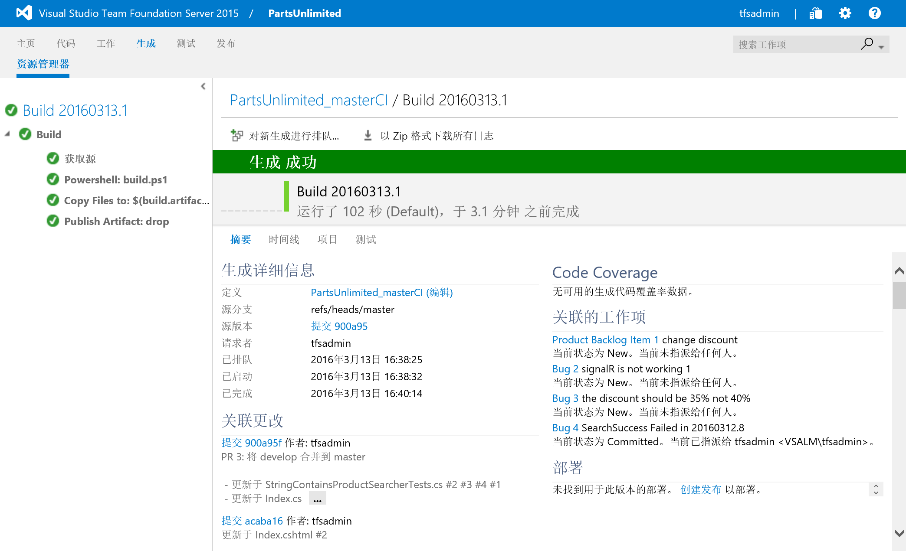

这个页面包含以下信息：

============ ==========
内容          说明
============ ==========
生成详细信息   当前生成的详细信息，包括时间，触发者，代码源等
关联更改       在这次生成中所包含的代码变更列表，这是一个相对列表，会显示这次构建相对于上一次的不同
测试           这次生成中所运行的测试用例执行情况
代码覆盖率     如果测试中激活了代码覆盖率，将显示不同模块的覆盖率信息
关联工作项     这次构建中所包含的任务，需求和bug
部署          如果关联了自动化发布，这里将显示当前版本在不同环境的部署情况            
============ ==========

练习二: 建立产品发布管道 - 实现自动发布
~~~~~~~~~~~~~~~~~~~~~~~~~~~~~~~~~~~~~

建立发布管道可以帮助团队快速的将新版本部署到开发，测试或者生产环境，加速开发与测试，开发与运维，最终用户与开发之间的迭代速度。一个团队迭代速度的快慢决定其适应变化的能力，也是判断一个团队敏捷程度的重要标志。

任务一：在 **生成定义** 中添加 打包步骤
^^^^^^^^^^^^^^^^^^^^^^^^^^^^^^^^^^^^^^^^^^

应用程序打包是为了能够方便部署而将程序的文件结构调整为目标环境可以直接使用的格式，这个格式与开发时所用的格式往往不同。

1. 添加打包步骤

首先按照 *练习一 | 任务一：创建生成定义 | 步骤4-5* 中的方式在添加一个 PowerShell 任务，并将其放置在 *编译* 任务一下。并对这个任务的参数做如下配置

================    ===========
    参数              值
================    ===========
Script filename     publish.ps1
Arguments           -BuildConfiguration $(BuildConfiguration)
================    ===========

如下图：

.. figure:: images/CI-Exercise-1-add-powershell-task-publishscript.png

这个 publish.ps1 脚本将调用 dnu publish 这个命令来完成网站的打包工作，由于我们的网站中用到了很多前端工具，其中还会调用 npm 和 grunt 来完成前端脚本的打包工作。

publish.ps1 的内容如下：

.. code-block:: powershell

    # Publish to a self-contained folder
    & scripts/Call-Dnu.ps1 publish src/PartsUnlimitedWebsite -o artifacts\Publish --runtime dnx-clr-win-x64.1.0.0-rc1-update1 --no-source

2. 将打包结果上传至服务器

选中 **Copy Files** 这个生成任务，并在 **Contents** 这个参数中添加一行

.. code-block:: powershell

    **\publish\** 

如下图：

.. figure:: images/CI-Exercise-1-add-powershell-task-publishscript-1.png

3. 触发生成以便将打包完成的文件上传至服务器

按照 *练习一 | 任务二：运行生成* 中的步骤触发生成并等待生成完成。

任务二：创建发布定义
^^^^^^^^^^^^^^^^^^^^^^^^^^^

与 **生成定义** 类似，在TFS中使用 **发布定义** 来管理发布管道。在一个 **团队项目** 可以创建多条发布管道分别对应不同的代码分支，团队或者目标环境。

1. 创建 **发布定义**

登录系统，并切换至 **发布** 视图，点击 **加号** 图标，创建新的 **发布定义**

.. figure:: images/CI-Exercise-2-create-release-definition.png

在弹出的 **部署模板** 对话框中，选择 **Emtpy** （空模板）并点击 **确定** 

.. figure:: images/CI-Exercise-2-create-release-definition-1.png

在名称中输入 **PartsUnlimited_Pipleline**，将第一个环境命名为 **测试环境** ，并单击 **保存** 按钮

.. figure:: images/CI-Exercise-2-create-release-definition-2.png

2. 将 **发布定义** 链接到 **生成定义** 上

单机 **链接到生成定义** 链接，并选择 **PartsUnlimited_masterCI** 定义，点击 **链接**

.. figure:: images/CI-Exercise-2-create-release-definition-3.png

3. 配置 **测试环境** 的部署任务

在 **测试环境** 中点击 **添加任务** 

.. figure:: images/CI-Exercise-2-create-release-definition-4.png

在弹出的 **添加任务** 对话框中选择 **部署 | Windows Machine File Copy** , 并点击 **添加** 按钮

.. figure:: images/CI-Exercise-2-create-release-definition-5.png

4. 配置 Windows Machine File Copy 任务 

点击 **Source** 参数后面的 **...** 标志

.. figure:: images/CI-Exercise-2-create-release-definition-6.png

在弹出的 **选择文件或文件夹** 对话框中选择 

PartsUnlimited_masterCI/drop/artifacts/Publish 这个文件夹，并单击 **确定** 按钮

.. figure:: images/CI-Exercise-2-create-release-definition-7.png

.. note::

    这个文件夹由 *练习二 | 任务一* 创建，如果您看不到这个文件夹，请从新执行这个步骤。

并对以下参数进行配置

.. figure:: images/CI-Exercise-2-create-release-definition-8.png

=================== ===========
    参数                 值
=================== ===========
Admin login          (对目标服务器有管理员权限的账户)
P2ssw0rd             (以上账户的密码)
Destination Folder   c:\\websites\\test 
=================== ===========

.. note:: 
    
    为了简化实验的目的，我们已经在目标服务器上针对以下目录配置了IIS的站点
    
    * c:\\websites\\test 对应的站点地址为 http://[实验服务器]:8012/
    * c:\\websites\\pro 对应的站点地址为 http://[实验服务器]:8013/
    
    实际工作中，可以使用其他的 PowerShell 脚本来完成这个工作，可以参考
    
    `使用Powershell创建IIS站点 <http://www.iis.net/learn/manage/powershell/powershell-snap-in-creating-web-sites-web-applications-virtual-directories-and-application-pools>`_
    
4. 克隆环境

以上我们已经完成了 **测试环境** 的部署任务配置，为了实验简化目的，我们使用同样服务器的不同端口来模拟不同的环境，因此 **生产环境** 的配置不过是另外一个目录而已。所以，我们使用 **克隆环境** 来完成这一步操作。

点击 **测试环境** 右上角的 **...** 标识，并选择 **克隆环境** 

.. figure:: images/CI-Exercise-2-clone-env.png

修改 Destination Folder 这个参数为：

=================== ===========
    参数                 值
=================== ===========
Destination Folder   c:\\websites\\pro  
=================== ===========

最后保存我们的 **发布定义** 

任务三：触发部署
^^^^^^^^^^^^^^^^^^^^^^^^^^^

1. 创建部署

在 **PartsUnlimited_Pipleline** 这个 **发布定义** 上点击 **发布 | 创建发布** 

.. figure:: images/CI-Exercise-2-create-deployment.png

在弹出的 **创建PARTSUNLIMITED_PIPELINE的新版本** 对话框中，选择最新的版本，并单击 **创建** 按钮

.. figure:: images/CI-Exercise-2-create-deployment-1.png

2. 运行发布

在 PartsUnlimited_Pipleline / Release 1 上选择 **部署 | 测试环境** 启动一个向 **测试环境** 的部署任务

.. figure:: images/CI-Exercise-2-trigger-release.png

在弹出的  **在 测试环境 上部署 Release 1** 对话框中点击 **部署** 按钮

.. figure:: images/CI-Exercise-2-trigger-release-1.png

3. 查看部署进度

可以看到 **测试环境** 的进度条中显示 **正在进行** 或其他状态

.. figure:: images/CI-Exercise-2-trigger-release-2.png

也可以切换至 **日志** 视图查看脚本的输出日志

.. figure:: images/CI-Exercise-2-trigger-release-3.png

最终，如果一切顺利，进度条将显示 **成功** 

.. figure:: images/CI-Exercise-2-trigger-release-4.png

4. 查看部署完成的网站

我们可以打开一下地址看到 PartsUnlimited 站点已经可以运行

* 测试站点地址为 http://[实验服务器]:8012/
* 生产站点地址为 http://[实验服务器]:8013/

.. figure:: images/CI-Exercise-2-release-result.png

到这里为止，我们已经完成了我们所规划中的自动化编译和部署，如下图中的灰色部分：

.. figure:: images/CI-planning-chart-01.png

练习三：添加自动化测试
~~~~~~~~~~~~~~~~~~~~~~~~~~~~~~~~~~~~~

自动化单元测试是敏捷开发中的提升质量最为有效的实践之一，为了能够确保所有的版本都经过自动化测试后才能发布，我们需要对之前创建 **生成定义** 进行修改，添加自动化测试步骤。

1. 打开 **PartsUnlimited_masterCI** 这个 **生成定义** 

添加一个新的 PowerShell 任务，对其参数进行以下配置

=================== ===========
    参数                 值
=================== ===========
Script filename     test.ps1
Arguments           -BuildConfiguration $(BuildConfiguration)
=================== ===========

test.ps1 这个脚本的内容如下：

.. code-block:: powershell

    [CmdletBinding()]
    Param(
        [Parameter(Mandatory=$True)] [string] $BuildConfiguration
    )

    & scripts/Call-Dnu.ps1 restore .\test
    & scripts/Call-Dnu.ps1 build .\test\PartsUnlimited.UnitTests --configuration $BuildConfiguration 

    # Run tests
    & scripts/Call-Dnx.ps1 -p .\test\PartsUnlimited.UnitTests test -xml testresults.xml 
    
如下图：

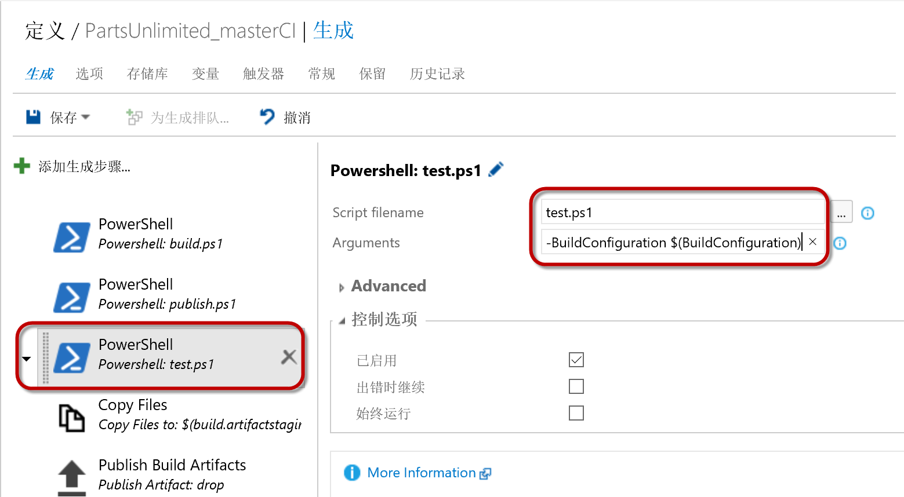

2. 上传测试结果

为了能够在生成结果中看到测试结果，我们在 **生成定义** 中添加 **Publish Test Result** 任务

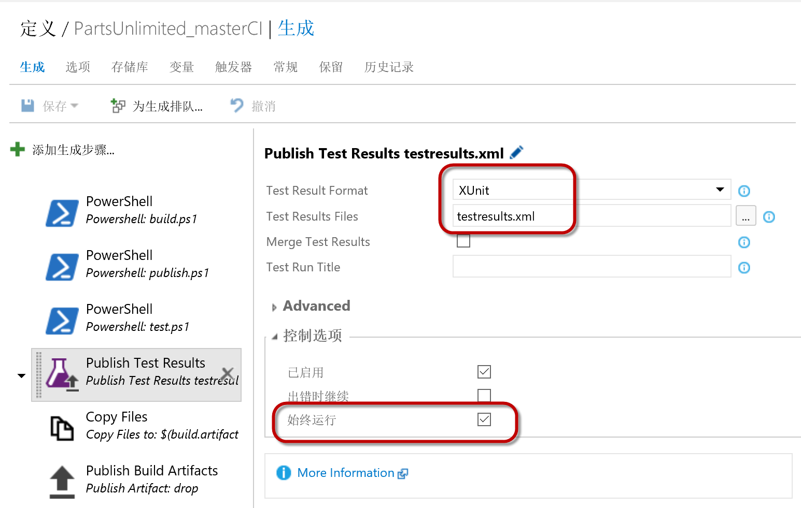

并对其进行以下配置

=================== ===========
    参数                 值
=================== ===========
Test Result Format   XUnit
Test Result Files    testresults.xml
始终运行              选中
=================== ===========

.. note::

    请注意在前面的 test.ps1 这个脚本中，我们指定了测试结果文件为 testresult.xml，这里使用同样的文件名。

3. 运行生成并查看测试结果

打开运行完成的生成，我们可以看到一下结果

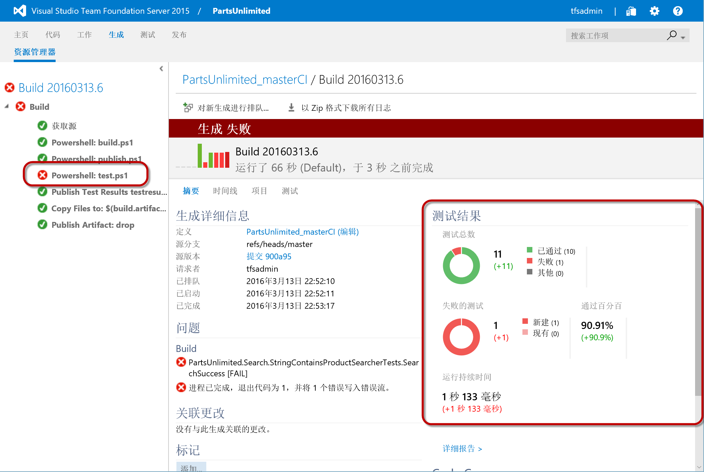

切换至 **测试** 视图，我们可以看到更加详细的测试结果信息，包括失败测试的详细信息

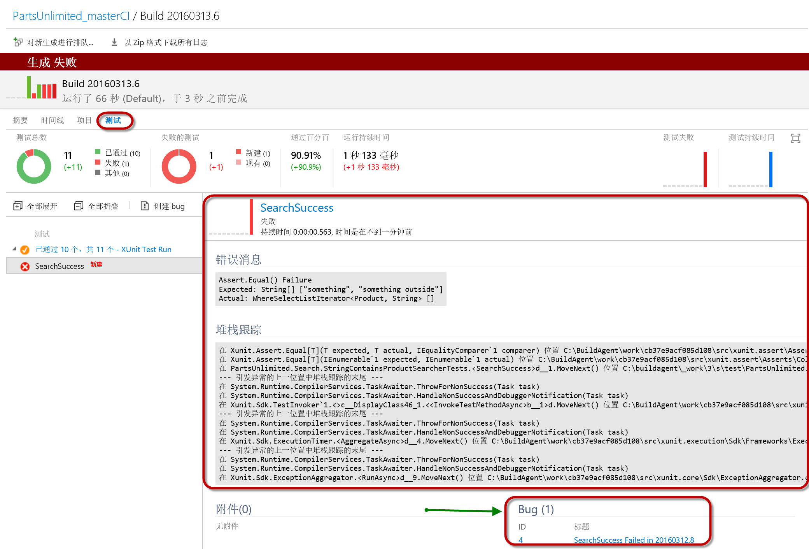

你会注意到，TFS已经为我们创建了一个 bug，点击这个bug我们可以看到这个Bug的 STEP TO REPRODUCE 中详细列出了问题细节，这样开发人员就可以根据这些信息来定位问题，修复BUG。

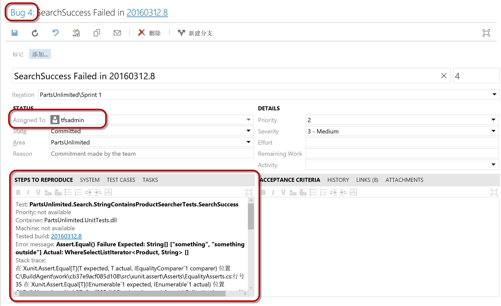

单击测试结果，我们还可以查看更为详细的测试信息，包括每个测试的执行情况和统计信息

运行摘要：

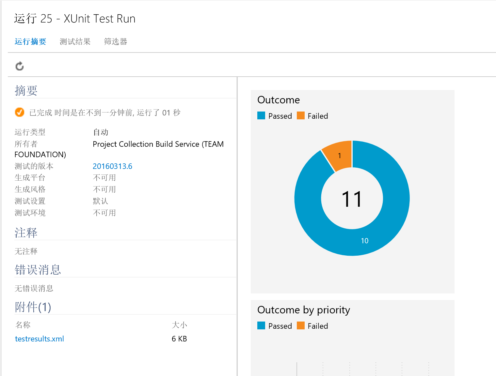

测试结果：

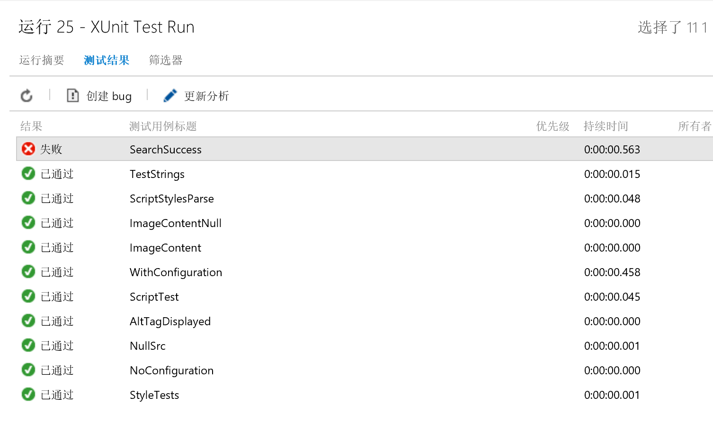

练习四：配拉取请求实现质量门控制
~~~~~~~~~~~~~~~~~~~~~~~~~~~~~~~~~~~~~

