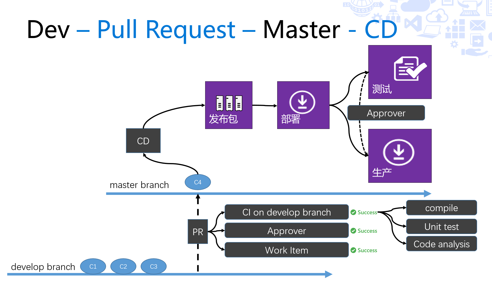

持续交付 - 持续集成，自动化发布和自动化测试
------------------------------------------------------

在这个实验中，您和您的团队成员将完成产品从代码到上线的发布管道的建立。我们将借助TFS所提供的持续集成引擎和Release Management功能构建一条全自动的发布管道，您将可以在完成代码编写后一键发布新版本到生产环境，并在这个过程中通过测试环境完成产品功能的验证和上线审批。

我们还将使用单元测试，代码覆盖率，代码分析和自动化UI测试来提高我们对代码质量的掌控能力。

最终我们将实现如下图的持续集成环境：

**练习列表**

.. toctree::
   :titlesonly:

   continues-delivery-1
   continues-delivery-2
   continues-delivery-3
   continues-delivery-4
   

