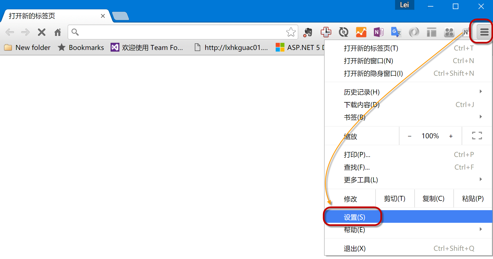
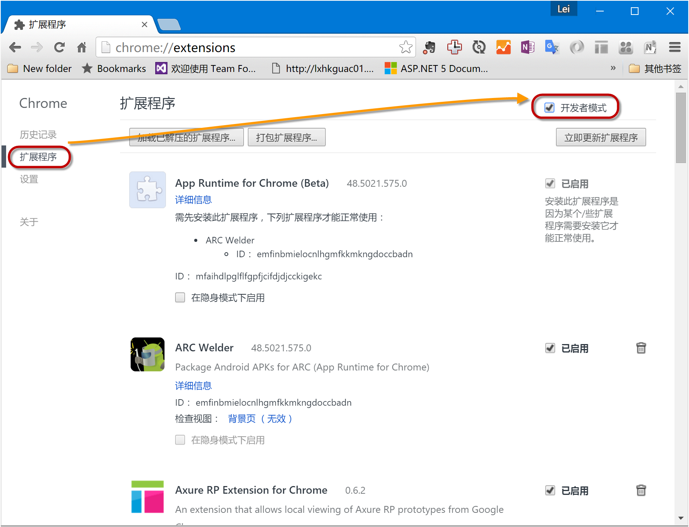
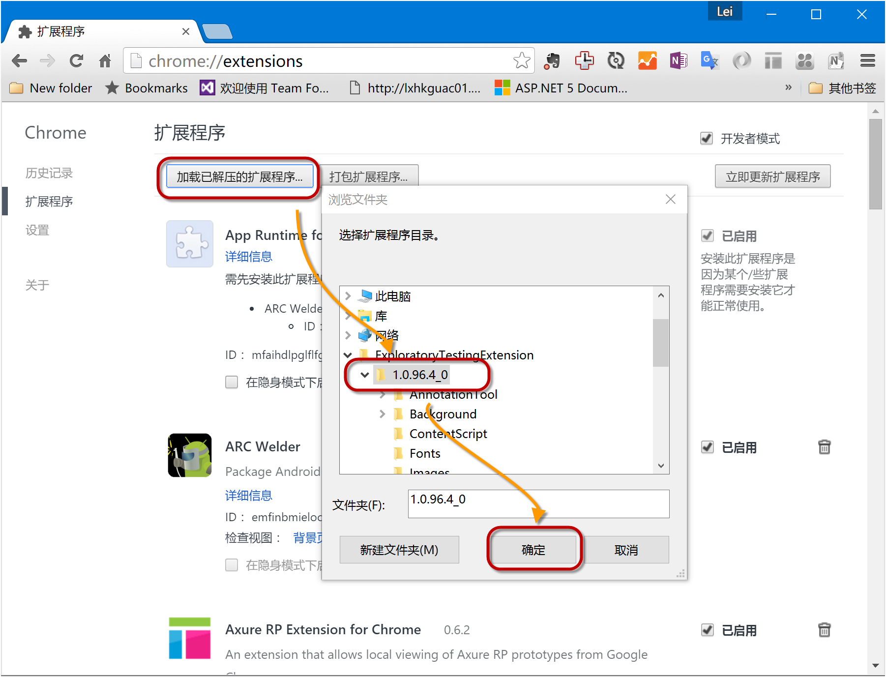
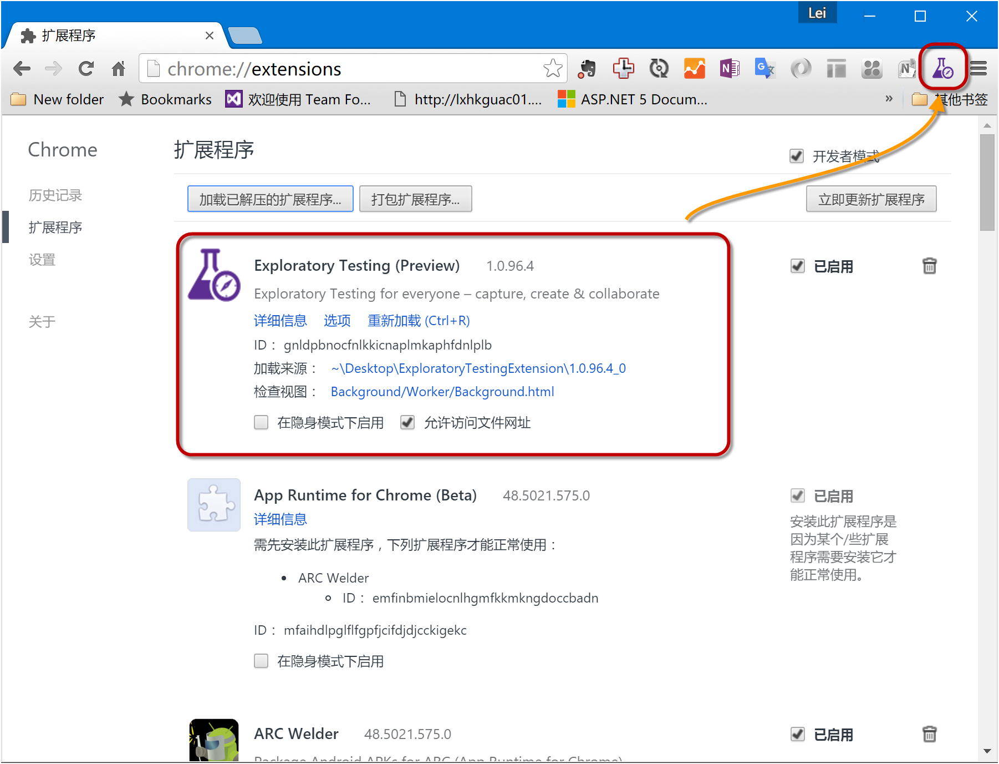
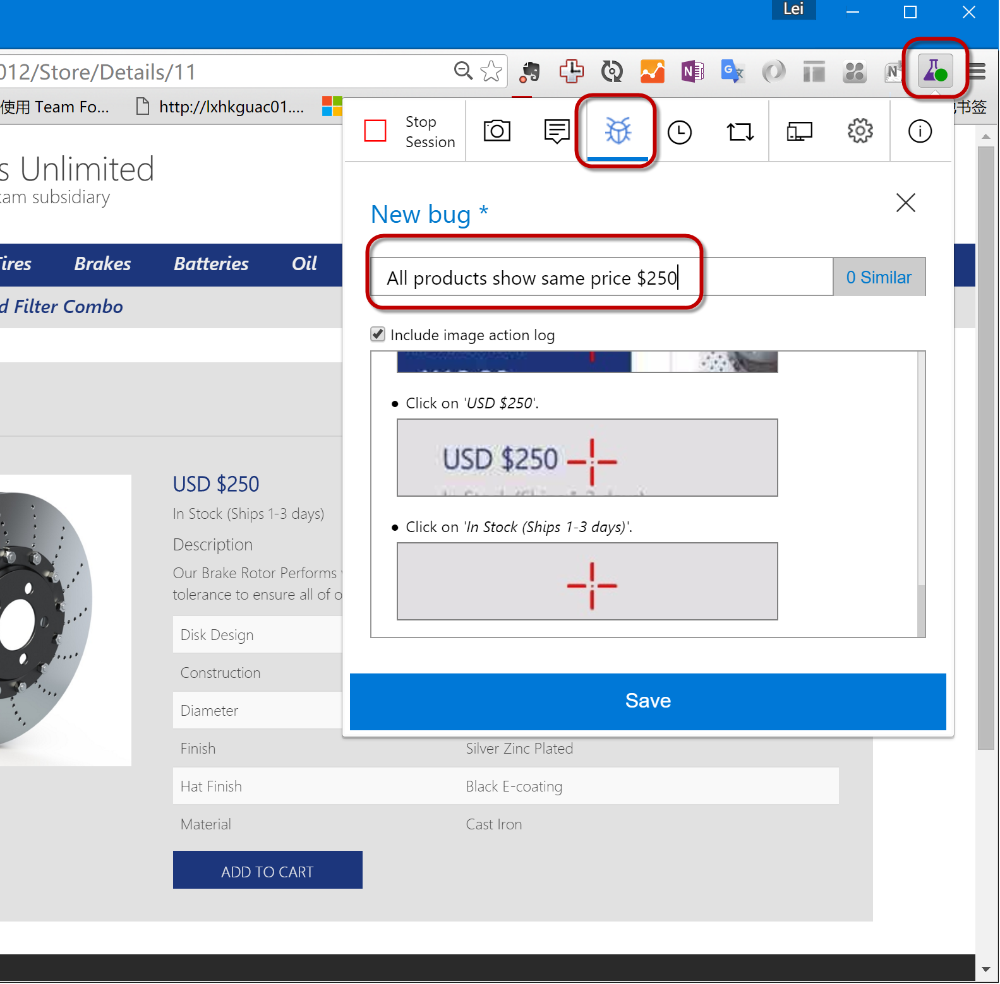

练习一：使用探索测试工具发现和反馈问题
~~~~~~~~~~~~~~~~~~~~~~~~~~~~~~~~~~~

探索性测试（Exploratory Testing）是由Cem Caner首次提出，11年，James Whittaker出版《探索性测试》艺术后，在业内引起广泛关注。

探索性测试时一种强调个人自由与责任的测试方法，让独立的测试者可以借由不断的学习来改善测试的规划与测试的执行，而在测试的过程中也会同时的改善专案达到相辅相成的效果。    探索性测试强调测试设计和测试执行的同时性，这一点与传统的软件测试过程的“先计划，再分析，后设计，最后执行”是有一定的区别的。在探索性测试中这四个部分相互交织，相辅相成。十分强调个人的能动性，要求在测试的过程中探索学习，并不断的修正测试方法。探索性测试将戴明环方法（PDCA）使用到极致。

我们的实验中将使用 **Exploratory Testing** 工具来完成，这个工具是Visual Studio Team Service所提供的一个基于Chrome浏览器的插件，可以在测试过程中记录用户的操作，进行截图并上传结果到TFS作为Bug或者测试用例。

.. figure:: images/FB-Exercise-1-ExploratoryTesting-Tool.png

任务一：安装Exploratory Testing工具并连接至TFS
^^^^^^^^^^^^^^^^^^^^^^^^^^^^^^^^^^^^^^^^^^^^^^^^

如果您的电脑上没有安装Chrome浏览器，请先安装。

1. 获取 Exploratory Testing 插件

从讲师处获取本地安装包, ExploratoryTestingExtension.zip，并解压缩。

2. 在Chrome上安装插件

打开Chrome浏览器，打开 **设置** 页面

进入 **扩展程序** ，选中 **开发者模式**

点击 **加载已解压的扩展程序** ，并选择你所解压缩出来的文件夹中的 **版本号** 子文件夹，单击 **确定**

**Exploratory Testing (Preview)** 将出现在列表中，并在工具栏中出现相应的图标

3. 连接至TFS

 点击工具栏中的 **图标** ，选择 **齿轮** 标志，并选择 **Connected (VSTS/TFS)**，输入服务器地址，点击 **下一步**
 
 .. figure:: images/FB-Exercise-1-ET-config.png
 
 在下面页面中选择您的项目，并单击 **保存** 
 
 .. figure:: images/FB-Exercise-1-ET-config-1.png
 
任务二：执行探索性测试并提交Bug
^^^^^^^^^^^^^^^^^^^^^^^^^^^^^^^^^^^^^^^^^^^^^^^^

1. 启动测试

点击 **Start Session** 开始一个 **测试会话**

 .. figure:: images/FB-Exercise-1-ET-runtest.png

2. 完成应用测试过程

根据 :doc:`/labs/continues-delivery` 这个实验中我们所创建的站点地址，打开您的站点

 .. figure:: images/FB-Exercise-1-ET-runtest-1.png
 
 请按照以下步骤执行测试

============================ ===========
    步骤                       说明
============================ ===========
 (1)打开首页                    使用 **测试环境** 或者 **生产环境** 的地址打开首页
 (2)点击 Lighting               在应用的的主菜单上点击第一个菜单项 Lighting 
 (3)点击 Halogen Headlights     在列出的产品中点击第一个产品 Halogen Headlights
 (4)打开产品详细信息页           进入产品详细信息页，注意产品价格信息
============================ ===========

您可以重复以上步骤 2 - 4，进入不同的产品详细信息页面，可以注意到所有产品的价格都是 $250, 这是我们应用中的一个 Bug.

.. note:: 

    一般来说，进行探索测试的时候是没有测试步骤的，我们的实验为了简化目的，将测试的步骤列在这里以帮助您更快的定位问题。
    
    您也可以不按照以上步骤进行操作。

3. 提交 Bug 

再次点击工具栏 **图标**，并选择 **Bug** 视图，输入以下内容作为 Bug 的标题

All products show same price $250

.. note:: 

    您会注意到工具已经将我们刚才的操作一步一步的记录下拉，这样非常便于开发人员定位问题。另外，在标题框的右侧有一个 *类似Bug* 的标识，这里将按照您所输入的内容搜索TFS的数据库，帮助您定位可能已经出现过的类似问题。
    
最后，点击 **保存** 提交 Bug, 并点击 **Stop Session** 停止我们的 **测试会话** 。