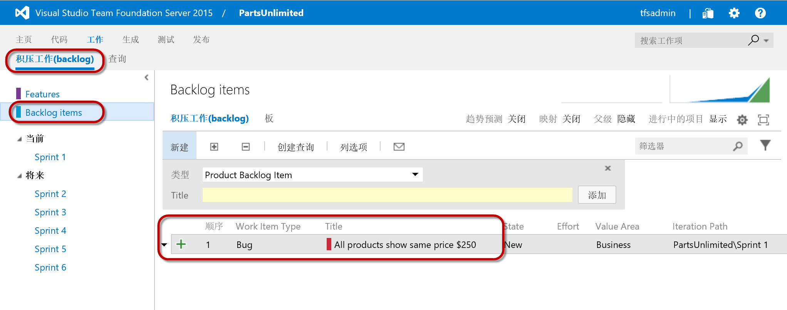
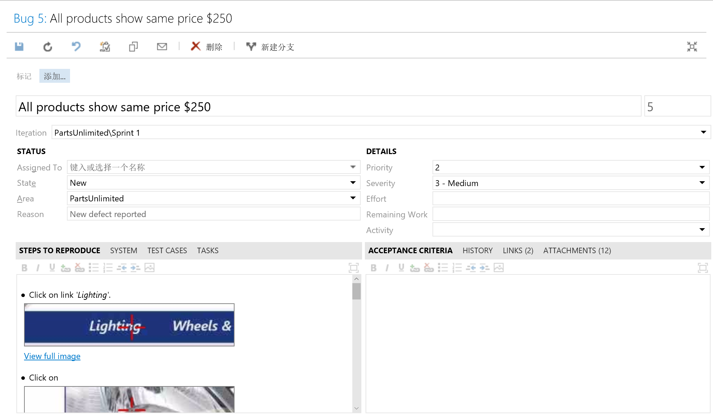
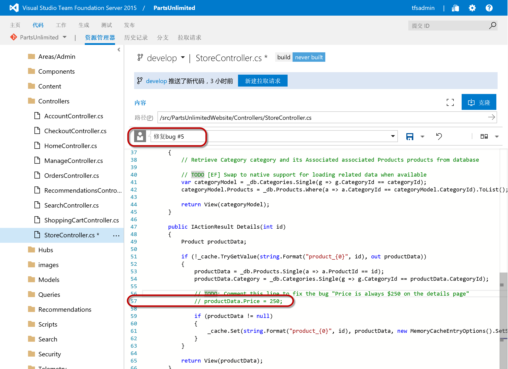

练习二：快速修复问题
~~~~~~~~~~~~~~~~~~~~~~~~~~~~~~~~~~~

由于我们已经建立了从代码到生产环境的快速发布管道，我们可以非常快速的修复我们的问题，并进行发布。

任务一：修复Bug
^^^^^^^^^^^^^^^^^^^^^^^^^^^^^^^^^^^^^^^^^^^^^^^^

1. 打开TFS的产品backlog查看bug

打开TFS的 **工作 | 积压工作(backlog)**，您会看到刚才所提交的bug已经出现在了列表中

请双击打开这个bug，您可以看到我们刚才所提交的内容

记录下这个Bug 的 ID。

2. 修复Bug

为了简化实验目的，您可以按照以下方式修复bug，在实际工作中，开发人员需要自己重现问题，定位问题，修复问题。

打开一下文件，并注释掉 **第57行**，并在签入注释中输入 **修复Bug #bugID** 其中 bugID是在上一步中所记录的ID。单击 **保存** 按钮。

/src/PartsUnlimitedWebsite/Controllers/StoreController.cs

.. code-block:: c#

     // productData.Price = 250;
     
.. note:: 

    使用#加上id可以告诉TFS此次修改与这个id的工作项相关，这将有助于我们跟踪代码变更与工作的关系。
    
任务二：发布新版本
^^^^^^^^^^^^^^^^^^^^^^^^^^^^^^^^^^^^^^^^^^^^^^^^

请按照以下实验内容完成发布过程

:doc:`/continues-delivery-4`

总结
~~~~~~~~~~~~~~~~~~~~~~~~~~~~~~~~~~~

以上，我们借助于 :doc:`/continues-delivery` 中所创建的自动化发布管道和探索性测试工具完成了一个线上问题的快速修复。这个场景在实际工作中非常普遍。

至此，您应该可以体会到TFS所提供的一体化需求，任务，测试，构建和发布功能的强大之处。使用TFS这种高度集成的研发平台，我们可以帮助开发团队建立非常快的相应能力，同时确保质量的稳定。