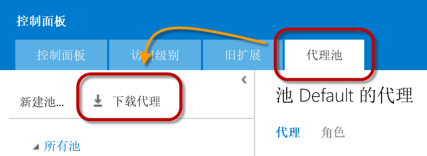
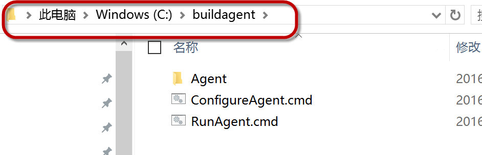
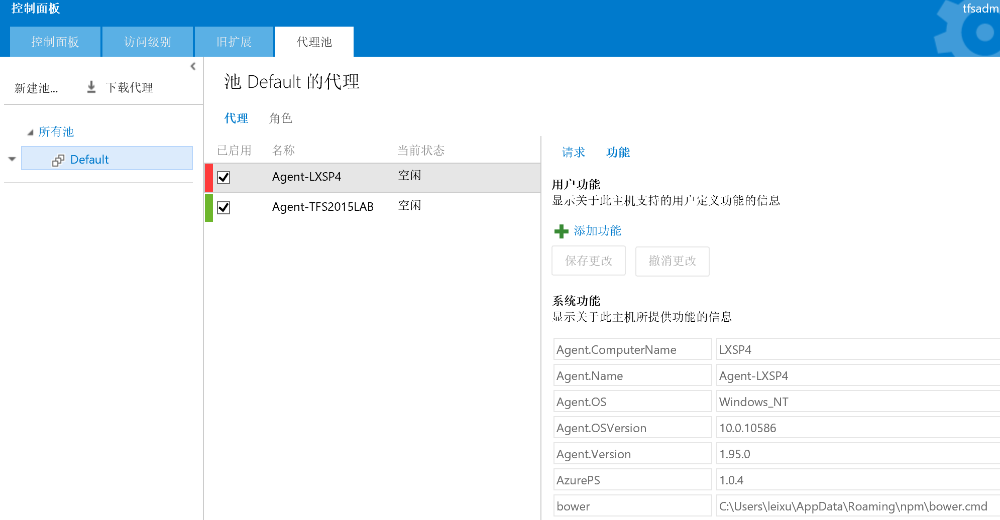
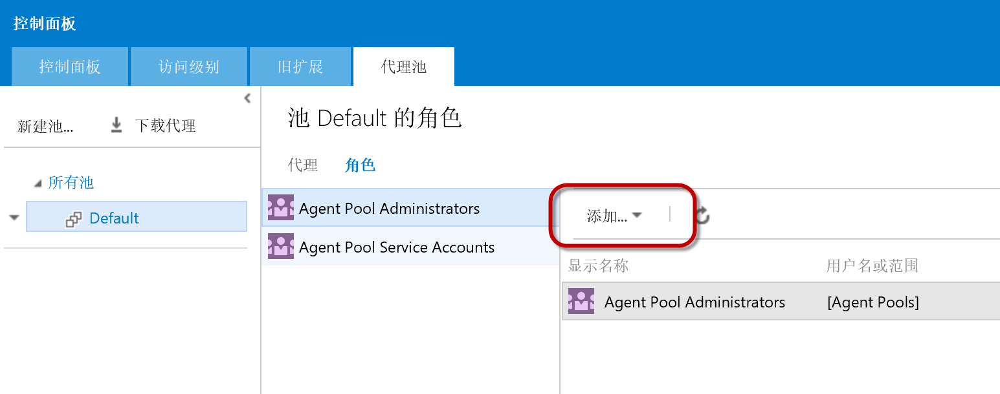

TFS Build vNext Agent 简介及安装配置指导
----------------------------------------

TFS Build vNext 是微软与TFS 2015版本一同发布的全新一代持续集成引擎，这个引擎与以往版本的不同指出在于它对不同的操作系统，开发环境，语言和工具提供了良好的兼容性。可以部署在包括Windows, Linux, Unix和Mac的各种主流操作系统上，并可以支持包括.net, java, iOS, Android等各种语言的编译打包和自动化。

同时，这一版本的 Build Agent 使用Node.js开发，也通过开源的方式提供给社区，并接受社区的反馈和代码Pull Request, 您可以从以下GitHub地址上获取本Agent的代码：

https://github.com/Microsoft/vso-agent

本引擎中所提供的所有构建任务和脚本也通过GitHub开源，可以通过以下地址获取：

https://github.com/Microsoft/vso-agent-tasks

本Agent中包含了所有主流的构建工具，如下图：

.. figure:: images/add-build-steps.png

如果你的项目已经有了自己的构建脚本，你也可以很容易的进行调用，如下图：

.. figure:: images/add-build-steps-utility.png

对于不同的语言的单元测试框架也提供了很好的支持，如下图：

.. figure:: images/publish-test-results.png

Windows环境安装和配置向导
~~~~~~~~~~~~~~~~~~~~~~~~~~

请在执行以下步骤前，在您的Windows系统上安装Node.JS，可以中以下地址获取Node.JS安装包：

https://nodejs.org 

.. note:: 
    一般来说，推荐使用LTS（长久支持版）的Node安装包，并根据您所使用的操作系统的版本选择x64或者x86版本来使用。
    

1. 首先使用 **团队项目集合管理员** 身份登录系统，在系统的右上角点击 **齿轮** 标志进行后台

.. figure:: images/agent-install-1.png

2. 在后台 **控制面板** 中，点击 **代理池|下载代理** 按钮，并保存下载好的.zip文件

3. 将zip包内容解压缩至一个本地路径，建议放置在 C:\BuildAgent 目录下面

4. **以管理员身份** 运行 Windows Powershell 命令行工具，并将ExecutionPolicy设置为Unrestricted，具体命令为

Set-ExecutionPolicy -ExecutionPolicy Unrestricted

5. 进入 c:\BuildAgent 目录，并运行 ConfigureAgent.cmd 

.. figure:: images/agent-install-4.png

上图对代理名称，服务器地址，代理池名称，工作文件进行了配置。

对于是否要将代理作为Windows服务进行安装，可以视情况而定，一般来说

* 作为Windows服务运行：每次系统启动服务即可启动，相对维护简单
* 不作为Windows服务运行：则每次需要人工运行RunAgent.cmd来启动，但是如果所运行的任务需要和桌面进行交互，则会比较方便，如：运行自动化界面测试。

如果作为服务运行，则还需要输入服务所使用的账户

.. figure:: images/agent-install-5.png

6. 回到TFS后台 **控制面板** 中，你将可以看到新配置的代理出现在代理池中，并在功能页中列出了这台机器所具备的能力（也就是各种工具）

7. 最后，我们还需要对权限进行配置，你可以将允许管理这个代理的人员加入到 Agent Pool Administrators 这个角色中。

至此，Windows环境上的安装和配置完成。

Linux环境安装和配置向导
~~~~~~~~~~~~~~~~~~~~~~~~~~

todo

Mac环境安装和配置向导
~~~~~~~~~~~~~~~~~~~~~~~~~~

todo 

