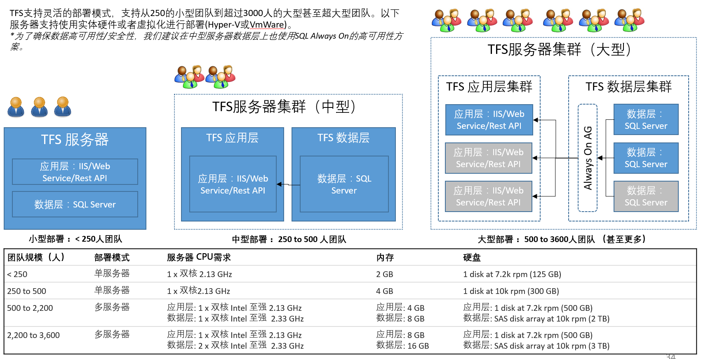

TFS 安装和配置
-----------------

.. attention::
    
    文档内容将与最新版TFS企业版保持同步，请确保你所使用的TFS版本与本文档的适用范围一致，再参照本文档进行TFS的安装和配置，不同版本的TFS企业版的安装配置虽然区别不大，但对于企业部署，一个很小的差异都可能造成生产系统的问题。
    
    本文档适用于：
    
    * Team Foundation Server 2015 Update 2. 
    
TFS 技术架构
~~~~~~~~~~~~~~~~~~~~~~~~~~~~~~~~

服务器架构
^^^^^^^^^^^^^^^^^^^^^^

TFS 的服务器分为核心服务和外围服务，核心服务采用2层架构，分别为数据层和应用层。

* 数据层：采用SQL Server的数据库服务器提供数据存储，数据分析和多维数据处理能力。
* 应用层：采用IIS所提供的Web服务器提供网站访问和Web Service供内部服务和外部服务调用，同时提供符合RestAPI标准的服务。

.. figure:: images/tfs-server-arch-01.png

外围服务部分，TFS可以和以下服务进行集成提供不同的功能

* SQL Reporting Service (SSRS) 提供报表服务
* SharePoint 提供门户功能
* Build Service 提供自动化和持续集成功能
* System Center Virutal Machine Manager (SCVMM) 虚拟化平台管理，提供实验室环境管理功能
* Proxy Server 提供分布式代理服务器功能

.. figure:: images/tfs-server-arch-02.png

客户端架构
^^^^^^^^^^^^^^^^^^^^^^

TFS 客户端通过多种方式为用户访问提供方便，包括：

* TFS 网站 兼容任何主流浏览器的访问能力，跨平台访问
* Viusal Studio 客户端，通过 **团队资源管理器** 提供集成式的IDE内访问
* Eclipse/IntelliJ 客户端， 通过 **Team Explorer Everywhere（TEE）** 插件提供级城市的IDE内访问，跨平台访问
* Office 集成组件，提供Excel/Project内直接访问TFS的能力
* 任何标准的Git客户端，提供Git分布式源代码管理能力，跨平台访问
* Test Controller (测试控制器) 提供自动化UI测试，压力测试和性能测试功能

.. figure:: images/tfs-server-arch-03.png

操作系统兼容性
^^^^^^^^^^^^^^^^^^^^^^

TFS服务器端兼容以下版本的操作系统

* Windows Server 2012 R2 (Essentials, Standard, Datacenter)
* Windows Server 2012
* Windows Server 2008 R2 (minimum SP1) (Standard, Enterprise, Datacenter)

TFS客户端支持以下版本的操作系统

* Windows 10 (Home, Professional, Enterprise)
* Windows 8.1 (Basic, Professional, Enterprise)
* Windows 8
* Windows 7 (minimum SP1) (Home Premium, Professional, Enterprise, Ultimate)

以下操作系统通过 Team Explorer Everywhere 支持 （见以下*Java Runtime需求）

* Linux with GLIBC 2.3 to 2.11 (x86, x86_64, PowerPC)
* Mac OS X 10.8+ (Intel Only)
* Solaris 8 to 11 (SPARC x64)
* AIX 5.2 to 7.1 (32 and 64 bit)
* HP-UX 11i v1 to v3 (PA-RISC, Itanium)

**Java Runtime 需求** 

* Oracle Java 1.6+ or IBM Java 1.6+ on Windows 
* Apple Java 1.6+ on Mac OS X
* Oracle Java 1.6+ on Linux or Solaris
* IBM Java 1.6+ on Linux or AIX
* HP Java 1.6+ on HP-UX

TFS 部署模式
~~~~~~~~~~~~~~~~~~~~~~~~~~~~~~~~

TFS 可以支持几人到几千人的不同团队规模，提供不同的单机部署模式和多级集群部署模式满足小团队或者大型企业的需求。下图中列出了小型，中型和大型三种不同的部署模式，以及相关的硬件需求和可支持的团队大小。

高可用性方案
~~~~~~~~~~~~~~~~~~~~~~~~~~~~~~~~

对于需要持续提供安全可靠的大型团队来说，TFS提供灵活的高可用性方案可供选择，以下列出最常用的高可用性部署方案。也可以根据企业的要求对以下方案进行定制，满足不同的可维护性要求和可用性要求。

.. figure:: images/tfs-server-deploy-model-02.png

数据备份方案
~~~~~~~~~~~~~~~~~~~~~~~~~~~~~~~~
    
研发相关数据对任何企业都是关键的资产，TFS提供内置的数据备份和恢复方案供系统管理员使用完成日常的数据备份和简单易操作的数据恢复。

.. figure:: images/tfs-server-deploy-model-03.png

TFS 安装说明
~~~~~~~~~~~~~~~~~~~~~~~~~~~~~~~~

.. toctree::
   :titlesonly:

   tfs-installation-ad
   tfs-installation-accounts
   tfs-installation-small
   tfs-installation-middle
   tfs-installation-large
