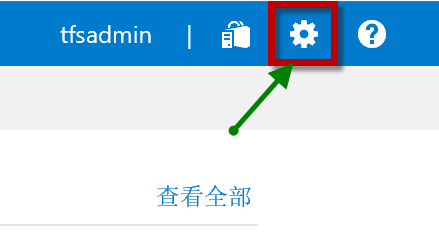
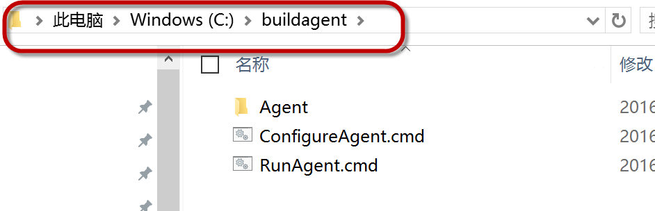
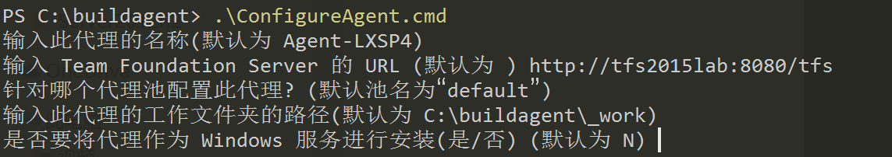
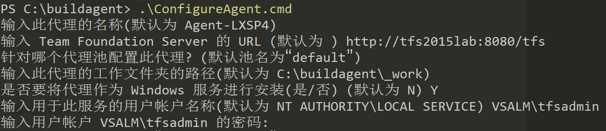

TFS Build vNext Agent 简介及安装配置指导
----------------------------------------

TFS Build vNext 是微软与TFS 2015版本一同发布的全新一代持续集成引擎，它对不同的操作系统，开发环境，语言和工具提供了良好的兼容性。可以部署在包括Windows, Linux, Unix和Mac的各种主流操作系统上，支持包括.net, java, iOS, Android等各种语言的编译打包和自动化。

这一版本的 Build Agent 使用Node.js开发，通过开源的方式提供给社区，并接受社区的反馈和代码Pull Request, 以下是GitHub地址：

https://github.com/Microsoft/vso-agent

引擎中所提供的所有构建任务和脚本也通过GitHub开源，可以通过以下地址获取：

https://github.com/Microsoft/vso-agent-tasks

对于不同的开发语言和环境，您可能会使用不同的构建工具，本引擎中已经包括了主流的构建工具，如下图：

.. figure:: images/add-build-steps.png

如果你的项目已经有了自己的构建脚本，你也可以很容易的进行调用；提供了不同操作系统上的脚本调用方式，如：Windows上的PowerShell和cmd,Linux上的shell script等，如下图：

.. figure:: images/add-build-steps-utility.png

对于不同的语言的单元测试框架也提供了很好的支持，包括 VSTest, NUnit, XUnit和JUnit， 如下图：

.. figure:: images/agent-install-8.png

测试结果可以被发布到TFS服务器上，并在构建结果中显示，对于失败的测试用例可以直接转换成Bug分配给开发人员进行修复

.. figure:: images/agent-install-9.png

Windows环境安装和配置向导
~~~~~~~~~~~~~~~~~~~~~~~~~~

在执行以下步骤前，需要在您的Windows系统上安装Node.JS，可以中以下地址获取Node.JS安装包：

https://nodejs.org 

.. note:: 
    一般来说，推荐使用LTS（长久支持版）的Node安装包，并根据您所使用的操作系统的版本选择x64或者x86版本来使用。
    

1. 登录系统，在系统的右上角点击 **齿轮** 标志进入后台

.. note:: 

        您的登录账户需要是 **团队项目集合管理员** 组的成员才具备管理构建代理的权限。

2. 在后台 **控制面板** 中，点击 **代理池 | 下载代理** 按钮，并保存下载好的.zip文件

.. figure:: images/agent-install-2.png

3. 将zip包内容解压缩至一个本地路径，建议放置在 C:\\buildagent 目录下面

4. **以管理员身份** 运行 Windows Powershell 命令行工具，并将ExecutionPolicy设置为Unrestricted，具体命令为

.. code-block:: powershell

    Set-ExecutionPolicy -ExecutionPolicy Unrestricted

5. 进入 c:\\buildagent 目录，并运行 ConfigureAgent.cmd 

上图对代理名称，服务器地址，代理池名称，工作文件夹进行了配置。如果作为服务运行，则还需要输入服务所使用的账户

===========  =====================
配置项         说明  
===========  =====================
代理名称        默认为当前机器名
服务器地址      为你的TFS服务器的地址，如：http://tfs2015.vsalm.local:8080/tfs 
代理池          代理池是服务上用来管理代理的容器，默认为default；也可以自己创建代理池。在配置构建的时候可以选择代理池来执行构建。
工作文件夹      构建的过程会在这个文件夹中执行，包括：下载代码，执行编译，运行测试等
服务账户        如果选择使用服务方式运行代理，则需要制定此服务所使用的账户名称和密码 
===========  =====================

.. note:: 

    对于是否要将代理作为Windows服务进行安装，可以视情况而定，一般来说

    * 作为Windows服务运行：每次系统启动服务即可启动，相对维护简单
    * 不作为Windows服务运行：则每次需要人工运行RunAgent.cmd来启动，但是如果所运行的任务需要和桌面进行交互，则会比较方便，如：运行自动化界面测试。

6. 回到TFS后台 **控制面板** 中，你将可以看到新配置的代理出现在代理池中，并在功能页中列出了这台机器所具备的能力（也就是当前代理商所安装的各种工具）

.. figure:: images/agent-install-6.png

.. note:: 
    为了能够支持不同开发语言的编译，测试的打包，我们需要安装不同的工具，如：对于传统的.NET应用，我们需要安装Visual Studio；对于Java应用，需要JDK和Maven/Ant；对于很多前端语言，我们还需要安装Grunt, Gulp等工具。

7. 最后，我们还需要对权限进行配置，你可以将允许管理这个代理的人员加入到 Agent Pool Administrators 这个角色中。

.. figure:: images/agent-install-7.png

至此，Windows环境上的安装和配置完成。

Linux环境安装和配置向导
~~~~~~~~~~~~~~~~~~~~~~~~~~

todo

Mac环境安装和配置向导
~~~~~~~~~~~~~~~~~~~~~~~~~~

todo 

