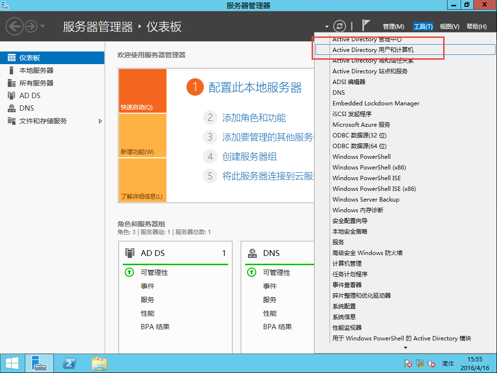
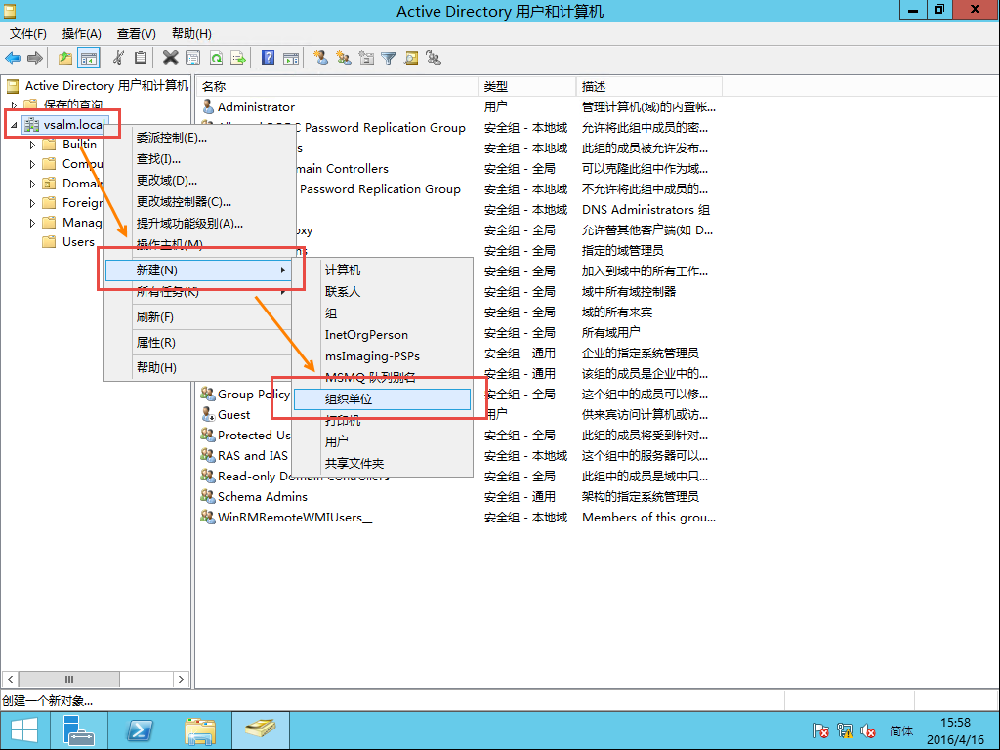
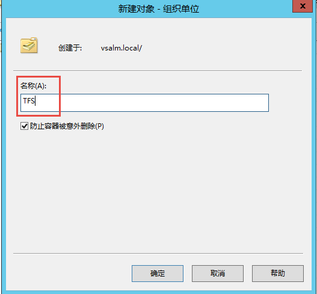
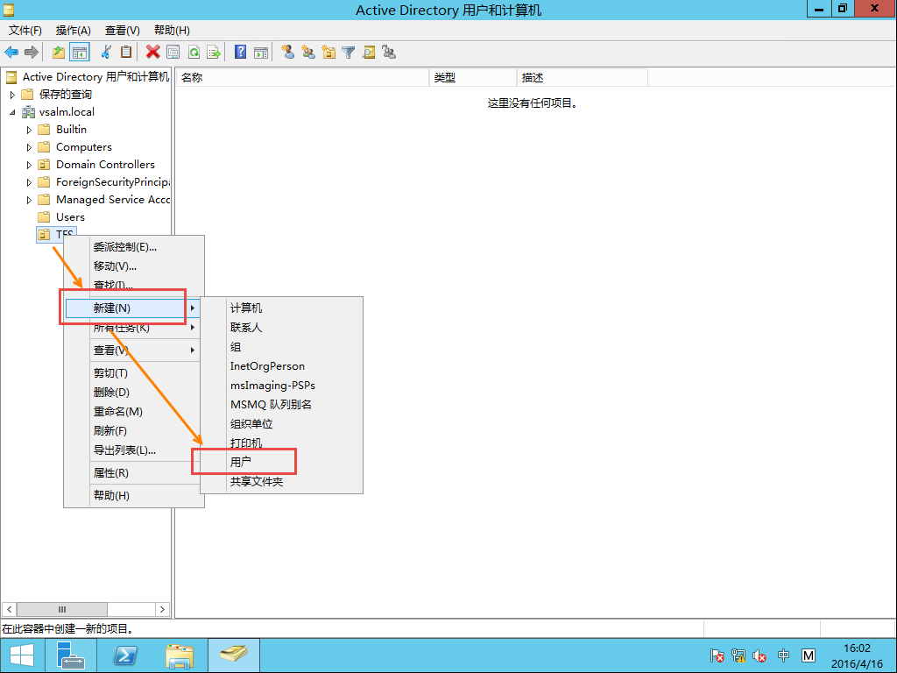
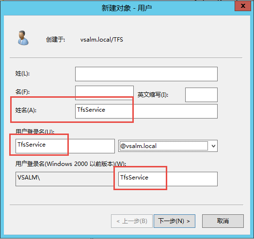
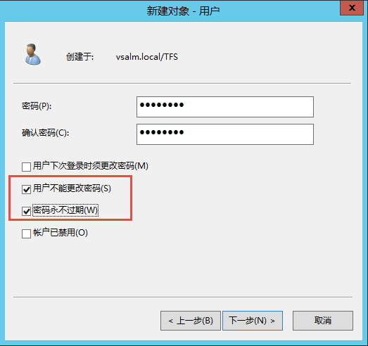
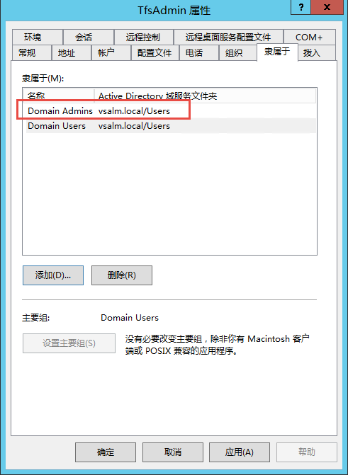

为TFS服务器创建服务账户
^^^^^^^^^^^^^^^^^^^^^^

为了确保TFS服务的安全性，稳定性以及未来集成外围服务的方便性，我们需要使用专用的账户来运行TFS和其相关的服务。

服务账户
++++++++++++++++++++++++++

你需要至少创建以下几个 **服务账户**：

================    ===========
账户名称             用途
================    ===========
TfsService          用来运行TFS的核心服务
TfsReport           用来代替TFS核心服务访问Tfs的报表
TfsBuild            用来代替TFS核心服务运行构建服务
================    ===========

服务账户不需要再创建的时候赋予任何特殊权限，他们的权限都通过TFS安装配置程序自动赋予，TFS安装配置程序会保证这些账户仅仅具备最基本的权限。

管理员账户
++++++++++++++++++++++++++

另外，你还可以创建几个公用的 **管理员账户** 用来完成TFS的安装部署以及日常的维护工作：

================    ===========
账户名称             用途
================    ===========
TfsAdmin            日常TFS系统维护，包括安装配置和日常数据备份和恢复
================    ===========

.. attention::
    使用公用账户有其方便的地方但也可能造成安全隐患，比如你无法知晓到底是谁在使用这个账户进行了操作。所以，我们更加推荐使用授权的方式，为那些行使TFS管理员职责的用户账户赋予相应的权限

在Active Directory中创建账户
++++++++++++++++++++++++++++

在 **服务器管理器** 上点击 **工具 | Active Directory 用户和计算机** 

在 **Active Directory 用户和计算机** 中，右键点击 **vsalm.local**，选择 **新建 | 组织单位 ** 

在弹出的 **新建对象-组织单位** 对话框中，输入 **TFS** 作为名称并点击　**确定** 

右键单击 **TFS** 这个组织单位，选择 **新建|用户** 

按照你要创建的账户名称填写表单，并点击 **下一步** 

填写密码，并仅仅勾选以下两个选项

[x] 用户不能更改密码

[x] 密码永不过期

.. attention::

    对于 **服务账户** 来说，如果密码过期会造成服务失效。建议选定密码永不过期选项，如果你的组织有其他关于密码安全性的要求，则请按照要求进行配置。
    
重复以上方法，创建下列用户

这些用户中除了TfsAdmin是公用的管理员账户，其他的都是服务账户，对于服务账户，我们不需要赋予任何特殊的权限，但是对管理员账户，我们需要赋予Domain Admins组权限。

至此，我们就完成了TFS安装部署所需要的账户配置。

