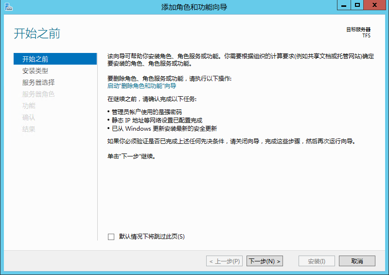
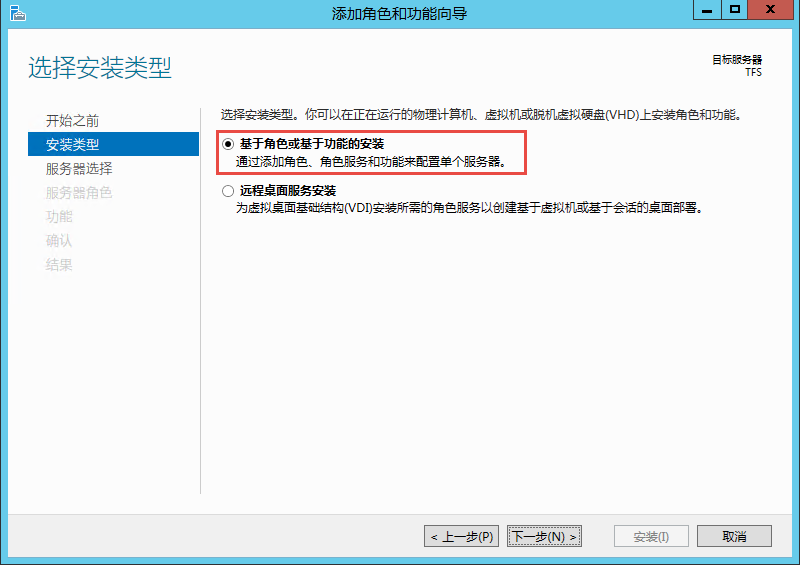

为TFS部署Windows活动目录（域环境）
^^^^^^^^^^^^^^^^^^^^^^^^^^^^^^^^^

活动目录（Active Directory）是面向Windows Standard Server、Windows Enterprise Server以及 Windows Datacenter Server的目录服务。Active Directory存储了有关网络对象的信息，并且让管理员和用户能够轻松地查找和使用这些信息。

**什么时候需要将TFS部署在域环境？**

如果将要使用TFS服务器的人员很多，或者需要使用中型（双机），大型（集群）模式的部署，推荐将TFS部署在域环境中。这样便于我们配置TFS的周边服务，如：报表服务，SharePoint服务和自动化持续集成服务。一般来说，我们无法在一台服务器上完成TFS核心服务和周边服务的完整部署，而必须将这些周边服务部署在独立的服务器上，这时我们就需要TFS与这些周边服务进行通信。在这种情况下，使用域环境将更加容易，因为我们可以使用域账户在不同的服务器之间进行授权，而不用依赖NETWORK SERVICE这类的机器账号进行授权。

活动目录部署说明
++++++++++++++++++++++++++

.. attention::
    这里提供的是最简单的Windows活动目录部署步骤，如果您需要企业级Windows活动目录部署，请与专业的Windows网络管理员进行沟通，进行整理规划。这里所提供的安装步骤仅可作为测试和验证用途。
    
.. attention::
    
    本文档中使用Windows Server 2012 R2 Datacenter版，如果需要在其他版本的Windows上部署活动目录，请参考微软官方文档。
    
    
1. 修改计算机名称

新安装Windows Server将使用一个随机字符串作为机器名称，这非常不利于后期维护。所以我们需求修改这个名称。

在 ** 服务器管理器 | 本地服务器 ** 中单击计算机名，并在弹出的对话中单击 **更改**，输入 新的计算机名称，单击 **确定** 

.. figure:: images/ad-install-01-changecomputername.png

然后按照提示重新启动服务器。
    
2. 安装Windows活动目录服务

服务器完成启动后，在 **服务器管理器 | 仪表盘** 上点击 **添加角色和功能** 

弹出的 **开始之前** 页面上点击 **下一步**

在 **选择安装类型** 页面上选择 **基于角色或基于功能的安装** 并点击 **下一步**

在 **选择目标服务器** 页面上选择 **从服务器池中选择服务器** 确保 **TFS** 服务器被选中，并点击 **下一步** 

.. figure:: image/ad-install-003.png
    
在 **选择服务器角色** 页面上选择 **Active Directory 域服务**，并在弹出的 **添加角色和功能向导** 对话框中，点击 **添加功能**，回到 **选择服务器角色** 页面上点击 **下一步**

.. figure:: image/ad-install-004.png

.. figure:: image/ad-install-004-1.png

在 **选择功能** 页面上，点击 **下一步** 

.. figure:: image/ad-install-005.png

在 **Active Directory 域服务** 页面上点击 **下一步** 

.. figure:: image/ad-install-006.png

在 **确认** 页面上点击 **安装** 

.. figure:: image/ad-install-007.png

等待安装完成，并在 **安装进度** 页面上点击 **关闭** 

.. figure:: image/ad-install-007.png

3. 将服务器升级为域控制器

4. 从新启动服务器

