小型（单机）部署安装说明
^^^^^^^^^^^^^^^^^^^^^^

在这份文档中，我们将完成小型（单机）模式的TFS安装和配置过程。

安装账户
++++++++++++++++++++++++++++

确保你使用 **TFS管理员账户** 登录计算机进行以下操作

.. figure:: images/account-tfsadmin.png

TFS 安装过程
++++++++++++++++++++++++++++

启动TFS安装程序并点击 **安装** 

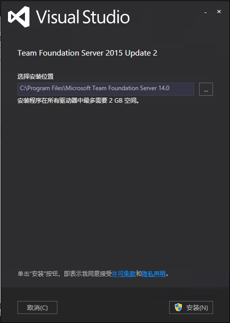

TFS 配置过程
++++++++++++++++++++++++++++

在 **TFS配置中心** 中选择 **完整服务器** 并点击 **启动向导** 

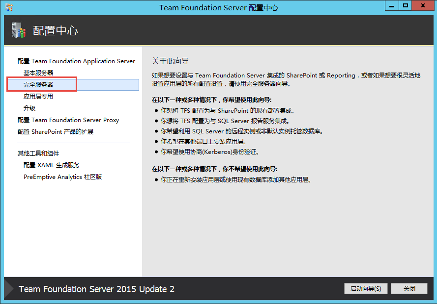

在 **完全服务器配置向导** 中点击 **下一步** 

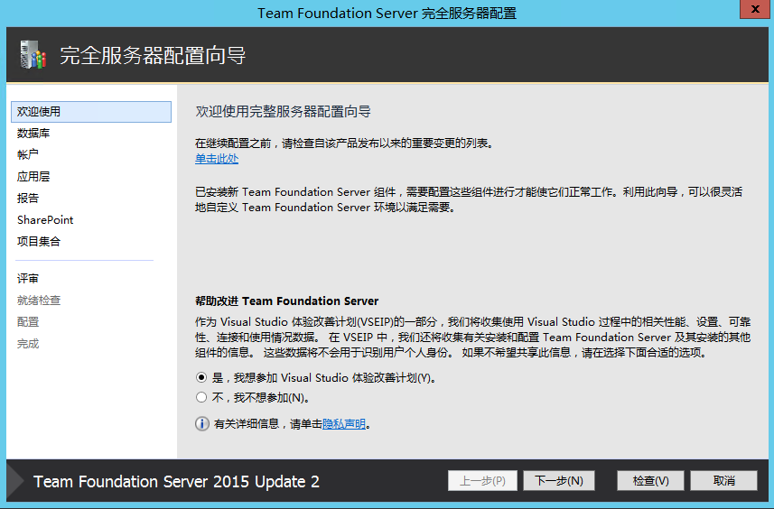

在 **数据库** 页面中，确保 SQL Server实例正确，点击 **测试**，确保测试成功，点击 **下一步** 

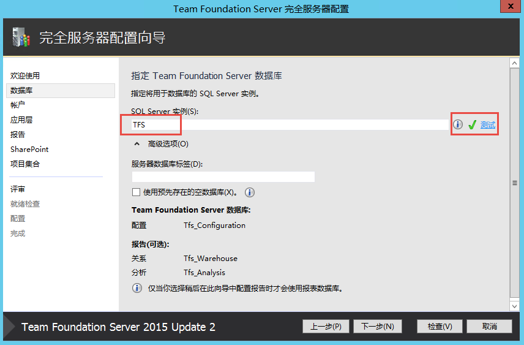

在 **账户** 页面中，输入 TFS服务账户 **TfsService**，点击 **测试**，确保测试成功，点击 **下一步** 

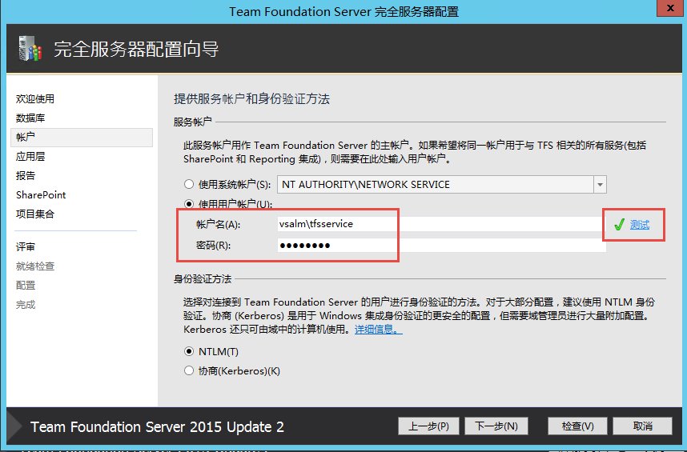

在 **应用层** 页面中，点击 **下一步** 

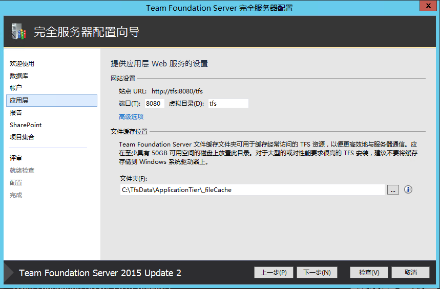

在 **报告** 页面中，选中 **配置用于Team Foundation Server的报告**，点击 **下一步** 

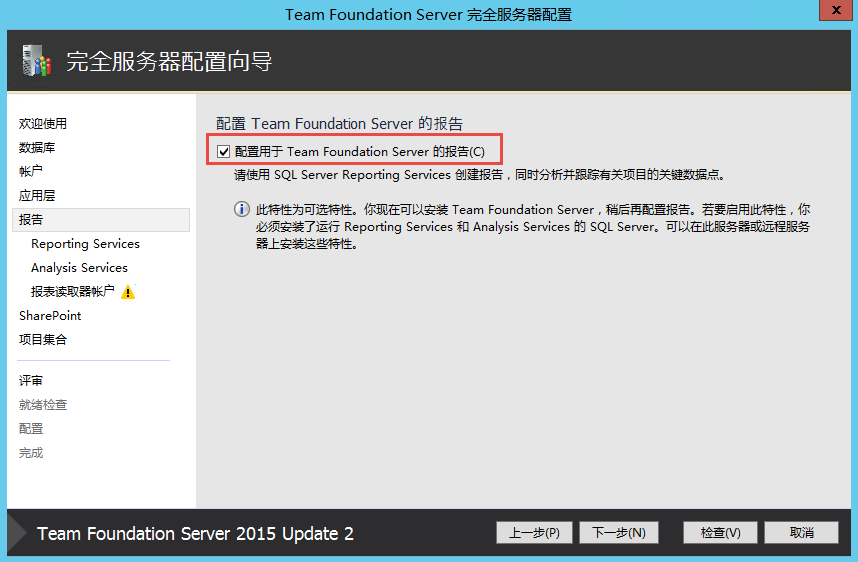

在 **报告|Reporting Services** 页面中，点击 **填充URL**，确保服务器URL正确，点击 **下一步** 

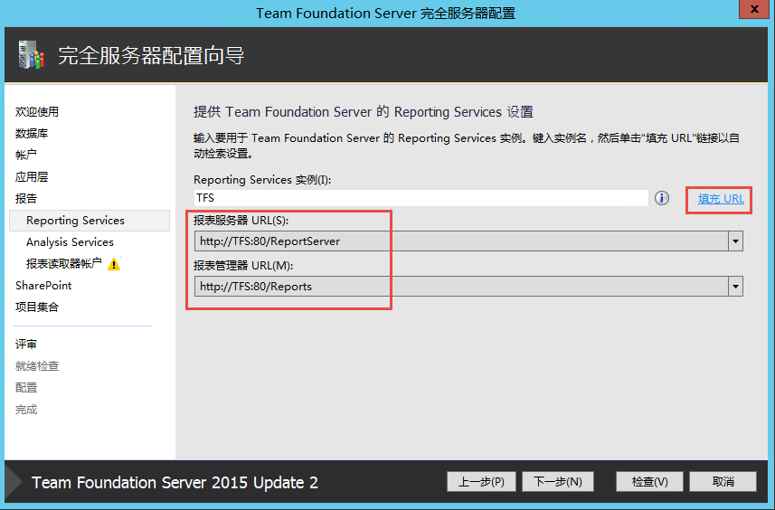

在 **报告|Analysis Services** 页面中，确保实例名称正确，点击 **测试** 成功，点击 **下一步** 

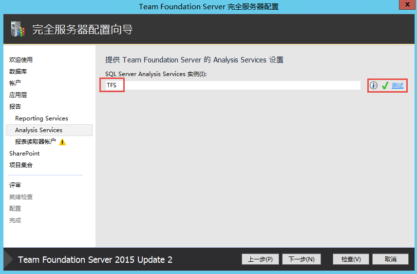

在 **报告|报表读取账户** 中，输入tfsreport账户，点击 **测试** 成功，点击 **下一步** 

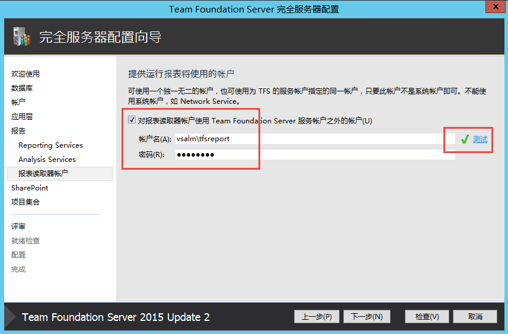

在 **SharePoint** 页面中，不要选中 **启用与SharePoint的集成** ，点击 **下一步** 

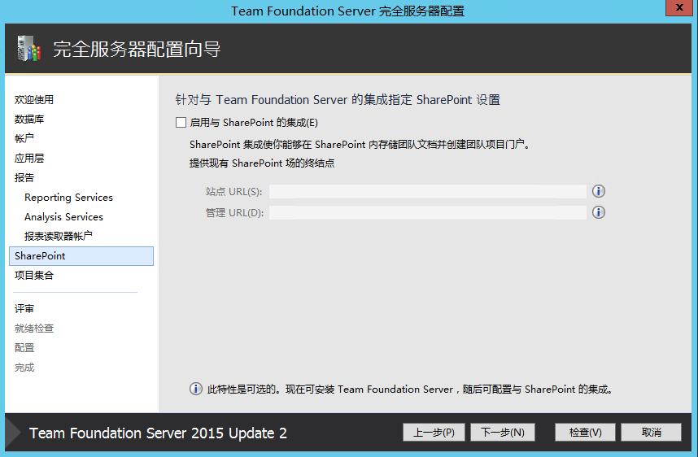

在 **项目集合** 页面中，保留所有默认值，点击 **下一步** 

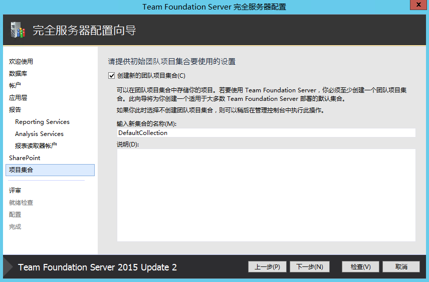

在 **评审** 页面中，检查所有配置正确，点击 **下一步** 

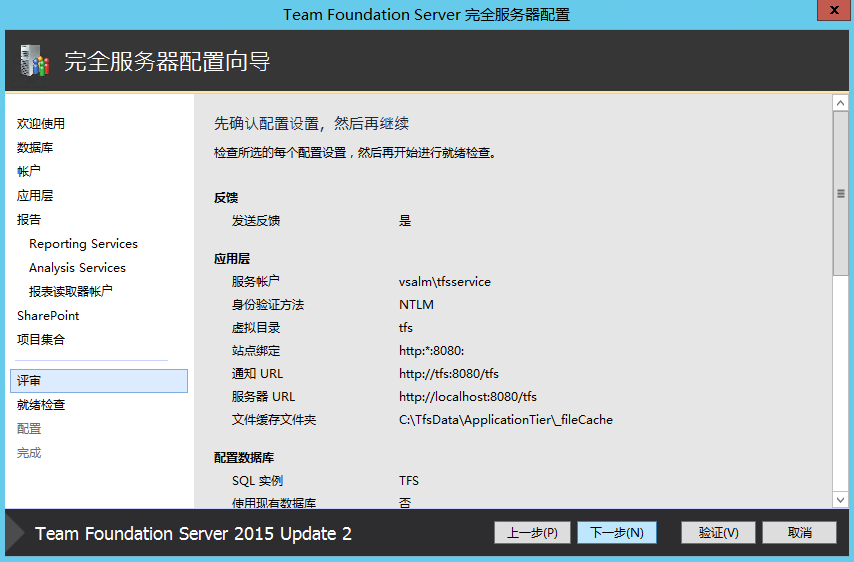

在 **就绪检查** 页面中，等待所有检查通过，点击 **配置** 

.. figure:: images/tfs-install-014.png

等待TFS安装完成，出现以下页面，并点击 **下一步** 

.. figure:: images/tfs-install-015.png

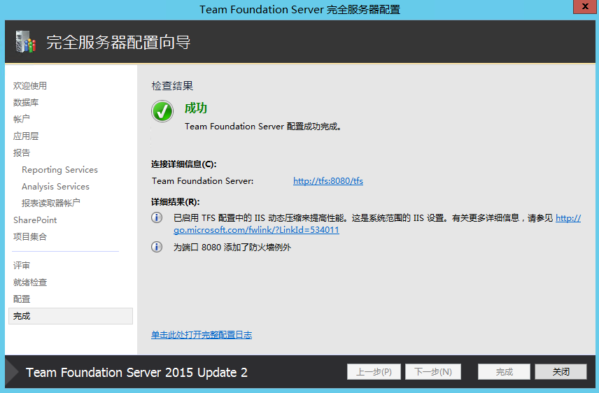

点击 **关闭**。

至此，我们就完成了小型（单机）模式的TFS部署，你可以在服务器上打开浏览器并导航到 http://localhost:8080/tfs， 查看TFS门户显示正常。

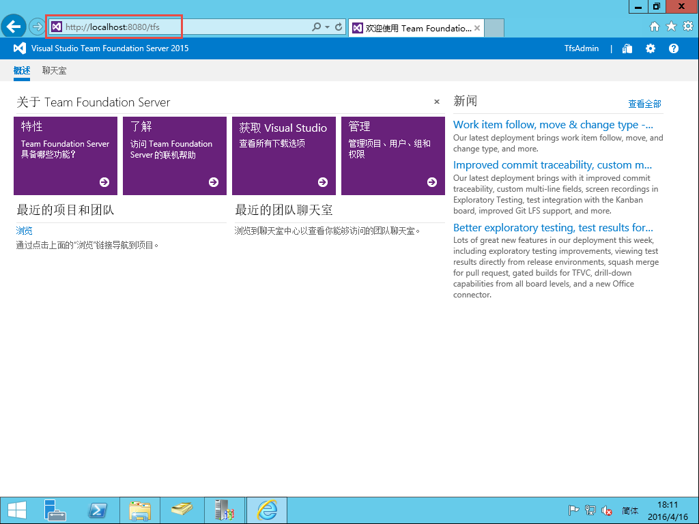

下一步，你就可以在TFS服务器上创建项目，开始使用了！

