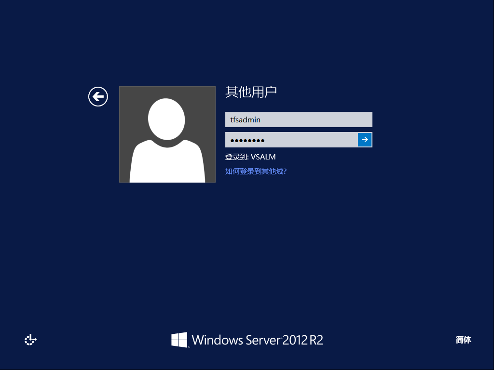

为TFS部署SQL Server环境
^^^^^^^^^^^^^^^^^^^^^^^^^^^^^^^^^

TFS 的不同版本支持使用不同版本的SQL Server，请参考下列表格决定是否您的SQL Server版本可以用户TFS部署。

==================    ===================
TFS版本                 SQL Server 版本
==================    ===================
TFS 2015               SQL Server 2014
                       SQL Server 2012 (minimum SP1)
TFS 2013 Update 2      SQL Server 2014
                       SQL Server 2012 (minimum SP1)
TFS 2013               SQL Server 2012 (minimum SP1)
TFS 2012               SQL Server 2012
                       SQL Server 2008 R2
TFS 2010               SQL Server 2008 R2
                       SQL Server 2008
==================    ===================

安装账户
++++++++++++++++++++++++++++

确保你使用 **TFS管理员账户** 登录计算机进行以下操作

SQL Server 2014 安装过程
++++++++++++++++++++++++++++

1. 安装.NET Framework 3.5

    使用 **添加角色和功能向导** 安装 **.NET Framework 3.5 功能** 
    
    .. figure:: images/sql-install-netfx35-001.png
    
    由于这个安装过程会从互联网下载内容，你可以按照以下方式使用本地安装盘中的备用路径来加快安装过程
    
    .. figure:: images/sql-install-netfx35-002.png
    
2. 配置和安装SQL Server 2014 

    运行SQL Server 安装程序并选择 **安装|全新SQL Server独立安装或向现有安装添加功能** 
    
    .. figure:: images/sql-install-001.png
    
    接受许可条款
    
    .. figure:: images/sql-install-002.png
    
    如果您的服务器可以链接互联网，请选择 **使用Microsoft Update检查更新** 
    
    .. figure:: images/sql-install-003.png
    
    在 **安装规则** 页面中点击 **下一步** 
    
    .. figure:: images/sql-install-004.png
    
    .. attention::
        
        这里的2个警告分别是提示我们正在一台域控制器上进行SQL Server安装，这是不推荐的方式；另外一个是因为我们没有针对SQL Server进行防火墙配置。
        
        由于我们采用单机安装的方式，这2个警告都可以忽略。
        
    选择 **SQL Server功能安装** 
    
    .. figure:: images/sql-install-005.png
    
    针对TFS的使用场景，我们至少需要安装以下所选定的功能
    
    - 数据库引擎服务
    - 全文和语义提取搜索
    - Analysis Service 
    - Reporting Services - 本机
    - 客户端连接工具
    - 客户端连接工具向后兼容性
    - 管理工具 （基本和完整）
        
    .. figure:: images/sql-install-006.png
    
    使用 **默认实例** 
    
    .. figure:: images/sql-install-007.png
    
    使用 TFS 服务账户 **TfsService** 运行所有服务
    
    .. figure:: images/sql-install-008.png
    
    确保 **排序规则** 都使用 Chinese_PRC_CI_AS
    
    .. figure:: images/sql-install-009.png
    
    推荐使用 **混合模式** 的身份认证，这样非域用户也可以比较容易的访问SQL Server
    将TfsAdmin管理员账户加入SQL Server管理员组，确保TFS管理员可以有足够的权限管理SQL Server
    
    .. figure:: images/sql-install-010.png
    
    将TfsAdmin管理员账户加入SQL Analysis Service管理员组，确保TFS管理员可以有足够的权限管理SQL Analysis Service 
    
    .. figure:: images/sql-install-011.png
    
    选择 Reporting Service 的版本安装和配置
    
    .. figure:: images/sql-install-012.png
    
    检查配置，开始安装
    
    .. figure:: images/sql-install-013.png
    
    等待安装完成，并检查所有组件安装成功。
    
    .. figure:: images/sql-install-014.png
    

至此，我们就完成TFS所需要的SQL Server环境的安装部署。

